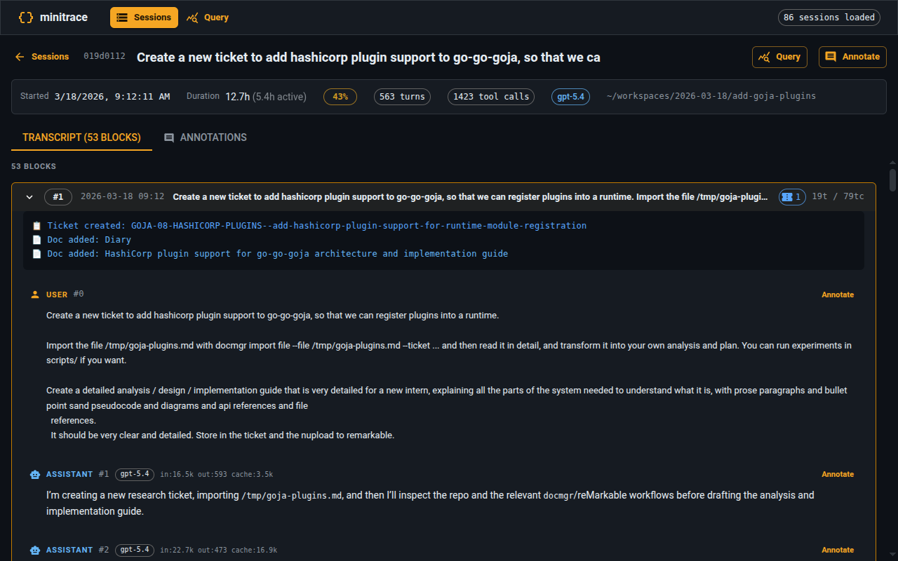
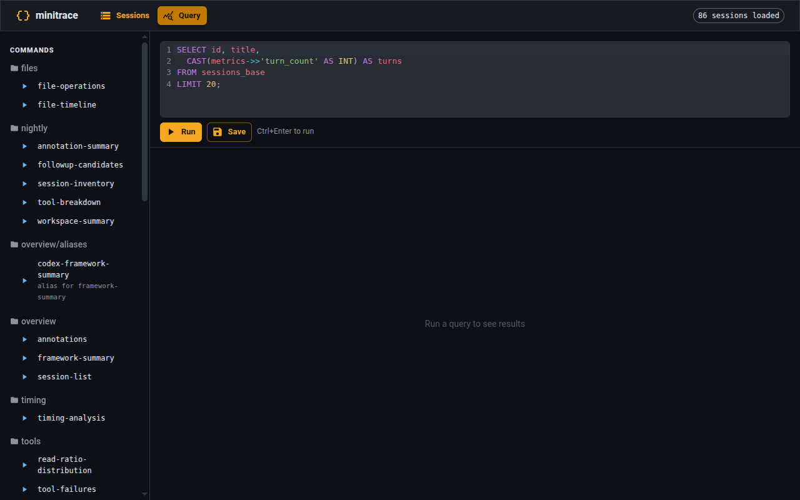

# go-minitrace

A transcript analysis toolkit that converts AI agent sessions into queryable archives and lets you build reusable analysis tooling with SQL and JavaScript.

**The core problem it solves:** when something breaks in a codebase you've worked on for months, the question is rarely "what changed?" — it's "what did this look like when it worked, and which sessions show the transition?" go-minitrace treats transcript analysis as a **reduction pipeline**, not a reading task.

---

## What it does

go-minitrace converts raw session stores into structured `.minitrace.json` archives, then provides three query surfaces over a normalized SQLite engine — `query run` (presets and ad hoc SQL), `query commands` (reusable structured commands), and a JavaScript runtime (`mt.db()`) — plus a web UI with a transcript viewer and annotation editor.

Supported sources: Claude Code, Codex, Pi, GitHub Copilot CLI, claude.ai, ChatGPT, Geppetto/Pinocchio.

## Installation

```bash
# Homebrew (recommended — includes the embedded web UI)
brew tap go-go-golems/go-go-go
brew install go-minitrace

# Go install (NOTE: the embedded web UI will be missing;
# use Homebrew or build from source for the full experience)
go install github.com/go-go-golems/go-minitrace/cmd/go-minitrace@latest

# From source (includes the embedded web UI)
git clone https://github.com/go-go-golems/go-minitrace.git
cd go-minitrace
go generate ./...   # builds the frontend with Dagger (requires Docker)
go build ./...
```

## Quick start

```bash
# See what sessions exist (narrow by project and date)
go-minitrace discover pi --cwd-contains my-repo --since 2026-06-01

# Convert sessions into queryable archives
go-minitrace convert claude-code --output-dir ./output
go-minitrace convert pi --output-dir ./output
# ... or convert exactly the sessions discover found
go-minitrace convert pi --source-session /path/to/session.jsonl --output-dir ./output

# Query with built-in presets (no SQL required)
go-minitrace query run \
  --archive-glob './output/active/*/*.minitrace.json' \
  --preset session-list

# Run a structured command
go-minitrace query commands overview session-list \
  --archive-glob './output/active/*/*.minitrace.json'

# Start the web UI
go-minitrace serve --archive-glob './output/active/*/*.minitrace.json'
```

---

## Why this exists

A common mistake when debugging with historical sessions is treating every transcript as equally important. That leads to two failures:

1. **Token waste** — too much raw material, too little structure.
2. **Reasoning waste** — the investigator spends time rediscovering the same filters, archive globs, and path patterns instead of asking progressively better questions.

go-minitrace is most effective when treated as a **small analysis framework**, not a one-off SQL runner. The recommended workflow is a three-layer reduction funnel:

```
Native session stores    →    .minitrace.json archives    →    SQLite database
                                (queryable)                     (normalized)
                                                                 │
                              ┌─────────────────┐                │
                              │  SQL leaves     │◀───────────────┘
                              │  (filter/search)│
                              └────────┬────────┘
                                       │
                              ┌────────▼────────┐
                              │  JS summarizers │
                              │  (explain to    │
                              │   humans)       │
                              └────────┬────────┘
                                       │
                              ┌────────▼────────┐
                              │  Compact        │
                              │  evidence /     │
                              │  next hypothesis│
                              └─────────────────┘
```

1. **Session inventory** — find the 4 sessions that matter, not the 400 that don't.
2. **Evidence extraction** — pull only the tool calls that carry actual signal (bash output, file touches, git history).
3. **Summarization** — turn raw rows into a chronological narrative a human can act on.

Every stage reduces entropy. The end result is not a dump — it's a report.

---

## The three query layers

### 1. Built-in presets (no SQL required)

Nine presets ship with go-minitrace for common questions:

| Preset | Description |
|--------|-------------|
| `session-list` | One row per session: framework, model, turns, tools, duration |
| `framework-summary` | Aggregate stats grouped by framework |
| `tool-operation-breakdown` | Tool call counts by framework and operation type |
| `tool-failures` | Failed tool calls with target and error detail |
| `timing-analysis` | Duration, active time, TTFA, and idle ratio by framework |
| `read-ratio-distribution` | Read/write/execute breakdown per session |
| `file-operations` | Every file touch in session order |
| `file-timeline` | Chronological operations on files |
| `annotations` | All annotations across sessions |

```bash
go-minitrace query run \
  --archive-glob './output/active/*/*.minitrace.json' \
  --preset framework-summary
```

### 2. Custom SQL

When a preset doesn't fit, write SQL directly. The normalized schema exposes the full session structure as real tables — `sessions`, `turns`, `tool_calls`, `files`, `annotations`, `metrics`, `events`, `attachments` — so most queries need no JSON extraction:

```sql
-- Sessions with highest tool-call density (tools per turn)
SELECT session_id, title,
       tool_call_count AS tools,
       turn_count AS turns,
       CAST(tool_call_count AS REAL) / turn_count AS density
FROM sessions
WHERE turn_count > 0
ORDER BY density DESC
LIMIT 10;

-- Tool failures across all sessions
SELECT tc.session_id, s.title, tc.tool_name, tc.error
FROM tool_calls tc
JOIN sessions s USING (session_id)
WHERE tc.success = 0;

-- Bash output containing a specific keyword (e.g. a runtime error)
SELECT tc.session_id, s.title, s.started_at,
       tc.tool_call_id, tc.command, substr(tc.result, 1, 200) AS bash_output
FROM tool_calls tc
JOIN sessions s USING (session_id)
WHERE tc.tool_name = 'bash'
  AND tc.result LIKE '%Connect successful%'
ORDER BY s.started_at, tc.session_id
LIMIT 50;
```

```bash
go-minitrace query run \
  --archive-glob './output/active/*/*.minitrace.json' \
  --sql "SELECT session_id, title, tool_call_count AS tools
        FROM sessions
        WHERE agent_framework = 'pi'
        ORDER BY tools DESC
        LIMIT 20"
```

Long-tail fields stay reachable via `json_extract` on `raw_json`/`framework_metadata_json`, and session-level SQL written for the old DuckDB engine keeps working against the `sessions_base` compatibility view (`go-minitrace help query-duckdb` has the migration table).

Output formats: `--output table` (default), `--output json`, `--output csv`.

### 3. Structured query commands (reusable tooling)

When an analysis task becomes part of your repeatable workflow, promote it to a structured command. Structured commands give you named, typed parameters, alias support, and work identically in CLI, web UI, and API.

A command file is a `.sql` or `.js` file with metadata:

```sql
/* sqleton
name: session-list
short: List minitrace sessions
flags:
  - name: framework
    type: stringList
    help: Filter by agent framework
  - name: limit
    type: int
    default: 100
    help: Limit the number of rows returned
*/
SELECT
  session_id AS id,
  agent_framework AS framework,
  title,
  turn_count AS turns,
  tool_call_count AS tools
FROM sessions
WHERE 1=1
{{ if .framework -}}
AND agent_framework IN ({{ .framework | sqlStringIn }})
{{ end -}}
ORDER BY started_at DESC
LIMIT {{ .limit }};
```

Repository layout maps directly to CLI structure:

```
query-commands/
└── overview/
    ├── session-list.sql           → go-minitrace query commands overview session-list
    └── framework-summary.sql     → go-minitrace query commands overview framework-summary
```

Run with typed parameters:

```bash
go-minitrace query commands overview session-list \
  --archive-glob './output/active/*/*.minitrace.json' \
  --framework codex,pi \
  --limit 50
```

Load external repositories for team or investigation-specific commands:

```bash
go-minitrace query commands overview session-list \
  --query-repository ./my-commands \
  --archive-glob './output/active/*/*.minitrace.json'
```

Configure repositories via `GO_MINITRACE_QUERY_REPOSITORIES` or in the app config:

```yaml
queryRepositories:
  - ./query-commands/team
  - ~/.config/go-minitrace/query-commands
```

---

## JavaScript command handlers

For analysis tasks that go beyond what SQL can express conveniently — multi-query joins, JS-side scoring, classification logic, async control — write a JS handler.

JS handlers run in a Goja-powered runtime with access to:

- `require("minitrace")` — normalized SQLite databases through `mt.db()` and `db.query()`
- `require("timer")` — `setTimeout`, `setInterval` for async commands
- `require("fs")`, `require("exec")`, `require("path")` — file system and shell access
- `require("console")` — debug output to server logs

```js
// overview/session-tools.js
__section__("filters", {
  title: "Filters",
  fields: {
    framework: {
      type: "stringList",
      help: "Filter by agent framework",
    },
    limit: {
      type: "int",
      default: 25,
      help: "Maximum number of rows",
    },
  },
});

function sessionList(filters) {
  const mt = require("minitrace");
  const db = mt.db().RuntimeArchives().QueryCommandDefaults().Build();

  try {
    // Run SQL against normalized SQLite tables and post-process in JS.
    const rows = db.query(`
      SELECT
        session_id,
        title,
        agent_framework AS framework,
        tool_call_count AS tools,
        turn_count AS turns
      FROM sessions
      WHERE 1=1
      ${filters.framework?.length
        ? `AND agent_framework IN (${mt.sql.stringIn(filters.framework)})`
        : ""}
      ORDER BY started_at DESC
      LIMIT ${filters.limit}
    `);

    return rows.map(row => ({
      ...row,
      density: row.turns > 0 ? (row.tools / row.turns).toFixed(2) : 0,
      type: row.tools / row.turns > 2 ? "tool-heavy" : "balanced",
    }));
  } finally {
    db.close();
  }
}

__verb__("sessionList", {
  name: "session-list",
  short: "List minitrace sessions",
  fields: { filters: { bind: "filters" } },
});
```

This becomes:

```bash
go-minitrace query commands overview session-tools session-list \
  --archive-glob './output/active/*/*.minitrace.json' \
  --framework codex \
  --limit 25 \
  --output json
```

**When to use JS instead of SQL:**

| SQL is the right tool | JS is the right tool |
|-----------------------|----------------------|
| Single-query filtering and grouping | Multi-query joins: run several queries and combine in JS |
| Aggregations (`COUNT`, `AVG`, `GROUP BY`) | JS-side scoring and classification |
| Simple predicates | Async logic with `require("timer")` |
| Row-oriented questions | Reusable helper modules shared across commands |
| Single-column transformations | Output shapes richer than flat SQL rows |

See `go-minitrace help js-api-reference` for the complete `require("minitrace")` API.

---

## Embedding `require("minitrace")` in a hand-built Goja host

You can embed the JavaScript API in your own Go binary without shelling out to the `go-minitrace` CLI or generating an xgoja application. Link the module package for its side effect, build a plain go-go-goja runtime, and then use `require("minitrace")` from JavaScript.

```go
package main

import (
	"context"

	"github.com/dop251/goja"
	"github.com/go-go-golems/go-go-goja/pkg/engine"

	// Side-effect imports register these packages in modules.DefaultRegistry.
	_ "github.com/go-go-golems/go-minitrace/pkg/minitracejs"
	_ "github.com/go-go-golems/goja-text/pkg/template"
)

func main() {
	factory, err := engine.NewRuntimeFactoryBuilder().Build()
	if err != nil {
		panic(err)
	}

	rt, err := factory.NewRuntime(
		engine.WithStartupContext(context.Background()),
		engine.WithLifetimeContext(context.Background()),
	)
	if err != nil {
		panic(err)
	}
	defer func() { _ = rt.Close(context.Background()) }()

	_, err = rt.Owner.Call(context.Background(), "render-report", func(_ context.Context, vm *goja.Runtime) (any, error) {
		return vm.RunString(`
			const mt = require("minitrace");
			const template = require("template");
			const fs = require("fs");

			const session = mt.session()
				.File("./output/active/example/session.minitrace.json")
				.InteractiveCache("./.cache/minitrace")
				.Open();

			try {
				const markdown = template.renderText("# {{ .Title }}\n\nSession: {{ .SessionID }}\n", {
					Title: "Embedded minitrace report",
					SessionID: session.id(),
				}).Text;
				fs.writeFileSync("./dist/minitrace-report.md", markdown);
			} finally {
				session.close();
			}
		`)
	})
	if err != nil {
		panic(err)
	}
}
```

Important details:

- Go does not dynamically discover modules by JavaScript name. The blank import of `pkg/minitracejs` links the package into the binary and runs its `init()` registration.
- `require("fs")` comes from go-go-goja's default registry. `require("template")` comes from the optional `goja-text` side-effect import shown above.
- The default minitrace module has empty runtime settings. In embedded hosts, prefer explicit sources such as `.File(...)`, `.Files(...)`, `.Glob(...)`, `.Dir(...)`, or `.Content(...)`.
- Generated query-command runtimes still use a command-scoped loader so `.RuntimeArchives()` can read `--archive-glob` and related runtime settings.
- If you call `WithModules(...)` directly, you are choosing an explicit module set and must register every module that JavaScript should be able to require.

---

## The web UI

`go-minitrace serve` starts an HTTP server on the same normalized SQLite engine (the live annotation store is ATTACHed as `anno.annotations`) and exposes:

- **Sessions** (`/sessions`) — sortable session list with framework, model, turns, tools, duration, active %, and annotation badges
- **Transcript viewer** — per-session turn/tool-call timeline with inline annotation creation and editing
- **Query** (`/query`) — interactive query editor with saved queries, presets, structured command forms, SQL rendering, and result tables
- **REST API** — sessions, queries, annotations, and structured command execution under `/api/v2/*`

Flags: `--archive-glob`, `--port`, `--max-rows`, `--query-timeout-ms`, plus `--query-dir`/`--preset-dir`/`--query-repository` for SQL libraries.






---

## Annotations

Add human review notes to sessions and turns. Annotations live in `output/annotations.db` and sync back into `.minitrace.json` files.

```bash
go-minitrace annotate add \
  --output-dir ./output \
  --session <session-id> \
  --category observation \
  --title "Session worth revisiting for context"

go-minitrace annotate sync --output-dir ./output
```

Categories: `observation`, `ai-failure`, `user-error`, `environment-issue`, `success`, `question`, `to-discuss`, `to-improve`

Full workflow: `go-minitrace help annotation-playbook`.

---

## Supported sources

| Source | Format | Command |
|--------|--------|---------|
| Claude Code | JSON (dir-v1, subagent transcripts) | `convert claude-code` |
| Codex | JSONL (sessions + exec) | `convert codex` |
| Pi | JSONL | `convert pi` |
| GitHub Copilot CLI | Session-state directories | `convert copilot` |
| claude.ai | ZIP export | `convert claude-ai` |
| ChatGPT | ZIP export / JSON | `convert chatgpt`, `convert chatgpt-json` |
| Geppetto / Pinocchio | `turns.db` | `convert turnsdb` |

## Development

```bash
make lint
make test
make build
```

Pre-commit hooks:

```bash
lefthook install
```

Release:

```bash
make goreleaser
```

## Security

CLI output, logs, and exported data may contain sensitive information from your session history. Review tool output before sharing it.

## License

MIT