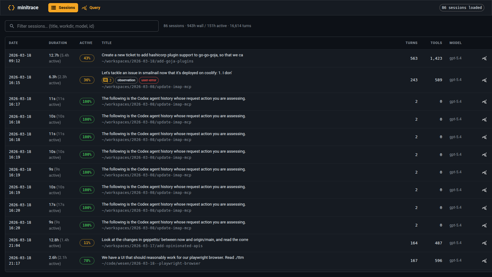
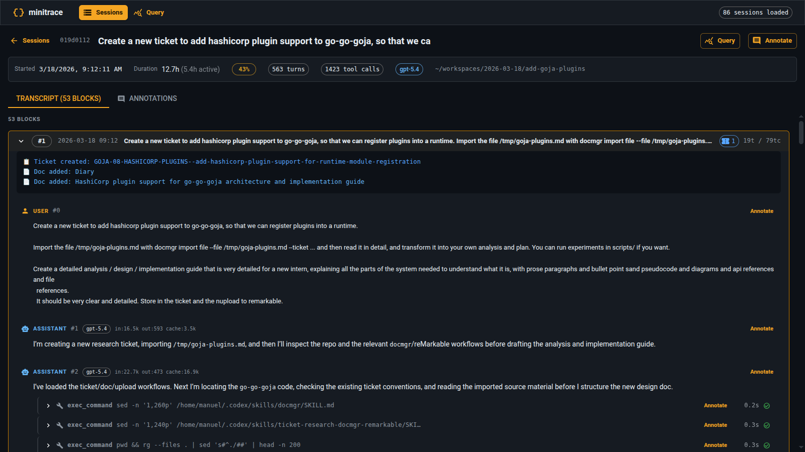
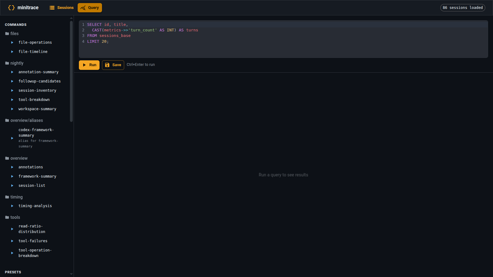
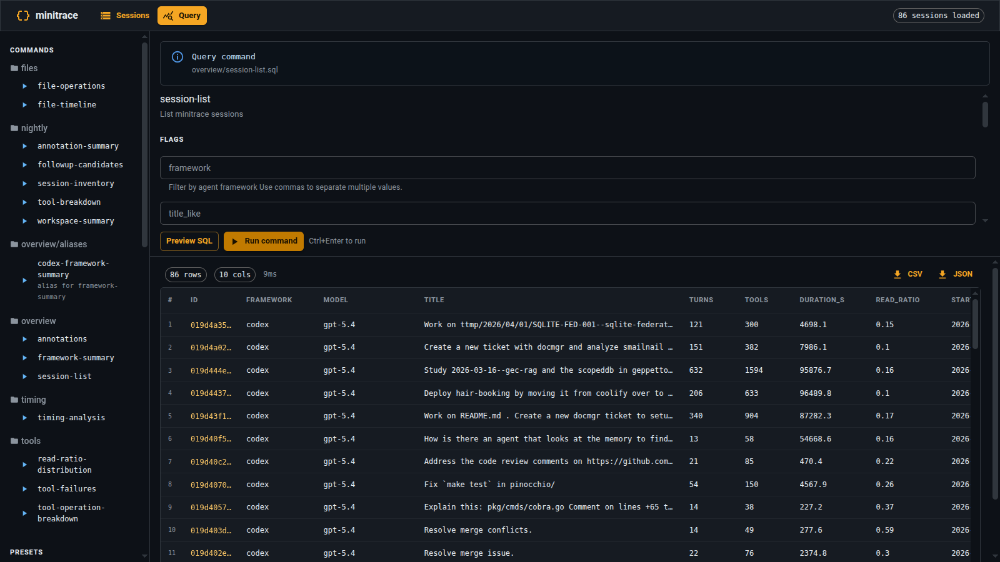

# go-minitrace

> **Turn months of AI agent sessions into answers — without drowning in JSON.**

**go-minitrace** is a Glazed-based Go port of [minitrace](https://github.com/fukami/minitrace) that converts session stores from Claude Code, Codex, Pi, claude.ai, ChatGPT, and Geppetto/Pinocchio into structured, queryable archives — then gives you SQL, JavaScript, and a web UI to actually make sense of them.

If you've ever tried to answer "what changed?" by scrolling through raw transcripts, you already know the problem. go-minitrace treats transcript analysis as a **reduction pipeline**, not a reading task.

---

## What it looks like

### Browse every session you've ever had



### Drill into a single conversation — complete with tool calls, annotations, and turns



### Query with SQL, run reusable commands, and explore your history programmatically



### Get results in milliseconds



---

## The three-layer funnel

The most effective way to use go-minitrace is not as "DuckDB over JSON" but as a **three-stage reduction pipeline**. Every stage should reduce entropy:

```
┌─────────────────────┐     ┌──────────────────┐     ┌──────────────┐
│  Native session     │────▶│  .minitrace.json │────▶│  DuckDB      │
│  stores (noisy)     │     │  archives        │     │  table       │
└─────────────────────┘     └──────────────────┘     └──────────────┘
                                                              │
                              ┌─────────────────┐             │
                              │  SQL leaves     │◀────────────┘
                              │  (filter/search)│
                              └────────┬────────┘
                                       │
                              ┌────────▼────────┐
                              │  JS summarizers │
                              │  (explain to    │
                              │   humans)       │
                              └────────┬────────┘
                                       │
                              ┌────────▼────────┐
                              │  Compact        │
                              │  evidence /     │
                              │  next hypothesis│
                              └─────────────────┘
```

1. **Inventory** — Find the 4 sessions that matter, not the 400 that don't.
2. **Extract** — Pull only the tool calls that carry evidence (bash logs, file touches, git history).
3. **Summarize** — Turn raw rows into a chronological narrative a human can act on.

This is how you answer questions like:

- *"Did this transport stack ever work before?"*
- *"Which files were touched when behavior changed?"*
- *"What did the earlier investigator believe, and what evidence did they use?"*

---

## Install

### Homebrew

```bash
brew tap go-go-golems/go-go-go
brew install go-minitrace
```

### Go install (from source)

```bash
go install github.com/go-go-golems/go-minitrace/cmd/go-minitrace@latest
```

### Building from a checkout

The embedded web UI is refreshed via `go generate` — no separate manual frontend step.

```bash
go generate ./...
go build ./...
```

---

## Quick start

### 1. Discover what you have

```bash
# Find Claude Code sessions
go-minitrace discover claude-code --source-dir ~/.claude/projects

# Find Codex sessions
go-minitrace discover codex --source-dir ~/.codex

# Find Pi sessions
go-minitrace discover pi --source-dir ~/.pi/agent/sessions
```

### 2. Convert to queryable archives

```bash
go-minitrace convert claude-code --source-dir ~/.claude/projects --output-dir ./output
go-minitrace convert codex --source-dir ~/.codex --output-dir ./output
go-minitrace convert pi --source-dir ~/.pi/agent/sessions --output-dir ./output
go-minitrace convert claude-ai --source ~/Downloads/data-2026-03-29-11-53-11-batch-0000.zip --output-dir ./output
go-minitrace convert chatgpt --source ~/Downloads/chatgpt-export.zip --output-dir ./output
go-minitrace convert turnsdb --source /tmp/turns.db --output-dir ./output
```

### 3. Query with built-in commands

```bash
go-minitrace query commands overview session-list \
  --archive-glob './output/active/*/*.minitrace.json'

go-minitrace query commands overview framework-summary \
  --archive-glob './output/active/*/*.minitrace.json'
```

### 4. Start the web UI

```bash
go-minitrace serve --archive-glob './output/active/*/*.minitrace.json'
# open http://localhost:8080
```

### 5. Run ad-hoc DuckDB SQL

```bash
go-minitrace query duckdb \
  --archive-glob './output/active/*/*.minitrace.json' \
  --preset session-list

go-minitrace query duckdb \
  --archive-glob './output/active/*/*.minitrace.json' \
  --sql 'SELECT COUNT(*) AS sessions FROM sessions_base'
```

---

## Why this exists: a real case study

A recent Loupedeck investigation showed why raw transcript reading fails and how go-minitrace succeeds.

**The symptom:** a runtime failure late in the startup sequence:

```text
INFO Connect successful resp="... Status:101 Switching Protocols ..."
INFO Sending reset.
...
WARN Read error, exiting error="websocket: bad opcode 4"
```

The error was *late enough* to imply partial success — the device was found, the handshake completed, reset and brightness setup happened, and only then the read loop died. The question was not "did anything ever work?" but "what changed after it did?"

By converting only the relevant sessions and applying the three-layer funnel:

1. **Inventory** surfaced 4 high-signal sessions from dozens of candidates.
2. **Bash keyword search** recovered an older successful runtime log showing the exact sequence that used to work.
3. **File-touch search** narrowed the problem to `pkg/device/listen.go`, `pkg/device/display.go`, and `cmd/loupedeck/cmds/run/*`.
4. **JS timeline builder** produced a compact chronological narrative without forcing anyone to re-read hundreds of turns.

The result: a bounded set of files and sessions to investigate, instead of a vague sense that "something happened over a week."

> *"A transcript cannot directly prove the precise runtime cause of today's bug. What it can do very well is establish a historical baseline, identify the sessions where code was actively changed, surface the key files and commit neighborhoods, and rule out large classes of wrong assumptions."*

---

## Structured query commands (the good stuff)

Beyond ad-hoc SQL, go-minitrace supports **repository-backed structured query commands**. Your repository layout becomes your CLI:

```text
query-commands/
└── loupedeck/
    ├── bash-keyword-search.sql
    ├── file-touch-search.sql
    └── analysis/
        └── protocol-timeline.js
```

These become:

```bash
go-minitrace query commands loupedeck bash-keyword-search --keyword 'websocket'
go-minitrace query commands loupedeck analysis protocol-timeline --session-id 114cf5a5
```

SQL files become leaves directly. JS files add one grouping level based on the filename stem. This means your investigation's command repo is its own reproducible toolkit.

### Working rules that actually help

- **Every investigation gets a ticket-local `scripts/query-commands/` repository.** Don't leave useful commands in shell history.
- **Start with two SQL leaves before writing any JS:** a bash keyword search and a file-touch search.
- **Use JS only for summary-shaped outputs.** If it's basically a single query, keep it in SQL.
- **Prefix helper-only top-level JS functions with `_`** to prevent the scanner from treating them as command surfaces.

### Minimal SQL command

```sql
/* sqleton
name: session-list
short: List minitrace sessions
flags:
  - name: framework
    type: stringList
    help: Filter by agent framework
  - name: limit
    type: int
    default: 100
    help: Limit the number of rows returned
*/
SELECT
  id,
  environment->>'agent_framework' AS framework,
  title
FROM {{TABLE_NAME}}
WHERE 1=1
{{ if .framework -}}
AND (environment->>'agent_framework') IN ({{ .framework | sqlStringIn }})
{{ end -}}
ORDER BY timing->>'started_at' DESC
LIMIT {{ .limit }};
```

For full usage and authoring, run:

```bash
go-minitrace help structured-query-commands
go-minitrace help js-api-reference
go-minitrace help writing-duckdb-queries
go-minitrace help duckdb-query-recipes
go-minitrace help analysis-guide
```

---

## Annotations

Minitrace sessions support an `annotations` array for human-authored metadata on sessions, turns, and tool calls. Annotations live in a parallel SQLite database and can be written via CLI or HTTP API, then synced back to `.minitrace.json` source files.

### Storage model

- **Working store**: `outputDir/annotations.db` (SQLite, WAL mode)
- **Source of truth**: `.minitrace.json` files (modified only via `annotate sync`)
- **DuckDB integration**: annotations attached live via DuckDB's `sqlite_scanner` extension

### CLI

```bash
# Add annotation
go-minitrace annotate add \
  --output-dir ./output \
  --session sess-001 \
  --category ai-failure \
  --title "Authentication failure in tool call" \
  --taxonomy-minitrace F-AUT \
  --tags auth,regression

# List / edit / delete / sync
go-minitrace annotate list --output-dir ./output
go-minitrace annotate edit --id <id> --title "Updated title"
go-minitrace annotate delete --id <id>
go-minitrace annotate sync --output-dir ./output
go-minitrace annotate sync --output-dir ./output --dry-run
```

### Categories

`observation`, `ai-failure`, `user-error`, `environment-issue`, `success`, `question`, `to-discuss`, `to-improve`

### Serve + HTTP API

When `serve` is started with an `--archive-glob`, it automatically attaches the annotations database.

```bash
go-minitrace serve --archive-glob './output/active/*/*.minitrace.json'
```

| Method | Path | Description |
|--------|------|-------------|
| GET | `/api/v2/sessions/{id}/annotations` | List annotations for session |
| POST | `/api/v2/sessions/{id}/annotations` | Create annotation |
| GET | `/api/v2/annotations` | List all (filter: `?session=&category=&annotator=`) |
| PUT | `/api/v2/annotations/{annId}` | Patch annotation |
| DELETE | `/api/v2/annotations/{annId}` | Delete annotation |
| POST | `/api/v2/annotations/sync` | Sync SQLite → .minitrace.json |

For a full operator workflow, see:

```bash
go-minitrace help annotation-playbook
```

---

## Development

```bash
make lint
make test
make build
```

Pre-commit hooks via `lefthook`:

```bash
lefthook install
```

Snapshot release:

```bash
make goreleaser
```

---

## Security notes

Treat CLI output, logs, and exported data as sensitive until you've reviewed what the tool emits.

---

## License

MIT. See `LICENSE`.

---

> *"The investigator who succeeds is not the one who can stare at the most JSON. It is the one who can build the smallest trustworthy set of tools that turns historical noise into current leverage."*
