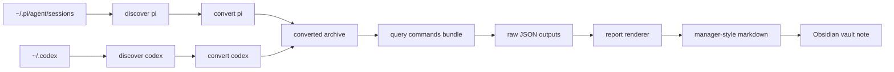

This playbook describes the nightly workflow used to turn the previous day’s Pi and Codex sessions into a manager-style technical report. The core idea is to avoid one giant SQL query and instead use a small, repeatable analysis bundle: discover the sessions, convert them, run reusable query commands, inspect annotations, and synthesize the results into a narrative report.

The workflow is designed to be resumable. If the report is too large for one context window, each stage leaves behind artifacts that can be revisited later: source lists, a converted archive, raw query JSON, and the final markdown writeup.

> [!summary]
> - Discover and convert the previous day’s Pi/Codex sessions first; do not try to summarize raw session files directly.
> - Use a fixed query bundle for the day’s story: session inventory, workspace summary, tool breakdown, follow-up candidates, and annotation summary.
> - Treat annotations as part of the report workflow: read them in the nightly pass, and only write/sync them when you want the archive updated.

## When to use this playbook

Use this playbook when you want to answer the question:

> “What did the team actually accomplish yesterday, what got stuck, and what should a manager know?”

It is especially useful when the prior day contains:

- one or two very large workstreams,
- a mix of infrastructure, code, and investigation work,
- transcript quality issues that need to be called out explicitly,
- or follow-up sessions that should be handed to the next review window.

## The mental model

A nightly review is not a single report generation step. It is a pipeline:



The important detail is that each step captures reusable evidence:

- discovery gives you the source file lists,
- conversion creates a queryable archive,
- query commands produce structured tables,
- the renderer turns those tables into prose,
- and annotations let the next window pick up from where you left off.

## Standard command sequence

The ticket-local workflow used this sequence:

1. discover yesterday’s Pi sessions
2. discover yesterday’s Codex sessions
3. convert the matching Pi sessions one by one
4. stage Codex files into a temporary `.codex`-shaped tree and convert them
5. run the query bundle with structured query commands
6. render the markdown report
7. review follow-up candidates and annotations
8. store the final note in the vault

A concrete command bundle looks like this:

```bash
DAY=2026-04-16
WORKDIR=/tmp/nightly-review-run

# discovery
go-minitrace discover pi --source-dir ~/.pi/agent/sessions --output json
go-minitrace discover codex --source-dir ~/.codex --output json

# conversion
go-minitrace convert pi --source-session /path/to/session.jsonl --output-dir "$WORKDIR/$DAY/output"
go-minitrace convert codex --source-dir "$WORKDIR/$DAY/codex-stage/.codex" --output-dir "$WORKDIR/$DAY/output"

# query bundle
go-minitrace query commands nightly session-inventory \
  --archive-glob "$WORKDIR/$DAY/output/active/*/*.minitrace.json" \
  --day "$DAY" \
  --output json
```

## The reusable query bundle

These are the canonical embedded commands under `pkg/minitracecmd/core/nightly/`. They are now exposed through the `nightly` subverb, which is what makes them proper reusable minitracecmd commands instead of a ticket-local query bundle.

| Query command | What it answers | Why it is useful in a nightly review | Flexibility worth adding later |
| --- | --- | --- | --- |
| `nightly session-inventory` | Which sessions belong in the day’s review? | Gives the canonical session list with framework, model, title, duration, turns, tool count, and read ratio. | Add filters for `workspace_like`, `model_like`, `source_format`, `min_turns`, `min_tools`, and `limit_by_framework`. |
| `nightly workspace-summary` | What work happened in each workspace? | Turns a flat session list into a story-by-workspace breakdown. | Add `top_n`, `workspace_like`, and maybe a prefix/grouping mode for family-level summaries. |
| `nightly tool-breakdown` | Were we reading, editing, or executing? | Tells the report whether the day was tool-heavy, read-heavy, or edit-heavy. | Add `operation_like`, `group_by_framework`, and a per-session breakdown for deep dives. |
| `nightly followup-candidates` | Which sessions should the next window inspect? | Surfaces long, tool-heavy, or research-heavy sessions that deserve more detail. | Add `min_read_ratio`, `workspace_like`, `title_like`, and perhaps a `top_n` per workspace. |
| `nightly annotation-summary` | What annotations already exist for the day? | Bridges the review workflow with the annotation system so the next window can continue from live notes. | Add `category`, `scope_type`, `title_like`, and `only_session_scoped` filters. |

The canonical invocation pattern is now:

```bash
go-minitrace query commands nightly session-inventory \
  --archive-glob './output/active/*/*.minitrace.json' \
  --day 2026-04-16 \
  --output json
```

The same shape is repeated for the workspace summary, tool breakdown, follow-up candidate, and annotation summary commands.

This is worth preserving because it makes the query bundle easy to rerun in a later window without rethinking the execution model.

## How the report gets written

After the query bundle finishes, the renderer turns the JSON outputs into the final human-readable report.

Typical rendering inputs:

- `pi-sources.txt`
- `codex-sources.txt`
- `report/session-inventory.json`
- `report/workspace-summary.json`
- `report/tool-breakdown.json`
- `report/followup-candidates.json`
- `report/annotation-summary.json`

The renderer then produces the final markdown report, which can be copied into the Obsidian vault as a durable summary.

## Annotations in the nightly workflow

The nightly review does **not** have to write annotations. In the run that produced the manager-style report, it only read annotations that already existed in the archive.

That said, the annotation system is part of the workflow because it gives the next review window a handoff point.

### The annotations actually used in the review

These were the annotations surfaced by the nightly annotation summary:

| Session | Scope | Category | Title | Why it mattered |
| --- | --- | --- | --- | --- |
| `045ccd1a-c605-4d4e-a531-956b32f35134` | `session` | `observation` | `Deduplicated 9 duplicate tool calls` | Showed transcript noise and deduplication in the Pi session. |
| `045ccd1a-c605-4d4e-a531-956b32f35134` | `tool_call` | `observation` | `Tool call edit never received result` | Captured a concrete missing-result anomaly. |
| `9686b654-654f-4e70-a24f-d5a62581d038` | `session` | `observation` | `Deduplicated 62 duplicate tool calls` | Showed another noisy transcript that needed deduplication. |

These annotations were useful because they explained why the transcript data should be treated carefully and why the report should not pretend the source data was perfectly clean.

### If you do want to add annotations for the next pass

Use the annotation CLI first, then sync the archive before querying it again:

```bash
go-minitrace annotate add --output-dir ./output --session <SESSION_ID> --category observation --title "Needs follow-up"
go-minitrace annotate sync --output-dir ./output --session <SESSION_ID>
```

That keeps the working store and the JSON archive in sync.

## Suggested flexible query additions

If you want future nightly reviews to be more reusable, the first improvements I would make are:

1. **Workspace filtering**
   - `--workspace_like`
   - `--workspace_prefix`
   - `--workspace_group`

2. **Complexity filters**
   - `--min_tools`
   - `--min_turns`
   - `--min_hours`
   - `--min_read_ratio`

3. **Finer session filters**
   - `--model_like`
   - `--title_like`
   - `--source_format`
   - `--framework`

4. **Review output controls**
   - `--limit`
   - `--top_n`
   - `--group_limit`
   - `--include_zero_codex`

Those flags would let a future nightly review answer narrower management questions without editing the SQL.

## Good failure modes to keep explicit

A good nightly review should call out these conditions when they happen:

- no Codex sessions found for the day,
- one long-running session crossing midnight,
- transcript deduplication or missing tool results,
- or a build/tooling blocker that prevents a fresh rerun.

The value of the report is not just in what happened; it is also in what was noisy, blocked, or partially complete.

## A practical operator checklist

1. Discover Pi and Codex sessions for the target day.
2. Convert the discovered sessions into a temporary archive.
3. Run the reusable query bundle.
4. Inspect workspace summary first, then follow-up candidates.
5. Check the annotation summary for anomalies or previously marked issues.
6. Write the narrative report.
7. Store the final writeup in the Obsidian vault.

## Related commands to remember

- `go-minitrace discover pi`
- `go-minitrace discover codex`
- `go-minitrace convert pi`
- `go-minitrace convert codex`
- `go-minitrace query commands nightly session-inventory`
- `go-minitrace query commands nightly workspace-summary`
- `go-minitrace query commands nightly tool-breakdown`
- `go-minitrace query commands nightly followup-candidates`
- `go-minitrace query commands nightly annotation-summary`
- `go-minitrace annotate add`
- `go-minitrace annotate sync`
- `go-minitrace validate`

## Bottom line

The nightly review playbook should stay focused on one thing: producing a readable management report from the previous day’s transcript work without losing the evidence trail. The best version of the workflow is the one that can be resumed in another window with the same query bundle, the same output files, and the same interpretation rules.
