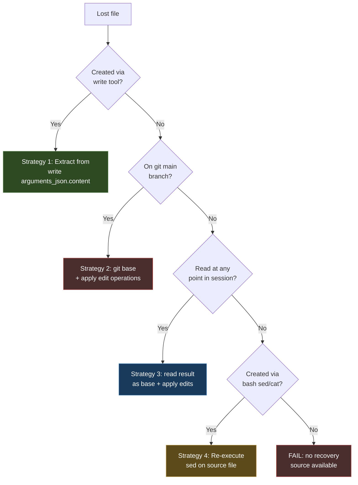

# Transcript File Recovery

## Purpose

Use this skill to reconstruct lost source files from coding-agent session
transcripts. The standard sequence is:

1. Confirm the loss and identify what needs recovering.
2. Discover all sessions that worked in the lost directory.
3. Convert sessions to go-minitrace archives.
4. Query for file-creating and file-modifying tool calls.
5. Reconstruct files using the appropriate recovery strategy per file.
6. Verify the reconstruction (build, vet, test, functional).
7. Commit and push the recovered code.

The key insight is that coding-agent transcripts record the full arguments
and results of every tool call. A `write` tool call stores complete file
content. An `edit` tool call stores `oldText`/`newText` diff fragments. A
`read` tool call stores the complete content of the file at read time. A
`bash` command stores the full command string. These four data sources,
queried with SQL and replayed in order, are sufficient to reconstruct files
that exist nowhere else.

This skill builds on `go-minitrace-transcript-analysis` (which covers
discovery, conversion, and the normalized schema). Load it for the
discovery and conversion stages.

## When to use this skill

- A working directory was accidentally deleted and the code was not pushed to a remote.
- A local branch with uncommitted or unpushed work was lost.
- A file was overwritten or corrupted and needs to be restored to a known state.
- You need to audit what an agent session wrote to disk (even if no loss occurred).

## When NOT to use this skill

- The code was pushed to a remote. Use `git clone` and `git checkout` instead.
- The code is in the local `.git` directory (reflog, dangling commits). Use `git fsck --lost-found` first.
- The code was never touched by a coding agent. Transcripts only contain what the agent did.

## The four recovery strategies

Each file in a repository is created or modified through one of four tool
call patterns. Each pattern requires a different recovery strategy.

| Strategy | Tool call | Data source | When to use | Completeness |
|----------|-----------|-------------|-------------|--------------|
| 1. Write extraction | `write` (NEW) | `arguments_json.content` | File was created from scratch by the agent | Complete and exact |
| 2. Edit replay on git base | `edit` (MODIFY) on a file that exists on git `main` | git base + sequential `oldText`/`newText` application | File existed before the session and was only modified | Complete if base matches agent's state |
| 3. Read result + edit replay | `read` (READ) + `edit` (MODIFY) | `result` column as base state + subsequent edits | File was only edited, never created via `write`, not on git | Complete for post-read state |
| 4. Bash sed re-execution | `bash` (EXECUTE) with `sed`/`cat` | Re-execute the captured command against the source file | File was created by transforming another file via `sed` | Structurally correct; may need manual fixes |



## Workflow

### 1. Confirm the loss and check git first

Before querying transcripts, check whether the code is recoverable from git:

```bash
# Check if the branch was pushed to any remote
git clone <remote-url> /tmp/repo-check
cd /tmp/repo-check
git branch -a  # look for the lost branch

# Check for dangling commits in the local repo (if .git survives)
git fsck --lost-found
git reflog  # may show the lost commits
```

If git recovery fails, proceed to transcript recovery.

### 2. Discover all sessions that worked in the lost directory

Use `go-minitrace discover` to find sessions by working directory and time
window. Use `--active-since` (not `--since`) when looking for sessions that
recorded activity in a time window, including older sessions.

```bash
# Pi sessions
go-minitrace discover pi \
  --active-since 2026-07-01 \
  --cwd-contains <repo-dir-fragment> \
  --output json > sources/01-pi-discovery.json

# Claude Code sessions
go-minitrace discover claude-code \
  --source-dir ~/.claude/projects \
  --cwd-contains <repo-dir-fragment> \
  --output json > sources/02-claude-discovery.json

# Codex sessions
go-minitrace discover codex \
  --output json > sources/03-codex-discovery.json
```

The `cwd` field in the discovery output is the session's working directory.
Filter for sessions whose `cwd` contains the lost directory path fragment.

Save the source paths to a file for conversion:

```bash
python3 -c "
import json
d = json.load(open('sources/01-pi-discovery.json'))
for s in d:
    print(s['source_path'])
" > sources/pi-source-list.txt
```

### 3. Convert sessions to archives

```bash
go-minitrace convert pi --source-list sources/pi-source-list.txt --output-dir ./archives
go-minitrace convert claude-code --source-list sources/claude-source-list.txt --output-dir ./archives
```

This produces `.minitrace.json` files under `archives/active/` (or
`archives/<framework>/active/` depending on the version).

### 4. Query for file-creating and file-modifying tool calls

Use `go-minitrace query run` with SQL to find all `NEW` and `MODIFY`
operations. The `--max-cell-chars` flag is critical: the default truncation
is too small for file contents. Set it to at least `100000`.

#### 4a. Find write/edit operations

```sql
-- 01-write-operations.sql
SELECT
  session_id,
  emitting_turn_index AS turn_index,
  tool_name,
  operation_type,
  file_path,
  arguments_json
FROM tool_calls
WHERE operation_type IN ('NEW', 'MODIFY')
  AND lower(coalesce(file_path, '')) LIKE '%<keyword>%'
ORDER BY session_id, emitting_turn_index;
```

```bash
go-minitrace query run \
  --archive-glob 'archives/*/*/*.minitrace.json' \
  --sql-file scripts/01-write-operations.sql \
  --output json --max-cell-chars 100000 \
  > sources/write-operations.json
```

#### 4b. Find bash file modifications (sed, cat, heredocs)

Files created by `bash` commands (`sed`, `cat >`, heredocs) do not appear
in `write`/`edit` tool call results. Query for them separately:

```sql
-- 04-bash-edits.sql
WITH exec_calls AS (
  SELECT
    session_id,
    emitting_turn_index AS turn_index,
    coalesce(nullif(command, ''),
             json_extract(arguments_json, '$.command'),
             json_extract(arguments_json, '$.input'),
             arguments_json) AS command_text
  FROM tool_calls
  WHERE tool_name IN ('bash', 'exec', 'exec_command', 'shell')
)
SELECT session_id, turn_index, command_text
FROM exec_calls
WHERE command_text LIKE '%sed -i%'
  OR command_text LIKE '%cat >%'
  OR command_text LIKE '%cat <<%'
  OR command_text LIKE '%git apply%'
  OR command_text LIKE '%patch %'
ORDER BY turn_index;
```

#### 4c. Find read operations for edited-only files

If a file has `edit` operations but no `write` operation and is not on git,
look for `read` operations. The `read` tool's `result` column contains the
full file content at the time of the read:

```sql
-- extract-read-results.sql
SELECT
  emitting_turn_index AS turn_index,
  file_path,
  result
FROM tool_calls
WHERE tool_name = 'read'
  AND lower(coalesce(file_path, '')) LIKE '%<filename>%'
ORDER BY emitting_turn_index;
```

### 5. Reconstruct files

#### Strategy 1 + 2: Write extraction and edit replay

The bundled script `scripts/reconstruct-files.py` handles both strategies.
It groups tool calls by file path, orders them by turn index, finds the
first `write` (NEW) to initialize content, then applies `edit` (MODIFY)
operations sequentially:

```bash
python3 scripts/reconstruct-files.py \
  sources/write-operations.json \
  sources/recovered/
```

For files that exist on git `main` but were only edited (Strategy 2),
copy the git base into the recovery directory first, then run the script
with only the edit operations for that file.

#### Strategy 3: Read result as base state

Extract the `read` result as the base file content, then apply subsequent
`edit` operations:

```bash
# Extract read result to file
go-minitrace query run \
  --archive-glob 'archives/*/*/*.minitrace.json' \
  --sql-file scripts/extract-read-results.sql \
  --output json --max-cell-chars 100000 \
  > sources/read-results.json

# Save the read result as the base file, then apply edits
python3 -c "
import json
d = json.load(open('sources/read-results.json'))
for r in d:
    path = r['file_path'].split('repo-root/')[-1]
    with open(f'sources/recovered/{path}', 'w') as f:
        f.write(r['result'])
    print(f'Wrote {path} from read at t{r[\"turn_index\"]}')
"

# Then apply edits using the reconstruction script
python3 scripts/reconstruct-files.py \
  sources/edits-for-read-files.json \
  sources/recovered/
```

#### Strategy 4: Bash sed re-execution

Re-execute the captured `sed` command against the recovered source file:

```bash
# The sed command is in the bash query results.
# Re-run it, substituting the recovered source path:
sed -e 's/OldIdentifier/NewIdentifier/g' \
    -e 's|old-path|new-path|g' \
    sources/recovered/source-file.go > sources/recovered/target-file.go

# Then find and apply any edit operations the agent made AFTER the sed
python3 scripts/reconstruct-files.py \
  sources/edits-after-sed.json \
  sources/recovered/
```

### 6. Verify the reconstruction

Verification is non-negotiable. A reconstruction that compiles and passes
tests is the minimum evidence of correctness.

```bash
# Copy recovered files into a fresh clone
cp -r sources/recovered/* /path/to/clone/

# Build
cd /path/to/clone
go build ./... 2>&1 | head -20
echo "BUILD_EXIT=$?"

# Vet
go vet ./... 2>&1 | head -20
echo "VET_EXIT=$?"

# Test
go test ./... -count=1 2>&1 | tail -10
echo "TEST_EXIT=$?"

# Functional verification — run the binary and check command structure
go build -o /tmp/binary ./cmd/binary
/tmp/binary --help 2>&1 | grep -E "expected|commands"
```

If the build fails, the error messages identify which files need manual
fixes. Common causes:

- A `sed`-created file has wrong string literals (the `sed` transformed
  identifiers but missed string constants).
- An `edit` was silently skipped because `oldText` did not match.
- A file depends on another file that was not yet recovered.

### 7. Commit and push

```bash
git add -A
git commit -m "feat: recover lost source files from coding agent transcripts

Recovered from go-minitrace session transcripts after the original
working directory was deleted. Files reconstructed using write tool
arguments, edit replay, read tool results, and bash sed re-execution."
git push origin <branch>
```

## The reconstruction script

The bundled `scripts/reconstruct-files.py` is the core of the pipeline.
It reads a JSON array of tool call rows (from the SQL extraction) and
produces reconstructed files.

For each file:
1. Group all tool calls by normalized file path.
2. Order by `emitting_turn_index` (turn number).
3. Find the first `write` (NEW) operation — its `arguments_json.content`
   is the initial file content.
4. Apply each subsequent `edit` (MODIFY) operation — for each edit in
   `arguments_json.edits[]`, replace `oldText` with `newText` in the
   content (single replacement).
5. If `oldText` is not found, the edit is silently skipped (reported in
   diagnostic output).

The silent-skip behavior is deliberate: it allows partial recovery with
diagnostic output, rather than failing on the first mismatch. The skip
count per file is the primary quality signal. A skip count of zero means
the reconstruction is likely complete. A non-zero skip count means the
file needs manual review.

## Failure modes

### Silent-skip cascading

If edit A is skipped (its `oldText` does not match), the content does not
have A's changes. Edit B, which expects A's changes in its `oldText`, will
also be skipped. Skips cascade forward.

**Defense:** Check the skip count in the reconstruction output. For any
file with non-zero skips, inspect the skipped edits manually and apply
them if the `newText` is still needed.

### sed misses string literals

A `sed` command that transforms Go identifiers (`OldCommand` →
`NewCommand`) does not necessarily transform string literals like
`"old-command"` in `NewCommandDescription("old-command", ...)`. The
result compiles but registers the wrong command name.

**Defense:** Functional verification. Run the compiled binary and check
that the command structure matches expectations. A mismatch identifies
the file and the specific string that needs manual correction.

### Wrong base state for edit replay

If the git `main` branch version of a file does not match the state the
agent was editing (because the agent was on a divergent branch), the first
edit may fail to apply.

**Defense:** Check the skip count. If the first edit for a file is
skipped, the base state may be wrong. Look for a `read` operation of that
file in the transcript — the `read` result may provide the correct base
state (Strategy 3).

### Missing creation command

If a file was never created via `write`, never read, and not on git, it
cannot be recovered from transcripts. This is rare but possible if the
file was created by a mechanism go-minitrace does not capture (e.g., a
build tool, a file copy, or a session whose transcript is not available).

**Defense:** None. This is a hard limit of transcript-based recovery.

## What the transcript must capture

| Requirement | Why | go-minitrace column |
|-------------|-----|---------------------|
| Full `write` arguments | Files created from scratch | `arguments_json` (with `--max-cell-chars 100000`) |
| Full `edit` arguments | File modifications as diffs | `arguments_json` |
| Full `read` results | Base state for edited-only files | `result` |
| Full `bash` commands | `sed`/`cat` file creation | `arguments_json` (`command` field) |
| Turn ordering | Edits must be applied in order | `emitting_turn_index` |
| Session working directory | Scoping discovery | `cwd` in discovery output |
| Tool call success/failure | Exclude failed writes | `success` column |

A transcript system that truncates `arguments_json` or `result` makes
recovery impossible for large files. Always use `--max-cell-chars 100000`
or higher when extracting for recovery.

## Key points

- Four recovery strategies cover all cases where the transcript recorded the
  tool call: `write` extraction, `edit` replay on git base, `read` result as
  base state, and `bash` `sed` re-execution.
- The `read` tool result is the key insight for files that were only edited
  (never created via `write` and not on git). The `result` column contains
  complete file content at read time.
- Always use `--max-cell-chars 100000` when extracting tool call arguments
  for recovery. The default truncation is too small for file contents.
- The reconstruction script's silent-skip behavior is deliberate. Check the
  skip count per file — non-zero skips indicate files needing manual review.
- `sed`-created files are structurally correct but may miss string literal
  transformations. Functional verification (running the binary) catches
  these mismatches.
- Verification is non-negotiable: build, vet, test, and functional check.
  A reconstruction that compiles and passes tests is minimum evidence.
- Transcript recovery is a safety net, not a version control strategy.
  Push branches early and often.

## Bundled scripts

- `scripts/reconstruct-files.py` — the core reconstruction script. Groups
  tool calls by file, applies write-then-edit replay, reports skip counts.
- `scripts/01-write-operations.sql` — SQL template for finding NEW/MODIFY
  operations targeting specific file patterns.
- `scripts/04-bash-edits.sql` — SQL template for finding bash sed/cat/heredoc
  file modifications.
- `scripts/extract-read-results.sql` — SQL template for extracting read tool
  results as base states for edited-only files.

## References

- Read `references/recovery-strategies.md` for detailed examples of each
  strategy, including the surf-cli recovery case study (29 files, 7,051
  lines recovered from 4 Pi sessions).

## Related skills

- `go-minitrace-transcript-analysis` — load for discovery, conversion, and
  the normalized schema. This skill builds on it.
- `transcript-doc-friction-analysis` — for analyzing documentation friction
  in transcripts (a different use case, but same tooling).
