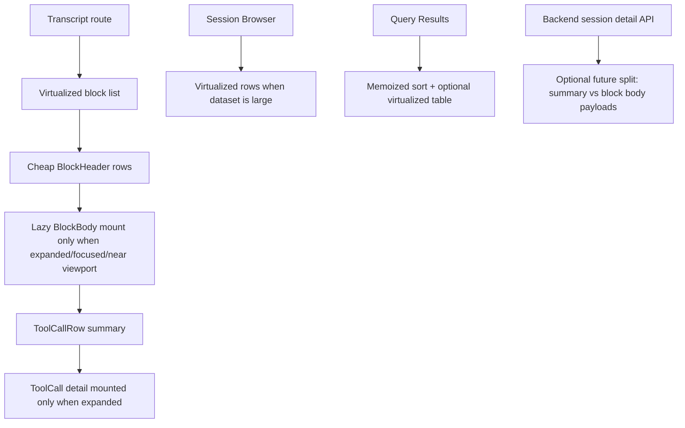

# Transcript viewer and web UI performance optimization study and implementation guide

## Executive Summary

This document studies the current performance shape of the `go-minitrace` web UI and proposes a phased optimization plan, with special attention to the transcript viewer. The most important finding is that the transcript route is qualitatively different from the rest of the app: it renders a much larger React tree, materializes many more DOM nodes, and does more work per visible record than either the Session Browser or the Query Editor.

A repeatable Playwright baseline script added during this ticket measured the following on the current local dev stack (`http://127.0.0.1:5174` frontend, `http://127.0.0.1:8080` backend), using a real session with 32 blocks, 243 turns, and 589 tool calls:

- Session Browser mean initial load: **~612 ms**
- Query Editor mean initial load: **~134 ms**
- Transcript mean initial load: **~3958 ms**
- Transcript tab switch to Annotations: **~1527 ms**
- Back to Transcript: **~66 ms** on the current local state
- Transcript DOM node count after initial render: **~15,479 nodes**

The central conclusion is that the app does not have one global performance problem. It has one dominant performance hotspot — the transcript tree — and two secondary scalability risks:

1. the Session Browser renders all rows in one table without virtualization,
2. the Query Results table sorts and renders the full result set on every render path.

The transcript problem should be addressed in layered phases:

1. **mount hygiene and lazy subtree rendering**,
2. **collapsed-content unmounting**,
3. **header/body split for blocks**,
4. **block-list virtualization**,
5. optional **backend response shaping** if frontend wins are not sufficient.

The highest-value short-term optimization is to ensure that collapsed block and tool-call content is not mounted at all until needed. The highest-value structural optimization is transcript block virtualization.

## Problem Statement

The user-reported problem is that transcript rendering feels slow, especially when navigating large sessions and switching between the transcript and annotations tabs. A concrete example was a real session at:

```text
/sessions/019d0295-d06b-7033-b154-a991a94672b6?tab=transcript
```

The requirement is not only to fix one symptom. The requirement is to understand the performance shape of the app well enough that future optimizations do not become guesswork.

That means the study must answer:

1. Which parts of the app are actually expensive today?
2. Which costs are frontend rendering costs versus data-shaping or transport costs?
3. Which optimizations are cheap and safe?
4. Which optimizations are structurally stronger but more invasive?
5. What should a new intern work on first without destabilizing the product?

The scope of this ticket therefore includes the whole web UI, but it prioritizes the transcript viewer because that is where user pain and measured cost are both highest.

## Scope

### In scope

- route-level performance in the React SPA
- transcript viewer rendering cost
- Session Browser scalability risks
- Query Editor / ResultsTable scalability risks
- server-side shaping work that affects UI latency
- measurement tooling that can be rerun later

### Out of scope

- backend SQL engine optimization for analytical queries themselves
- database tuning unrelated to web UI responsiveness
- code-splitting or bundle optimization as a primary focus
- non-web CLI performance
- speculative micro-optimizations without evidence

## Current-State Architecture

This section explains the relevant parts of the application so a new intern knows where performance work actually lives.

### Route structure

The web app uses `BrowserRouter` with three page routes in `/home/manuel/code/wesen/corporate-headquarters/go-minitrace/web/src/App.tsx`:

- `/sessions` → Session Browser
- `/sessions/:sessionId` → Transcript Viewer
- `/query` → Query Editor

This is a small route tree. That is good news for performance work because most costs are concentrated in a few components rather than spread across a large app shell.

### Data flow

At a high level, the app works like this:

```mermaid
flowchart LR
    A[Browser route] --> B[RTK Query hook]
    B --> C[/api endpoint]
    C --> D[Go serve handler]
    D --> E[Session index / DuckDB / annotations store]
    E --> D
    D --> C
    C --> B
    B --> F[React component tree]

    subgraph transcript_route [Transcript route]
      F --> G[TranscriptViewer]
      G --> H[BlockCard x N]
      H --> I[Turn rows x many]
      I --> J[ToolCallRow x many]
    end
```

The important fact is that the transcript route is not just “one more page.” It is a nested tree where a single page can contain:

- dozens of blocks,
- hundreds of turn rows,
- hundreds of tool call rows,
- multiple levels of MUI components,
- tooltips, chips, collapse regions, formatted timestamps, and inline affordances.

That is the path most likely to be slow.

### Transcript data shaping on the backend

The server does not send raw session JSON directly to the transcript route. The transcript page loads a session detail object from `handleGetSession` in `/home/manuel/code/wesen/corporate-headquarters/go-minitrace/cmd/go-minitrace/cmds/serve/handlers_sessions.go`.

Important evidence:

- `handleGetSession` loads the full session by ID and writes `normalizeSessionDetail(session)` (`handlers_sessions.go:194-213`)
- `normalizeSessionDetail(session)` includes `Blocks: buildSessionBlocks(session)` (`handlers_sessions.go:275-284` in the full file)
- `buildSessionBlocks` walks the entire turn list and the entire tool-call set to construct block-oriented transcript data (`blocks.go:23-50`, `blocks.go:53-103`)

That means every transcript page load already pays for server-side block construction before the browser starts rendering.

### Transcript composition on the frontend

The React composition path is:

```text
TranscriptViewerPage
  -> TranscriptViewer
    -> BlockCard (one per block)
      -> turn rows (one per turn in the block)
        -> ToolCallRow (one per rendered tool call)
```

Concrete files:

- `web/src/pages/TranscriptViewerPage.tsx`
- `web/src/components/TranscriptViewer/TranscriptViewer.tsx`
- `web/src/components/TranscriptViewer/BlockCard.tsx`
- `web/src/components/TranscriptViewer/ToolCallRow.tsx`
- `web/src/components/TranscriptViewer/AnnotationPanel.tsx`

The expensive part is not the route shell. It is the multiplication factor of block → turn → tool call.

### Session Browser composition

The Session Browser is much flatter:

- fetch all sessions once,
- filter them in memory,
- render them into a MUI table.

This route is substantially simpler, but it still renders all filtered rows in one table (`SessionBrowser.tsx:97-220`). That is acceptable for dozens of rows and risky for hundreds or thousands.

### Query page composition

The Query Editor itself is not currently the biggest interactive hotspot, but two things stand out:

1. the page polls preset and saved query endpoints every 3 seconds (`QueryEditorPage.tsx:31-40`),
2. `ResultsTable` sorts the entire result array on every render path (`ResultsTable.tsx:85-97`) and renders every visible row without virtualization (`ResultsTable.tsx:141-176`).

These are not the first problems to solve, but they are real future scaling concerns.

## Measured Baseline

This ticket adds a measurement script:

- `/home/manuel/code/wesen/corporate-headquarters/go-minitrace/ttmp/2026/04/06/TRANSCRIPT-PERF-001--transcript-viewer-and-web-ui-performance-optimization-study/scripts/01-web-ui-baseline-perf.mjs`

and one captured output file:

- `/home/manuel/code/wesen/corporate-headquarters/go-minitrace/ttmp/2026/04/06/TRANSCRIPT-PERF-001--transcript-viewer-and-web-ui-performance-optimization-study/sources/01-baseline-measurements.json`

### Measurement method

The script uses Playwright against a running dev stack to measure:

- Session Browser initial load
- Transcript initial load
- Transcript tab switch to Annotations
- switch back to Transcript
- Query page initial load
- rough DOM node counts

This is not a full Chrome trace or React Profiler capture. It is a lightweight, rerunnable baseline intended to support ticket-level reasoning and future before/after comparisons.

### Baseline target session

The measured session was:

- session ID: `019d0295-d06b-7033-b154-a991a94672b6`
- 32 blocks
- 243 turns
- 589 tool calls
- model: `gpt-5.4`

### Baseline results

| Surface | Mean load / transition time |
|---------|-----------------------------|
| Session Browser initial load | ~612 ms |
| Transcript initial load | ~3958 ms |
| Transcript → Annotations | ~1527 ms |
| Annotations → Transcript | ~66 ms |
| Query Editor initial load | ~134 ms |

Additional observation from the last transcript run:

- Transcript DOM nodes: ~15,479
- Session Browser DOM nodes: ~2,467
- Query page DOM nodes: ~346

### Interpretation

These numbers support three conclusions:

1. The transcript route is the dominant UI hotspot.
2. The Session Browser is not currently broken, but it will scale poorly without virtualization.
3. The Query Editor is currently fast enough at route load, but the ResultsTable implementation has predictable future costs for very large results.

The low back-to-transcript time (~66 ms) on the current local stack also suggests that one specific regression — full transcript remount on tab switch — has already been partially mitigated in local state. That is useful context: the remaining performance problem is more about **initial heavy render cost** than only about tab toggling.

## Evidence-Backed Findings

## Finding 1: TranscriptViewer still renders one `BlockCard` per block up front

In `TranscriptViewer.tsx`, the transcript pane maps the entire `session.blocks` array into `BlockCard` components (`TranscriptViewer.tsx:362-374`).

That means the route always constructs the full block list for the current session, even though only a fraction of it is visible at a given scroll position.

Observed implication:

- large sessions pay a cost proportional to the number of blocks immediately,
- this cost grows again with any expanded block body cost.

This is the strongest frontend argument for virtualization.

## Finding 2: Block bodies are large and nested

`BlockCard.tsx` contains more than a lightweight block header. Inside the collapse region it renders:

- artifact summaries (`BlockCard.tsx:188-218`)
- every turn in the block (`BlockCard.tsx:221-340`)
- per-turn annotation chips and tooltips
- the visible subset of tool calls through `ToolCallRow`

This means the block component is not a cheap row. It is a composite transcript section. Even if many blocks are visually collapsed, if their content remains mounted then the app pays for far more work than the user can currently see.

## Finding 3: ToolCallRow contains heavy expanded subtrees

`ToolCallRow.tsx` renders a cheap summary row but also contains a detail panel with multiple `<pre>` blocks for command/output/error (`ToolCallRow.tsx:147-231`).

These are potentially large text payloads and expensive layout regions.

If expanded tool-call bodies remain mounted after first open, or if a large number of them are visible at once, the browser pays both React and layout cost repeatedly.

## Finding 4: Current collapse usage is a likely mount-hygiene bottleneck

The current transcript block and tool-call components both use MUI `Collapse`:

- `BlockCard.tsx:186`
- `ToolCallRow.tsx:148`

But they do not pass `unmountOnExit`.

That is a strong code-level signal that offscreen or collapsed content may remain mounted. This is one of the highest-value near-term optimization opportunities because it is small, localized, and unlikely to require architectural changes.

## Finding 5: Session Browser renders all rows without virtualization

`SessionBrowser.tsx` computes a filtered array and then renders every filtered session into a table row (`SessionBrowser.tsx:45-55`, `SessionBrowser.tsx:111-217`).

This is perfectly reasonable for 86 sessions, which is the measured current dataset. It becomes much riskier at 1,000+ sessions, especially because each row can also include annotation badges and formatted timestamps.

The current performance study does not show the Session Browser as the top bottleneck. It does show it as a clear scaling risk.

## Finding 6: ResultsTable does full-array sorting on render

`ResultsTable.tsx` builds `sortedRows` with:

```ts
const sortedRows = [...result.rows].sort(...)
```

(`ResultsTable.tsx:85-97`)

That means every render pays O(n log n) sorting cost for the full result set. The table then renders all rows (`ResultsTable.tsx:173-215`). This is fine for small results and increasingly expensive for large results.

This is a good candidate for a second wave of performance work after transcript rendering.

## Finding 7: QueryEditorPage polls every 3 seconds

`QueryEditorPage.tsx` polls both presets and saved queries every 3 seconds (`QueryEditorPage.tsx:31-40`). That behavior is intentional and useful, but it creates predictable re-render pressure for the query route.

This is not the dominant user-facing lag today. It is still part of the app-wide performance shape and should be considered if the query experience later feels noisy or unexpectedly expensive.

## Finding 8: Session detail payloads are fully materialized on every detail request

The backend session detail path constructs transcript blocks for the full session before responding:

- `handleGetSession` → `normalizeSessionDetail(session)` (`handlers_sessions.go:194-213`)
- `buildSessionBlocks(session)` builds all blocks from all turns/tool calls (`blocks.go:23-50`, `blocks.go:53-103`)

This is not necessarily the primary bottleneck. It does mean that the frontend cannot currently ask for “just block headers first” or “blocks lazily.” If we want a deeper optimization phase later, backend response shaping is a valid axis.

## Gap Analysis

The app already has some good performance-friendly properties:

- small route tree
- clear page boundaries
- RTK Query keeps data-fetching logic centralized
- transcript data is already grouped into blocks server-side
- recent local tab-switch mitigation keeps transcript mounted across tab changes

What is missing is a dedicated strategy for **large tree rendering**.

The current app assumes that it is acceptable to:

- render all transcript blocks up front,
- render all session rows up front,
- sort and render all query rows up front,
- keep collapsed subtrees available unless explicitly removed.

That assumption is what breaks down as the archive and session sizes grow.

## Proposed Solution

The proposed solution is phased. It intentionally starts with the smallest changes that reduce the most work.

### Core strategy

1. **Reduce mount cost before reducing algorithmic cost.**
   - First stop rendering what the user cannot see.
2. **Split cheap headers from expensive bodies.**
   - Make collapsed transcript structures lightweight.
3. **Only then add virtualization.**
   - Virtualization is powerful but more invasive.
4. **Keep backend shaping as a later lever.**
   - Use it only if frontend improvements are not enough.

### Architectural target state



## Optimization Opportunities by Area

### A. Transcript Viewer: highest priority

#### A1. Unmount collapsed content

Files:

- `web/src/components/TranscriptViewer/BlockCard.tsx`
- `web/src/components/TranscriptViewer/ToolCallRow.tsx`

Change:

```tsx
<Collapse in={isExpanded} unmountOnExit>
<Collapse in={expanded} unmountOnExit>
```

Why:

- prevents collapsed transcript content from remaining mounted
- reduces initial render work and memory pressure
- minimal conceptual risk

Expected impact:

- high

#### A2. Split block header from block body

Create a more explicit structure:

```text
BlockCard
  -> BlockHeader   (always mounted, cheap)
  -> BlockBody     (mounted only when needed)
```

Why:

- creates a clear performance boundary
- makes later virtualization easier
- improves memoization opportunities

Expected impact:

- medium to high

#### A3. Virtualize the block list

Use a virtualization library such as `@tanstack/react-virtual`.

Why:

- only render visible blocks plus overscan
- strongest long-term fix for large sessions

Tradeoff:

- expanded block heights are dynamic
- focused scrolling needs careful coordination
- more implementation complexity than A1/A2

Expected impact:

- very high on large transcripts

#### A4. Add `content-visibility: auto` to block containers

This is a browser-level paint/layout optimization, not a React-level tree-size optimization.

Why:

- easy supplemental win for offscreen content

Expected impact:

- low to medium, but cheap

#### A5. Memoize display formatting and derived strings

Examples:

- `toLocaleTimeString`
- `toLocaleDateString`
- tooltip string construction
- chip label formatting

Why:

- small per-row savings multiplied across many nodes

Expected impact:

- low individually, worthwhile in aggregate

### B. Session Browser: medium priority

#### B1. Add row virtualization once dataset size grows

Current implementation renders all rows in a sticky MUI table. That is acceptable today and not robust forever.

Recommendation:

- keep current implementation for small datasets,
- switch to virtualization after a configurable threshold.

Pseudo-rule:

```ts
if (filtered.length < 200) {
  renderPlainTable();
} else {
  renderVirtualizedTable();
}
```

#### B2. Memoize summary totals and formatted dates more explicitly

The current code already memoizes filtering. Additional summary and per-row formatting memoization would be a secondary cleanup.

### C. Query Editor / ResultsTable: medium priority

#### C1. Memoize sortedRows with `useMemo`

Current code sorts on every render.

Better:

```ts
const sortedRows = useMemo(() => {
  return [...result.rows].sort(compare(sortCol, sortDir));
}, [result.rows, sortCol, sortDir]);
```

#### C2. Virtualize large result sets

For very large results, render-windowing becomes more important than sort memoization alone.

#### C3. Revisit polling strategy

The 3-second polling behavior is useful, but it may not need to run aggressively at all times.

Possible refinement:

- poll only when the query page is focused,
- or back off when there is no active source,
- or switch to manual refresh for some query libraries.

### D. Backend shaping: optional later phase

If transcript rendering remains slow even after A1-A3, introduce a two-stage transcript data strategy.

Example future split:

- `GET /api/sessions/{id}` → session summary + block header metadata only
- `GET /api/sessions/{id}/blocks/{blockNum}` → block body payload on demand

This is a stronger architectural move and should be delayed until frontend-only wins are exhausted.

## Pseudocode for the Recommended End State

### Phase-1 block mount hygiene

```tsx
function BlockCard({ block, expanded }) {
  return (
    <Paper>
      <BlockHeader block={block} />
      <Collapse in={expanded} unmountOnExit>
        <BlockBody block={block} />
      </Collapse>
    </Paper>
  );
}
```

### Phase-2 block header/body split

```tsx
function BlockHeader({ block, summary, onToggle }) {
  // cheap, always mounted
}

function BlockBody({ block, focusedTarget, annotations }) {
  return block.turns.map(renderTurn);
}
```

### Phase-3 virtualized transcript list

```tsx
const rowVirtualizer = useVirtualizer({
  count: session.blocks.length,
  getScrollElement: () => scrollRef.current,
  estimateSize: () => 72,
  overscan: 6,
});

return virtualItems.map((item) => {
  const block = session.blocks[item.index];
  return (
    <VirtualRow key={block.block_num} start={item.start}>
      <BlockCard block={block} />
    </VirtualRow>
  );
});
```

### Phase-4 query results memoized sort

```tsx
const sortedRows = useMemo(() => {
  if (!sortCol) return result.rows;
  return [...result.rows].sort((a, b) => compare(a, b, sortCol, sortDir));
}, [result.rows, sortCol, sortDir]);
```

## Design Decisions

### Decision 1: optimize transcript rendering before general app refactors

Rationale:

- transcript route is the measured hotspot,
- it has the highest DOM count and longest route load,
- fixing it yields the largest user-visible gain.

### Decision 2: start with subtree mount hygiene, not virtualization

Rationale:

- `unmountOnExit` is cheap to implement,
- it directly targets likely wasted work,
- it makes later measurements cleaner,
- it reduces risk before introducing dynamic-height virtualization.

### Decision 3: treat Session Browser and Query Results as second-wave scalability work

Rationale:

- they are not the primary complaint today,
- the current measured route load is acceptable,
- the code still shows clear scaling risks that should be documented now.

### Decision 4: defer backend response splitting until frontend wins are measured

Rationale:

- frontend rendering is clearly expensive today,
- backend API changes add complexity across client and server,
- do not redesign the API until we know frontend-only optimizations are insufficient.

## Alternatives Considered

### Alternative A: only add memoization everywhere

Why rejected as the main plan:

- useful, but not enough,
- memoization does not fix the fact that too much UI is being mounted,
- risks creating a pile of small optimizations without structural improvement.

### Alternative B: jump directly to virtualization

Why rejected as phase 1:

- strong long-term answer,
- but more complex because block heights are dynamic,
- harder to validate if collapsed-content mount cost is still uncontrolled.

### Alternative C: move transcript paging to the backend first

Why rejected as phase 1:

- possible future direction,
- but premature before local frontend waste is reduced,
- introduces API and state-management complexity too early.

### Alternative D: accept current architecture and only optimize CSS

Why rejected:

- `content-visibility` helps paint/layout,
- but does not fundamentally reduce React work,
- not enough for a ~4 second route load.

## Implementation Plan

This section is written as a concrete intern-friendly phase plan.

### Phase 1 — Measurement and guardrails

Goal: make performance work repeatable.

Tasks:

1. keep `scripts/01-web-ui-baseline-perf.mjs` working against the dev stack,
2. record at least one baseline output under `sources/`,
3. define success metrics before changing code.

Success metrics:

- transcript initial load reduced meaningfully,
- transcript tab switch does not regress,
- no broken focus/scroll behavior,
- no obvious UX regressions in block expansion.

### Phase 2 — Transcript mount hygiene

Files:

- `web/src/components/TranscriptViewer/BlockCard.tsx`
- `web/src/components/TranscriptViewer/ToolCallRow.tsx`

Tasks:

1. add `unmountOnExit` to both collapse regions,
2. verify focused target behavior still works,
3. rerun the measurement script.

Expected result:

- lower initial transcript cost,
- lower memory usage,
- reduced DOM size for collapsed states.

### Phase 3 — Block header/body split

Files:

- `web/src/components/TranscriptViewer/BlockCard.tsx`
- potentially new `BlockHeader.tsx` / `BlockBody.tsx`

Tasks:

1. separate always-mounted summary UI from expensive body UI,
2. keep prop surfaces small and stable,
3. isolate turn/tool-call rendering to the body only.

Expected result:

- cheaper collapsed block footprint,
- clearer future memoization and virtualization boundaries.

### Phase 4 — Transcript virtualization

Files:

- `web/src/components/TranscriptViewer/TranscriptViewer.tsx`
- possibly new list/virtual row helpers

Tasks:

1. choose virtualization library,
2. render only visible blocks,
3. integrate focused target scroll-to-item logic,
4. remeasure on the same baseline session.

Expected result:

- major reduction in large-session route cost,
- much better scaling as block counts grow.

### Phase 5 — Query and browser scalability

Files:

- `web/src/components/SessionBrowser/SessionBrowser.tsx`
- `web/src/components/QueryEditor/ResultsTable.tsx`
- `web/src/pages/QueryEditorPage.tsx`

Tasks:

1. memoize `sortedRows`,
2. evaluate row virtualization thresholds,
3. tune query polling policy.

Expected result:

- more stable large-result behavior,
- better scalability across the app rather than only in transcripts.

### Phase 6 — Backend response shaping (optional)

Files:

- `cmd/go-minitrace/cmds/serve/handlers_sessions.go`
- `cmd/go-minitrace/cmds/serve/blocks.go`

Tasks:

1. assess whether frontend work alone is enough,
2. if not, prototype summary/body split endpoints,
3. compare complexity against measured benefit.

Expected result:

- only pursue if justified by data.

## Testing and Validation Strategy

### Automated validation

1. rerun the Playwright baseline script after every phase,
2. compare before/after JSON outputs,
3. keep the same session ID for apples-to-apples comparison.

### Manual validation

Test these flows manually after every transcript change:

1. open `/sessions`,
2. open a large transcript,
3. expand and collapse multiple blocks,
4. jump between transcript and annotations tabs,
5. click annotation cards and ensure focused targets still scroll correctly,
6. verify tool-call expansion still works,
7. verify keyboard and pointer interactions still feel natural.

### Suggested comparison table format

| Metric | Before | After | Notes |
|--------|--------|-------|-------|
| Transcript initial load | 3958 ms | ? | same session, same stack |
| Transcript → annotations | 1527 ms | ? | same session |
| Annotations → transcript | 66 ms | ? | current local baseline already improved |
| Transcript DOM nodes | 15,479 | ? | compare after mount-hygiene work |

## Risks

### Risk 1: virtualization breaks target focusing

The transcript UI already relies on DOM anchors and focused scrolling. Virtualization can make a target unavailable in the DOM until the correct virtual row is mounted.

Mitigation:

- implement focused-target-to-virtual-index mapping deliberately,
- test transcript jumps thoroughly.

### Risk 2: unmounting collapsed content changes behavior subtly

If collapsed content currently preserves internal expanded state or layout assumptions, `unmountOnExit` could reset some state unexpectedly.

Mitigation:

- test expand/collapse flows carefully,
- preserve only the state that truly needs to survive.

### Risk 3: performance work becomes fragmented

Small optimizations can accumulate without making the system easier to reason about.

Mitigation:

- keep the header/body split and virtualization plan visible,
- treat micro-optimizations as supporting work, not the strategy.

## Open Questions

1. Is `unmountOnExit` enough to cut initial transcript load materially, or does the block list still require immediate virtualization?
2. Should transcript virtualization happen at block level only, or also at turn level inside very large blocks?
3. Is the current session detail payload too coarse for future transcript scaling?
4. Should Session Browser virtualization be threshold-based or always on?
5. Should Query Results pagination be introduced before or after virtualization?

## Recommended next move

If an intern started this work tomorrow, I would tell them to do exactly this:

1. run the measurement script and confirm the baseline,
2. add `unmountOnExit` to `BlockCard` and `ToolCallRow`,
3. measure again,
4. split block header from block body,
5. only then start transcript virtualization.

That sequence minimizes risk while moving directly at the biggest measurable bottleneck.

## References

### Primary source files

- `/home/manuel/code/wesen/corporate-headquarters/go-minitrace/web/src/App.tsx`
- `/home/manuel/code/wesen/corporate-headquarters/go-minitrace/web/src/pages/TranscriptViewerPage.tsx`
- `/home/manuel/code/wesen/corporate-headquarters/go-minitrace/web/src/components/TranscriptViewer/TranscriptViewer.tsx`
- `/home/manuel/code/wesen/corporate-headquarters/go-minitrace/web/src/components/TranscriptViewer/BlockCard.tsx`
- `/home/manuel/code/wesen/corporate-headquarters/go-minitrace/web/src/components/TranscriptViewer/ToolCallRow.tsx`
- `/home/manuel/code/wesen/corporate-headquarters/go-minitrace/web/src/components/SessionBrowser/SessionBrowser.tsx`
- `/home/manuel/code/wesen/corporate-headquarters/go-minitrace/web/src/pages/QueryEditorPage.tsx`
- `/home/manuel/code/wesen/corporate-headquarters/go-minitrace/web/src/components/QueryEditor/ResultsTable.tsx`
- `/home/manuel/code/wesen/corporate-headquarters/go-minitrace/cmd/go-minitrace/cmds/serve/handlers_sessions.go`
- `/home/manuel/code/wesen/corporate-headquarters/go-minitrace/cmd/go-minitrace/cmds/serve/blocks.go`

### Investigation artifacts

- `/home/manuel/code/wesen/corporate-headquarters/go-minitrace/ttmp/2026/04/06/TRANSCRIPT-PERF-001--transcript-viewer-and-web-ui-performance-optimization-study/scripts/01-web-ui-baseline-perf.mjs`
- `/home/manuel/code/wesen/corporate-headquarters/go-minitrace/ttmp/2026/04/06/TRANSCRIPT-PERF-001--transcript-viewer-and-web-ui-performance-optimization-study/sources/01-baseline-measurements.json`
- `/home/manuel/code/wesen/corporate-headquarters/go-minitrace/ttmp/2026/04/06/TRANSCRIPT-PERF-001--transcript-viewer-and-web-ui-performance-optimization-study/reference/01-investigation-diary.md`
