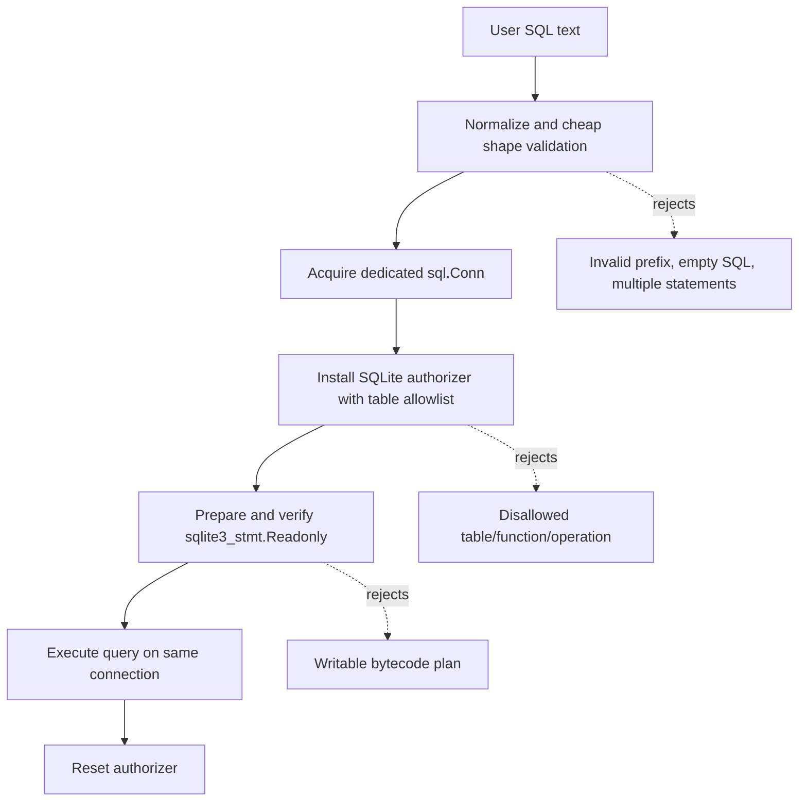

# Solid SQLite Query Authorization Design and Implementation Plan

## Executive Summary

The current `minitracedb.QueryRunner` combines three ideas: text normalization, a regular-expression table allowlist, and SQLite read-only enforcement. The read-only enforcement is sound because it asks SQLite whether the compiled statement is read-only. The regular-expression table allowlist is brittle because it tries to infer parsed SQL structure from sanitized source text.

Two code-review findings expose the problem clearly. First, quoted table names such as `"sqlite_master"` are removed by `stripSQLLiteralsAndComments`, so `referencedObjects` sees no table reference and the query can read SQLite system tables. Second, CTE aliases such as `recent` in `WITH recent AS (...) SELECT * FROM recent` are extracted as if they were physical tables, so ordinary read-only CTE queries fail even when they only read allowed minitrace tables.

The robust fix is to make SQLite's own parser the authority for object access. SQLite provides `sqlite3_set_authorizer`, which fires during statement preparation. For `SQLITE_READ`, SQLite passes the resolved physical table name and column name to the callback. This means quoted identifiers, schema-qualified names, aliases, subqueries, and CTEs have already been parsed and resolved by SQLite before our authorization decision runs.

The implementation should keep cheap text checks for query shape, keep the read-only prepared-statement check for bytecode-level defense in depth, and move table allowlist enforcement into a stricter SQLite authorizer installed on the same connection used for prepare and execution.

## Current State

`pkg/minitracedb/query.go` currently validates queries in `validateReadOnlySQLiteQuery`:

```go
func validateReadOnlySQLiteQuery(sqlText string, allowedObjects map[string]struct{}, opts QueryOptions) (string, error) {
    normalized, err := normalizeQuery(sqlText)
    if err != nil {
        return "", err
    }
    sanitized := stripSQLLiteralsAndComments(normalized)
    lower := strings.ToLower(strings.TrimSpace(sanitized))
    if !hasReadOnlyQueryPrefix(lower, "select") && !hasReadOnlyQueryPrefix(lower, "with") {
        return "", fmt.Errorf("only SELECT and WITH queries are allowed")
    }
    if opts.RequireOrderBy && strings.Contains(lower, " from ") && !strings.Contains(lower, " order by ") {
        return "", fmt.Errorf("query must include ORDER BY")
    }
    if len(allowedObjects) > 0 {
        for _, object := range referencedObjects(sanitized) {
            if _, ok := allowedObjects[normalizeObjectName(object)]; !ok {
                return "", fmt.Errorf("query references disallowed table/view %q", object)
            }
        }
    }
    return normalized, nil
}
```

The weak point is `referencedObjects(sanitized)`. It uses this regexp:

```go
var fromJoinObjectRe = regexp.MustCompile(`(?i)\b(from|join)\s+([a-zA-Z_][a-zA-Z0-9_\.]*)`)
```

That regexp has no knowledge of SQL grammar. It cannot distinguish a physical table from a CTE alias, derived table alias, view alias, table-valued function, or quoted identifier. The sanitizer protects the regexp from semicolons and string literals, but it also erases double-quoted, backtick-quoted, and bracket-quoted identifiers, which SQLite accepts as identifiers.

`QueryResult` then installs an authorizer and runs a read-only prepared-statement check:

```go
if err := setSQLiteAuthorizer(conn, newReadOnlyAuthorizer()); err != nil {
    return QueryResult{Error: err.Error()}, nil
}
defer func() { _ = setSQLiteAuthorizer(conn, nil) }()

if err := ensureReadonlyPreparedQuery(conn, normalized); err != nil {
    return QueryResult{Error: err.Error()}, nil
}
```

`newReadOnlyAuthorizer` currently permits all `SQLITE_READ` operations. It blocks writes and DDL, but it does not enforce the minitrace table allowlist.

## SQLite Authorizer Semantics

SQLite's authorizer is a compile-time callback. It is invoked while SQLite prepares a statement, not while each row is executed. The authorizer sees the SQL after tokenization and parsing, while the code generator is deciding which operations the bytecode program will need.

The relevant callback contract is:

```c
int sqlite3_set_authorizer(
  sqlite3*,
  int (*xAuth)(void*, int, const char*, const char*, const char*, const char*),
  void *pUserData
);
```

For `SQLITE_READ`, the action-code table defines:

```c
#define SQLITE_READ 20 /* Table Name, Column Name */
```

The `mattn/go-sqlite3` binding exposes this as:

```go
func (c *SQLiteConn) RegisterAuthorizer(callback func(int, string, string, string) int)
```

The callback receives `(op, arg1, arg2, arg3)`, where `arg1` is the table name, `arg2` is the column name, and `arg3` is the schema/database name (`main`, `temp`, or an attached database name) for operations that have one.

The critical property is that `arg1` is the resolved object name. If the source SQL says:

```sql
SELECT name FROM "sqlite_master"
```

SQLite emits `SQLITE_READ` with `arg1 = "sqlite_master"` and `arg2 = "name"`. The quotes are not part of the identifier anymore. A text sanitizer can erase the quoted token, but the SQLite parser cannot lose it; it must resolve the identifier to prepare the statement.

For CTEs, SQLite does not emit `SQLITE_READ` for the CTE alias itself. In this query:

```sql
WITH recent AS (SELECT * FROM sessions)
SELECT * FROM recent
```

`recent` is a compile-time name for a query expression. The physical table access is still `sessions`, so the authorizer sees reads from `sessions`. This is exactly the behavior needed for a table allowlist.

## Target Design

The target design has three explicit layers.



Layer 1 is text-level query shape validation. It should answer only questions that can be safely answered from source text without a full SQL grammar:

- Is the query non-empty?
- Is there more than one statement?
- Does the first token look like `SELECT` or `WITH`?
- If `RequireOrderBy` remains a product requirement, does the text contain an `ORDER BY` marker in simple cases?

Layer 1 should not enforce table access. It may return friendly errors, but it is not a security boundary.

Layer 2 is the SQLite authorizer. This is the table allowlist boundary. It should deny every `SQLITE_READ` whose resolved table name is not in `allowedObjects`. It should deny PRAGMAs, ATTACH, DETACH, DDL, writes, transactions, and savepoints. It may allow built-in functions, or it may introduce a function allowlist in a later hardening pass.

Layer 3 is the read-only prepared-statement check. It asks SQLite whether the compiled statement is read-only. This catches any writable bytecode plan even if the authorizer configuration changes later. It is a separate invariant from the table allowlist.

## Proposed API and Code Changes

### 1. Split text validation from object authorization

Replace `validateReadOnlySQLiteQuery` with a narrower function that returns normalized SQL and performs only text-shape checks.

```go
func validateSQLiteQueryShape(sqlText string, opts QueryOptions) (string, error) {
    normalized, err := normalizeQuery(sqlText)
    if err != nil {
        return "", err
    }

    sanitized := stripSQLLiteralsAndComments(normalized)
    lower := strings.ToLower(strings.TrimSpace(sanitized))
    if !hasReadOnlyQueryPrefix(lower, "select") && !hasReadOnlyQueryPrefix(lower, "with") {
        return "", fmt.Errorf("only SELECT and WITH queries are allowed")
    }

    if opts.RequireOrderBy && strings.Contains(lower, " from ") && !strings.Contains(lower, " order by ") {
        return "", fmt.Errorf("query must include ORDER BY")
    }

    return normalized, nil
}
```

This keeps the existing shape behavior but removes the dangerous `referencedObjects` enforcement. `referencedObjects`, `normalizeExtractedObject`, and `fromJoinObjectRe` should be deleted unless tests or docs still need them. Removing them is preferable because keeping a misleading parser-like helper invites future misuse.

### 2. Pass the allowlist into the authorizer

Change the call site:

```go
if err := setSQLiteAuthorizer(conn, newReadOnlyAuthorizer(r.allowedObjects)); err != nil {
    return QueryResult{Error: err.Error()}, nil
}
```

Then change the authorizer constructor:

```go
func newReadOnlyAuthorizer(allowedObjects map[string]struct{}) func(int, string, string, string) int {
    return func(op int, arg1, arg2, dbName string) int {
        switch op {
        case sqlite3.SQLITE_SELECT:
            return sqlite3.SQLITE_OK
        case sqlite3.SQLITE_READ:
            if len(allowedObjects) == 0 {
                return sqlite3.SQLITE_OK
            }
            if _, ok := allowedObjects[normalizeObjectName(arg1)]; ok {
                return sqlite3.SQLITE_OK
            }
            return sqlite3.SQLITE_DENY
        case sqlite3.SQLITE_FUNCTION:
            return sqlite3.SQLITE_OK
        default:
            return sqlite3.SQLITE_DENY
        }
    }
}
```

This is intentionally stricter than the current implementation. The existing code allows unknown authorizer actions by default. For untrusted query execution, the safer default is deny-by-default and explicitly allow only operations needed for read-only analysis queries.

### 3. Preserve same-connection prepare and execution

The current code correctly obtains a single `*sql.Conn`, installs the authorizer, prepares the query, executes the query, and removes the authorizer before returning the connection to the pool. Keep this ordering.

The authorizer documentation states that the authorizer is connection-local and that statements may be re-prepared during `sqlite3_step()` after schema changes. Therefore the authorizer must remain installed through execution, not only for the explicit `ensureReadonlyPreparedQuery` call. The current defer-based reset pattern satisfies this requirement.

### 4. Improve error reporting

SQLite's default error for `SQLITE_DENY` may be generic. If Go-side `RegisterAuthorizer` cannot attach a custom error message, the practical path is to return a better high-level error after preparation fails.

A simple version is acceptable for this ticket:

```go
if err := ensureReadonlyPreparedQuery(conn, normalized); err != nil {
    return QueryResult{Error: err.Error()}, nil
}
```

If this produces ambiguous errors in tests, add a small wrapper around the authorizer with an atomic or mutex-protected last-denied object:

```go
type queryAuthorizationState struct {
    deniedOp     int
    deniedObject string
}
```

Because the authorizer is invoked synchronously during prepare on one connection, a simple local struct captured by the callback is enough. After prepare fails, the code can report `query references disallowed table/view "sqlite_master"`.

This improvement is optional for the first pass. Correct denial matters more than the exact error string.

## Required Regression Tests

Add tests in `pkg/minitracedb/query_test.go` before changing implementation, then make them pass.

### Quoted disallowed table names are denied

```go
func TestQueryRunnerRejectsQuotedDisallowedObjects(t *testing.T) {
    runner := setupQueryRunner(t)
    cases := []string{
        `SELECT name FROM "sqlite_master"`,
        "SELECT name FROM `sqlite_master`",
        `SELECT name FROM [sqlite_master]`,
    }
    for _, sqlText := range cases {
        result, err := runner.QueryResult(context.Background(), sqlText)
        if err != nil {
            t.Fatalf("QueryResult error: %v", err)
        }
        if !strings.Contains(strings.ToLower(result.Error), "not authorized") &&
           !strings.Contains(strings.ToLower(result.Error), "disallowed") {
            t.Fatalf("expected authorization error for %q, got %#v", sqlText, result)
        }
    }
}
```

The exact error string should match the implementation. If custom denial tracking is added, assert the clearer `disallowed` message.

### CTE aliases are not treated as physical tables

```go
func TestQueryRunnerAllowsCTEAliases(t *testing.T) {
    runner := setupQueryRunner(t)
    rows, err := runner.Query(context.Background(), `
        WITH recent AS (
            SELECT session_id FROM sessions
        )
        SELECT session_id FROM recent
    `)
    if err != nil {
        t.Fatalf("Query: %v", err)
    }
    if len(rows) != 1 || rows[0]["session_id"] != "s1" {
        t.Fatalf("unexpected rows %#v", rows)
    }
}
```

### Disallowed tables inside CTE bodies are denied

```go
func TestQueryRunnerRejectsDisallowedObjectsInsideCTE(t *testing.T) {
    runner := setupQueryRunner(t)
    result, err := runner.QueryResult(context.Background(), `
        WITH catalog AS (
            SELECT name FROM sqlite_master
        )
        SELECT name FROM catalog
    `)
    if err != nil {
        t.Fatalf("QueryResult error: %v", err)
    }
    if result.Error == "" {
        t.Fatalf("expected authorization error, got %#v", result)
    }
}
```

### Quoted allowed table names work

```go
func TestQueryRunnerAllowsQuotedAllowedObjects(t *testing.T) {
    runner := setupQueryRunner(t)
    rows, err := runner.Query(context.Background(), `SELECT session_id FROM "sessions"`)
    if err != nil {
        t.Fatalf("Query: %v", err)
    }
    if len(rows) != 1 || rows[0]["session_id"] != "s1" {
        t.Fatalf("unexpected rows %#v", rows)
    }
}
```

### Optional: schema-qualified allowed names work

```go
func TestQueryRunnerAllowsSchemaQualifiedAllowedObjects(t *testing.T) {
    runner := setupQueryRunner(t)
    rows, err := runner.Query(context.Background(), `SELECT session_id FROM main.sessions`)
    if err != nil {
        t.Fatalf("Query: %v", err)
    }
    if len(rows) != 1 || rows[0]["session_id"] != "s1" {
        t.Fatalf("unexpected rows %#v", rows)
    }
}
```

## Implementation Phases

### Phase 1: Unblock CI lint

This has already been done in the current working tree:

- Rename `summarizeText(value string, max int)` to use `maxChars` so it does not shadow the predeclared identifier `max`.
- Remove unused unexported `toJSON` methods from `SourceSet`, `ImportPolicy`, `CachePolicy`, and `QueryLimits`.
- Run `gofmt` and package tests.

Validation command:

```bash
go test ./pkg/minitracedb ./pkg/minitracejs/...
```

### Phase 2: Add failing query authorization tests

Add the regression tests described above. Commit these tests separately if possible. The first failing test should reproduce the quoted `sqlite_master` leak. The second should reproduce the CTE false positive.

Expected pre-fix behavior:

- Quoted `sqlite_master` query succeeds and returns catalog rows. This is a security failure.
- CTE alias query fails because `recent` is treated as a disallowed table. This is a correctness failure.

### Phase 3: Move table authorization into the SQLite authorizer

Implement the authorizer changes:

- Replace `validateReadOnlySQLiteQuery(sqlText, allowedObjects, opts)` with `validateSQLiteQueryShape(sqlText, opts)` or equivalent.
- Delete regex-based allowlist enforcement.
- Change `newReadOnlyAuthorizer()` to accept `allowedObjects`.
- Deny unknown authorizer actions by default.
- Allow only `SQLITE_SELECT`, allowed `SQLITE_READ`, and `SQLITE_FUNCTION` initially.

Run:

```bash
go test ./pkg/minitracedb -count=1
```

### Phase 4: Review function and PRAGMA policy

Allowing `SQLITE_FUNCTION` means user queries can call any registered SQLite function. That is likely acceptable for analysis queries over an in-memory minitrace database, but it should be a conscious choice.

`SQLITE_PRAGMA` should remain denied for untrusted queries. PRAGMAs can expose metadata, change connection behavior, or interact with implementation details that are outside the minitrace query contract.

### Phase 5: Run full validation

After the implementation passes package tests, run the same validation class as CI:

```bash
go test ./cmd/... ./pkg/... -count=1
golangci-lint run --timeout=5m ./cmd/... ./pkg/...
```

If the exact CI-pinned linter binary is not available locally, run the installed `golangci-lint` if present and rely on GitHub Actions for final version parity.

## Risks and Review Points

### Deny-by-default may block SQLite internal reads

A strict authorizer might deny an internal read that is needed to prepare otherwise valid queries. The tests should include representative queries with ordering, functions, aggregates, joins, and CTEs. If SQLite needs to read `sqlite_master` internally during preparation, the authorizer documentation and empirical examples suggest those reads are represented as explicit `SQLITE_READ` events. We should not allow them for user queries unless a failing test proves SQLite cannot prepare allowed queries without them.

### Function access is broad

Allowing all functions is convenient but broad. SQLite functions can include user-defined functions registered by the embedding process. If future runtime modules register unsafe functions on the same connection, the query runner should move from `SQLITE_FUNCTION` allow-all to a function allowlist.

### Error strings may differ by SQLite version

Tests should prefer behavior assertions over exact error strings unless custom denial tracking is implemented. For example, assert that `result.Error != ""` for denied queries, and only check for `disallowed` when the code explicitly formats that message.

### Authorizer lifetime must cover execution

Do not remove the authorizer immediately after `ensureReadonlyPreparedQuery`. SQLite can reprepare during `sqlite3_step()` after a schema change. The callback must remain installed until `rows.Close()` and `rows.Err()` have been handled, or at least through the query's active execution window. The current defer reset after query completion is the correct shape.

## Decision Records

### DR-1: Use SQLite authorizer for object allowlisting

**Status:** proposed

**Context:** Text-based table extraction is failing on quoted identifiers and CTE aliases. The SQLite parser already resolves table names during statement preparation.

**Options considered:**

1. Extend the regex parser to recognize quoted identifiers and CTEs.
2. Add a third-party SQL parser.
3. Use SQLite's authorizer callback for resolved object access.

**Decision:** Use SQLite's authorizer for table allowlisting.

**Rationale:** The authorizer is built into SQLite, uses SQLite's own parser, fires during prepare, and reports the actual table names used by the compiled query. It avoids dependency drift and supports SQLite-specific syntax better than a generic parser.

**Consequences:** QueryRunner must keep authorizer lifetime correct on `*sql.Conn`. Tests should focus on behavior rather than textual parsing. Error messages may need a small custom-denial tracker if generic SQLite errors are too vague.

### DR-2: Keep read-only prepared-statement verification

**Status:** proposed

**Context:** The authorizer can deny writes, but the existing `SQLiteStmt.Readonly()` check provides an independent bytecode-level read-only invariant.

**Options considered:**

1. Trust the authorizer alone.
2. Trust `SQLiteStmt.Readonly()` alone.
3. Use both.

**Decision:** Use both.

**Rationale:** The authorizer answers object and operation authorization questions. `Readonly()` answers whether the compiled bytecode program mutates the database. They verify different invariants and are cheap enough to run together.

**Consequences:** The code prepares the statement once for validation and again for execution via `QueryContext`. This is acceptable for the current workload. If performance becomes an issue, we can investigate reusing the prepared statement explicitly, but correctness comes first.

### DR-3: Remove regex table extraction from the security path

**Status:** proposed

**Context:** Keeping the regex helper after moving to the authorizer creates a future maintenance risk: a later change may accidentally use it as a security boundary again.

**Options considered:**

1. Keep `referencedObjects` for friendly error messages.
2. Keep it only in tests.
3. Delete it.

**Decision:** Delete it from production code.

**Rationale:** It is not a parser and should not be presented as one. Friendly messages can be implemented by tracking denied objects in the authorizer callback instead.

**Consequences:** Some error messages may become less specific until denial tracking is added. The implementation becomes simpler and safer.

## Concrete Acceptance Criteria

- `SELECT name FROM "sqlite_master"` is rejected.
- `SELECT name FROM sqlite_master` remains rejected.
- `WITH recent AS (SELECT * FROM sessions) SELECT * FROM recent` succeeds.
- A CTE body that reads `sqlite_master` is rejected.
- `SELECT session_id FROM "sessions"` succeeds.
- `SELECT session_id FROM main.sessions` succeeds or is deliberately rejected with a documented reason.
- Write, DDL, PRAGMA, ATTACH, and DETACH statements remain rejected.
- `go test ./pkg/minitracedb ./pkg/minitracejs/...` passes.
- `golangci-lint run --timeout=5m ./cmd/... ./pkg/...` no longer reports the five current lint failures.
