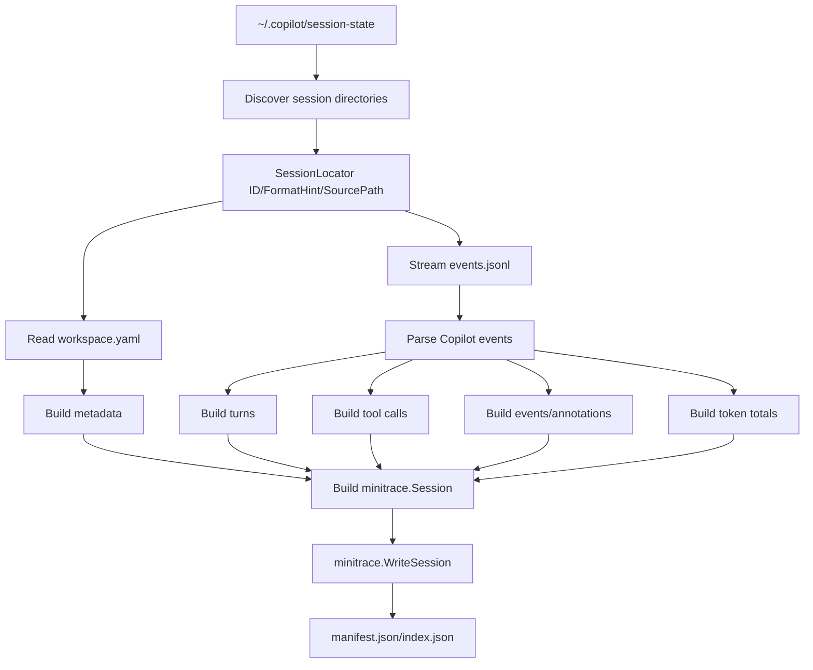

# GitHub Copilot CLI Session Support Design and Implementation Guide

## Executive summary

`go-minitrace` already knows how to discover and convert several coding-agent transcript formats into the common minitrace JSON schema. GitHub Copilot CLI now persists rich local session data under `~/.copilot/session-state/<session-id>/`, and this ticket designs a new adapter that discovers those session directories and converts their `events.jsonl` logs into minitrace sessions.

The recommended implementation is to add a first-class `copilot` adapter package under `pkg/adapters/copilot`, plus matching `go-minitrace discover copilot` and `go-minitrace convert copilot` commands. The converter should treat per-session `events.jsonl` as the source of truth for turns, tool calls, permissions, timing, and token summaries. It should use `workspace.yaml` as session metadata and keep per-session `session.db`, checkpoints, and rewind snapshots as optional metadata/events rather than required inputs.

This is a design-only deliverable. Do not start implementing until this document has been reviewed.

## Problem statement and scope

GitHub Copilot CLI sessions are useful research data because they contain:

- human messages and assistant responses,
- tool execution starts and completions,
- command permission prompts and decisions,
- repository/workspace metadata,
- model and token accounting events,
- shutdown summaries that include code-change and usage metadata.

Today `go-minitrace` does not have a Copilot CLI adapter. A user who wants to analyze Copilot CLI work with the existing DuckDB queries, transcript viewer, annotations, and minitrace JavaScript APIs must either hand-convert the session or lose the data.

### In scope

- Discover Copilot CLI session directories under `~/.copilot/session-state`.
- Convert `events.jsonl` plus `workspace.yaml` into the minitrace `Session` schema.
- Preserve important Copilot-specific details in `FrameworkMetadata` rather than dropping them.
- Add CLI commands and tests consistent with existing adapters.
- Handle incomplete, malformed, or partially written session directories defensively.
- Produce fixtures that are sanitized and derived from observed shapes, not copied from private local transcripts.

### Out of scope for the first implementation

- Reading synced GitHub-hosted session data.
- Mutating or repairing Copilot CLI files.
- Reindexing Copilot's own session store.
- Implementing a live tail/follow mode.
- Depending on private or unstable Copilot CLI internals beyond local files observed and documented here.

## Evidence and current-state analysis

### External source evidence

Official GitHub documentation says that every Copilot CLI session is recorded locally and includes user prompts, Copilot responses, actions taken, and files modified (`sources/01-github-docs-copilot-cli-session-data.md:12-15`). It also says every Copilot CLI session is persisted under `~/.copilot/session-state/` (`sources/01-github-docs-copilot-cli-session-data.md:39-46`) and that local session data is accessible only to the local user account (`sources/01-github-docs-copilot-cli-session-data.md:66-72`).

The configuration-directory reference identifies the relevant top-level storage areas:

- `session-state/` stores session history and workspace data (`sources/02-github-docs-copilot-cli-config-dir.md:37`).
- `session-store.db` is a cross-session SQLite database (`sources/02-github-docs-copilot-cli-config-dir.md:39`, `sources/02-github-docs-copilot-cli-config-dir.md:164-168`).
- Each session directory stores an event log and workspace artifacts (`sources/02-github-docs-copilot-cli-config-dir.md:144-147`).

A third-party exploration by Jon Magic independently observed the same high-level structure: one directory per session under `session-state/`, with `events.jsonl` and `workspace.yaml`, plus a separate `session-store.db` for cross-session indexing (`sources/03-jonmagic-copilot-session-search-resume.md:36-47`). This is not a formal API contract, but it is useful corroborating evidence.

Known issue reports matter because they define parser hazards:

- Copilot CLI issue 3520 reports `events.jsonl` records without a required `ephemeral` field in one CLI version (`sources/04-github-copilot-cli-issue-3520-ephemeral-field.md:12-16`). The adapter should not require `ephemeral`.
- Copilot CLI issue 2012 reports malformed JSON when raw `U+2028`/`U+2029` characters appear in `events.jsonl` (`sources/05-github-copilot-cli-issue-2012-jsonl-corruption.md:12-48`). The adapter should report bad lines clearly and optionally skip them in non-strict mode.

### Local sample evidence

The local sample inspected for this ticket is:

```text
/home/manuel/.copilot/session-state/e5b2d4a3-1027-4b0c-a6c4-fb5955855b2a
```

The structural analyzer intentionally redacted content bodies and reported only shapes. It found:

- `workspace.yaml` (596 bytes), `events.jsonl` (250,841 bytes), `session.db` (28,672 bytes), checkpoint and rewind files (`sources/06-local-copilot-session-structural-analysis.md:16-22`).
- Workspace keys including `id`, `cwd`, `git_root`, `branch`, `repository`, `client_name`, `host_type`, `created_at`, `updated_at`, and model-context ids (`sources/06-local-copilot-session-structural-analysis.md:24-40`).
- 72 parseable JSONL records and zero bad JSON lines in this sample (`sources/06-local-copilot-session-structural-analysis.md:43-47`).
- Event types including `session.start`, `session.model_change`, `system.message`, `user.message`, `assistant.turn_start`, `assistant.message`, `assistant.turn_end`, `tool.execution_start`, `tool.execution_complete`, `permission.requested`, `permission.completed`, and `session.shutdown` (`sources/06-local-copilot-session-structural-analysis.md:55-71`).
- `assistant.message` records include content, model, phase, output token count, opaque reasoning, and tool request fields (`sources/06-local-copilot-session-structural-analysis.md:85`).
- Tool execution records include arguments, model, tool call id, tool name, turn id, result content, success flag, and telemetry (`sources/06-local-copilot-session-structural-analysis.md:87-90`).
- `session.shutdown` includes token details, model metrics, current model, events file size, code-change summary, total API duration, and premium-request metrics (`sources/06-local-copilot-session-structural-analysis.md:93`).
- The per-session `session.db` sample contains `todos`, `todo_deps`, and `inbox_entries` tables with zero rows (`sources/06-local-copilot-session-structural-analysis.md:95-126`).

### Existing `go-minitrace` architecture evidence

`go-minitrace` already uses an adapter pattern:

- `pkg/adapters/types.go` defines the minimal `SessionLocator` contract with `ID`, `FormatHint`, and `SourcePath` (`sources/07-code-evidence-excerpts.md:140-145`).
- `cmd/go-minitrace/cmds/discover/root.go` creates the `discover` command group and registers first-class adapter subcommands (`sources/07-code-evidence-excerpts.md:93-117`).
- `cmd/go-minitrace/cmds/convert/root.go` creates the `convert` command group and registers conversion subcommands (`sources/07-code-evidence-excerpts.md:14-54`).
- The Codex discovery command demonstrates the Glazed command shape: it decodes `--source-dir`, calls adapter discovery, and emits one row per locator (`cmd/go-minitrace/cmds/discover/codex.go`).
- The Codex convert command demonstrates the conversion command shape: discover locators, convert each locator, write minitrace sessions, emit rows, and write manifests (`cmd/go-minitrace/cmds/convert/codex.go`).
- The minitrace schema has explicit top-level sections for provenance, flags, environment, operational context, timing, turns, tool calls, events, attachments, annotations, and metrics (`sources/07-code-evidence-excerpts.md:374-588`).
- `pkg/minitrace/builders.go` provides constructors such as `BuildSessionSkeleton`, `BuildTurn`, `BuildToolCall`, `BuildEvent`, `BuildAttachment`, and `BuildAnnotation`.

The existing Codex adapter is the closest model because it maps an agent JSONL event stream into the same concepts Copilot CLI exposes. However, the record shape is different. Codex persisted sessions use `type` plus `payload` and event types like `session_meta`, `turn_context`, `event_msg`, and `response_item` (`pkg/adapters/codex/convert.go`). Copilot CLI uses `type` plus `data`, with event names such as `assistant.message`, `tool.execution_start`, and `permission.requested`.

## System concepts for a new intern

### What is minitrace?

Minitrace is a normalized JSON representation of coding-agent work. It lets the rest of the project analyze sessions without caring whether the original transcript came from Codex, Claude Code, Pi, ChatGPT, Copilot CLI, or another tool.

A minitrace session answers these questions:

- Who participated in the conversation?
- What did the user ask?
- What did the assistant say?
- Which tools were called?
- Which files or commands were affected?
- Did tool calls succeed?
- How many tokens were used?
- What metadata is needed for reproducible analysis?

The key data model is `pkg/minitrace/schema.go`:

- `Session`: the top-level document.
- `Turn`: one conversational message or assistant turn.
- `ToolCall`: one command/tool invocation.
- `Event`: renderable auxiliary events such as permissions, image views, rate limits, or lifecycle events.
- `Attachment`: binary or external artifacts.
- `Annotation`: notes added by adapters or humans.
- `Metrics`: derived counts and token totals.

### What is an adapter?

An adapter is a package that knows how to read one native transcript format and build a minitrace `Session`. Existing adapters live under `pkg/adapters/<name>`. The CLI layer is intentionally thin:

```text
CLI command
  -> adapter.Discover(sourceDir)
  -> adapter.ConvertLocator(locator)
  -> minitrace.WriteSession(session, outputDir)
  -> minitrace.WriteManifests(entries, outputDir)
```

This keeps format-specific parsing out of command code and makes adapter tests easy to write with in-memory fixtures.

### What is GitHub Copilot CLI session-state?

Copilot CLI stores local state under `~/.copilot`. The session support relevant here is:

```text
~/.copilot/
├── session-state/
│   └── <session-id>/
│       ├── workspace.yaml          # metadata about cwd, repository, branch, ids
│       ├── events.jsonl            # append-only event log, one JSON object per line
│       ├── session.db              # per-session database; sample has todos/inbox tables
│       ├── checkpoints/            # checkpoint metadata/artifacts
│       └── rewind-snapshots/       # rewind snapshot metadata/artifacts
└── session-store.db                # cross-session database described by docs/blog
```

For the first implementation, use `session-state/<session-id>/events.jsonl` as the canonical transcript input and `workspace.yaml` as supporting metadata. Treat `session-store.db` as an optional future discovery accelerator, not as the source of truth.

## Proposed architecture

### Package layout

Add these files:

```text
pkg/adapters/copilot/
├── convert.go             # public ConvertLocator/ConvertRecords and mapping logic
├── discover.go            # discovery of session-state directories
├── types.go               # internal raw event/workspace structs if useful
├── convert_test.go        # sanitized conversion fixtures
├── discover_test.go       # temp-dir discovery fixtures
└── logcopter.go           # generated logging file if the project requires it

cmd/go-minitrace/cmds/discover/
└── copilot.go             # Glazed discover command

cmd/go-minitrace/cmds/convert/
└── copilot.go             # Glazed convert command
```

Modify these files:

```text
cmd/go-minitrace/cmds/discover/root.go   # register copilot discover command
cmd/go-minitrace/cmds/convert/root.go    # register copilot convert command
```

Potentially modify or regenerate:

```text
pkg/adapters/logcopter.go
cmd/go-minitrace/cmds/discover/logcopter.go
cmd/go-minitrace/cmds/convert/logcopter.go
```

### High-level data flow



### Discovery contract

The Copilot discovery function should return one locator per session directory that looks convertible.

Suggested public API:

```go
package copilot

const (
    AdapterVersion = "go-minitrace-copilot-adapter-dev"
    SourceFormatEvents = "copilot-cli-events-jsonl-v1"
)

func Discover(sourceDir string) ([]adapters.SessionLocator, error)
func ConvertLocator(locator adapters.SessionLocator) (*minitrace.Session, error)
func ConvertRecords(records []CopilotEvent, workspace *WorkspaceMetadata, sessionID string, sourcePath string) (*minitrace.Session, error)
```

Recommended default source directory:

```text
~/.copilot
```

Discovery behavior:

1. Expand `~` like the Codex adapter does.
2. If `sourceDir/session-state` exists, scan that directory.
3. If `sourceDir` itself appears to be a `session-state` directory, scan it directly.
4. If `sourceDir` appears to be one session directory containing `events.jsonl`, return exactly that one session.
5. Ignore scaffold directories that only contain `workspace.yaml` and no `events.jsonl` unless a future `--include-empty` flag is added.
6. Sort locators by source path for stable CLI output and tests.

Locator fields:

- `ID`: session id from `workspace.yaml.id` if present, otherwise directory name.
- `FormatHint`: `copilot-cli-events-jsonl-v1` for directories with `events.jsonl`.
- `SourcePath`: path to `events.jsonl`, because that is the source transcript file.

### CLI command shape

The command should mirror `convert codex` and `discover codex`.

Discover command:

```text
go-minitrace discover copilot --source-dir ~/.copilot --output yaml
```

Rows should include:

- `id`
- `format_hint`
- `source_path`
- `workspace_path`
- `event_count` if cheap to compute; optional
- `has_session_db`
- `has_checkpoints`

Convert command:

```text
go-minitrace convert copilot --source-dir ~/.copilot --output-dir ./output
go-minitrace convert copilot --source-dir ~/.copilot/session-state/<id> --dry-run --output json
```

Rows should include:

- `framework`: `copilot`
- `session_id`
- `source_format`
- `source_path`
- `turn_count`
- `tool_call_count`
- `quality`
- `classification`
- `dry_run`
- `session_path`
- `bad_line_count`

## Raw format model

### Event envelope

The local sample shows this envelope:

```json
{
  "type": "assistant.message",
  "data": { "...": "..." },
  "id": "...",
  "timestamp": "...",
  "parentId": "..."
}
```

Suggested Go type:

```go
type EventEnvelope struct {
    Type      string          `json:"type"`
    Data      json.RawMessage `json:"data"`
    ID        string          `json:"id"`
    Timestamp string          `json:"timestamp"`
    ParentID  *string         `json:"parentId"`
    Ephemeral *bool           `json:"ephemeral,omitempty"`
    Raw       map[string]any  `json:"-"`
}
```

The `Ephemeral` pointer is intentionally optional because one observed issue says some records lack it.

### Workspace metadata

`workspace.yaml` should be parsed into a permissive struct with a raw map fallback:

```go
type WorkspaceMetadata struct {
    ID              string    `yaml:"id"`
    Name            string    `yaml:"name"`
    CWD             string    `yaml:"cwd"`
    GitRoot         string    `yaml:"git_root"`
    Branch          string    `yaml:"branch"`
    Repository      string    `yaml:"repository"`
    HostType        string    `yaml:"host_type"`
    ClientName      string    `yaml:"client_name"`
    CreatedAt       any       `yaml:"created_at"`
    UpdatedAt       any       `yaml:"updated_at"`
    RemoteSteerable *bool     `yaml:"remote_steerable"`
    Raw             map[string]any
}
```

Use `gopkg.in/yaml.v3` if it is already in the module; otherwise add it only if the repository already accepts that dependency pattern. If avoiding a dependency is preferred, parse the small subset with a simple YAML decoder already present in the dependency tree.

### Important event data shapes

The first implementation should support these event types:

| Copilot event type | Minitrace target | Notes |
|---|---|---|
| `session.start` | session metadata + lifecycle event | Includes context, producer, version, Copilot version, session id. |
| `session.info` | `Event` | Preserve informational messages. |
| `session.model_change` | environment model + `Event` | Track latest model and model switches. |
| `system.message` | optional system `Turn` or metadata | Prefer metadata/event unless needed in transcript display. |
| `user.message` | user `Turn` | Use `content` or `transformedContent` per privacy policy. |
| `assistant.turn_start` | turn state | Opens a turn id; not a minitrace turn by itself. |
| `assistant.message` | assistant `Turn` | Use `content`; attach output tokens/model/phase/reasoning metadata. |
| `assistant.turn_end` | turn state/event | Closes turn id; useful for incomplete-turn detection. |
| `tool.execution_start` | pending `ToolCall` | Has tool call id, tool name, arguments, model, turn id. |
| `tool.execution_complete` | complete `ToolCall` | Has result, success, telemetry. |
| `permission.requested` | `Event` + tool metadata | Records command intention and possible paths/urls. |
| `permission.completed` | `Event` + tool metadata | Records allow/deny decision. |
| `hook.start`/`hook.end` | optional `Event` | Usually lifecycle/extension data; preserve summarized metadata. |
| `session.shutdown` | outcome + metrics + final event | Token totals, model metrics, code changes, API duration. |

## Mapping to minitrace

### Session fields

Build a session skeleton like other adapters:

```go
session := minitrace.BuildSessionSkeleton(sessionID, "copilot", SourceFormatEvents, AdapterVersion)
```

Then fill:

- `Provenance.SourcePath`: `events.jsonl` path.
- `Environment.AgentFramework`: already set to `copilot` by the skeleton.
- `Environment.AgentVersion`: `session.start.data.copilotVersion` when present.
- `Environment.Model`: latest model from `assistant.message.data.model`, `session.model_change.data.newModel`, or `session.shutdown.data.currentModel`.
- `Environment.ProviderHint`: `github-copilot`.
- `Environment.PlatformType`: `agent`.
- `Environment.ToolsEnabled`: unique tool names from converted tool calls.
- `OperationalContext.WorkingDirectory`: normalized `workspace.cwd` or `session.start.data.context.cwd`.
- `OperationalContext.GitBranch`: `workspace.branch` or `session.start.data.context.branch`.
- `OperationalContext.GitRef`: `session.start.data.context.headCommit` or `baseCommit` if useful.
- `OperationalContext.FrameworkConfig`: raw but redacted Copilot metadata, including repository, host type, client name, remote steerable, context tier, producer, and version.
- `Timing`: computed from event timestamps.
- `Title`: `workspace.name` unless it is generic, otherwise use `minitrace.ExtractTitle(turns, 80)`.
- `Metrics`: computed with `minitrace.ComputeMetrics` plus token totals.
- `Flags.ContainsPII`: use `minitrace.DetectPIIInPaths(toolCalls)` and mark local-home paths as sensitive.

### Turns

A `Turn` represents text intended for transcript reading. Suggested rules:

1. `user.message` becomes a user turn.
2. `assistant.message` becomes an assistant turn.
3. `system.message` should not be displayed as a normal transcript turn by default; preserve it as a system event or `Environment.SystemPrompt` if it is clearly the system prompt.
4. Empty assistant messages should be preserved only if they carry tool requests or usage metadata.
5. If multiple `assistant.message` records share one `turnId`, either:
   - concatenate them into one assistant turn in timestamp order, or
   - emit one turn per message and preserve `turnId` in metadata.

Recommended first implementation: one minitrace assistant turn per `assistant.message`, because it is simpler and matches the observed sample's 9 assistant messages / 9 turn starts / 9 turn ends. Preserve `turnId`, `interactionId`, `messageId`, `phase`, `requestId`, and `serviceRequestId` in `FrameworkMetadata`.

User turn pseudocode:

```go
func convertUserMessage(event EventEnvelope, data UserMessageData, idx int) minitrace.Turn {
    content := firstNonEmpty(data.TransformedContent, data.Content)
    turn := minitrace.BuildTurn(idx, optionalString(event.Timestamp), "user", ptr("human"), content)
    turn.InputChannel = ptr("user_input")
    turn.FrameworkMetadata = map[string]any{
        "copilot_event_id": event.ID,
        "interaction_id": data.InteractionID,
        "parent_agent_task_id": data.ParentAgentTaskID,
        "attachment_count": len(data.Attachments),
    }
    return turn
}
```

Assistant turn pseudocode:

```go
func convertAssistantMessage(event EventEnvelope, data AssistantMessageData, idx int, toolIDs []string) minitrace.Turn {
    turn := minitrace.BuildTurn(idx, optionalString(event.Timestamp), "assistant", ptr("model"), data.Content)
    turn.Model = optionalString(data.Model)
    turn.ToolCallsInTurn = toolIDs
    if data.OutputTokens > 0 {
        turn.Usage = &minitrace.Usage{OutputTokens: &data.OutputTokens}
    }
    if data.ReasoningOpaque != "" {
        turn.FrameworkMetadata = map[string]any{"reasoning_opaque_present": true}
        // Do not treat opaque/encrypted reasoning as readable Thinking.
    }
    return turn
}
```

Do not put `encryptedContent` or opaque reasoning into `Thinking`. Store only boolean/presence metadata unless there is a documented, readable field.

### Tool calls

Tool conversion is stateful because Copilot emits start and completion events separately.

Observed start shape:

```json
{
  "type": "tool.execution_start",
  "data": {
    "toolCallId": "...",
    "toolName": "...",
    "turnId": "...",
    "model": "...",
    "arguments": { "command": "...", "description": "...", "mode": "..." }
  }
}
```

Observed completion shape:

```json
{
  "type": "tool.execution_complete",
  "data": {
    "toolCallId": "...",
    "turnId": "...",
    "success": true,
    "result": { "content": "...", "detailedContent": "..." },
    "toolTelemetry": { "metrics": {}, "properties": {} }
  }
}
```

Mapping rules:

- `ToolCall.ID`: `toolCallId`.
- `ToolName`: `toolName`.
- `OperationType`: classify from tool name and command.
- `Input.Command`: `arguments.command` when present.
- `Input.FilePath`: first path inferred from command, `permission.requested.possiblePaths`, or tool-specific arguments.
- `Input.Justification`: `arguments.description` or `permission.requested.intention`.
- `Input.Arguments`: full arguments map.
- `Output.Success`: completion success.
- `Output.Result`: `result.content`, with truncation handled by `BuildToolCall`.
- `Output.Error`: result content if `success == false`.
- `Output.DurationMS`: no direct sample field except telemetry/API metrics; leave nil unless a duration is present.
- `FrameworkMetadata`: event ids, turn id, interaction id, model, telemetry, permission summary.

Tool-state pseudocode:

```go
type pendingTool struct {
    startEvent EventEnvelope
    startData  ToolExecutionStartData
    permission *PermissionRequestedData
}

pending := map[string]*pendingTool{}
tools := []minitrace.ToolCall{}
toolIndexByID := map[string]int{}
turnTools := map[string][]string{}

for _, ev := range events {
    switch ev.Type {
    case "tool.execution_start":
        d := decodeToolStart(ev.Data)
        pending[d.ToolCallID] = &pendingTool{startEvent: ev, startData: d}
        turnTools[d.TurnID] = append(turnTools[d.TurnID], d.ToolCallID)

    case "permission.requested":
        d := decodePermissionRequested(ev.Data)
        p := pending[d.PermissionRequest.ToolCallID]
        if p != nil { p.permission = &d }
        addPermissionEvent(ev, d)

    case "tool.execution_complete":
        d := decodeToolComplete(ev.Data)
        p := pending[d.ToolCallID]
        tc := buildToolCallFromStartAndComplete(p, ev, d)
        toolIndexByID[tc.ID] = len(tools)
        tools = append(tools, tc)
        delete(pending, d.ToolCallID)

    case "permission.completed":
        d := decodePermissionCompleted(ev.Data)
        annotateExistingOrPendingTool(d.ToolCallID, d)
    }
}

for _, p := range pending {
    tools = append(tools, buildIncompleteToolCall(p))
}
```

### Operation classification

Reuse the patterns from the Codex adapter where possible. The current Codex adapter classifies shell commands into `READ`, `MODIFY`, `CREATE`, `EXECUTE`, and other categories. For Copilot:

1. If `toolName` is a file read tool, classify as `READ`.
2. If `toolName` is a write/edit/patch tool, classify as `MODIFY` or `CREATE` depending on arguments.
3. If `toolName` is shell command execution, classify from the command string.
4. If permission metadata says `hasWriteFileRedirection`, prefer `MODIFY`.
5. Otherwise classify as `EXECUTE`.

Suggested helper:

```go
func classifyCopilotOperation(toolName string, args map[string]any, permission *PermissionRequestedData) string {
    command := stringValue(args["command"])
    if permission != nil && permission.PermissionRequest.HasWriteFileRedirection {
        return "MODIFY"
    }
    switch strings.ToLower(toolName) {
    case "read_file", "list_dir", "grep", "search":
        return "READ"
    case "write_file", "edit_file", "apply_patch":
        return "MODIFY"
    case "bash", "shell", "terminal", "run_in_terminal":
        return classifyOperationFromCommand(command)
    default:
        if command != "" {
            return classifyOperationFromCommand(command)
        }
        return "EXECUTE"
    }
}
```

### Permissions as events

Permissions should become minitrace `Event` rows because they are important transcript milestones but not conversational turns.

For `permission.requested`:

```go
event := minitrace.BuildEvent(
    "copilot-permission-requested-"+truncateID(requestID),
    optionalString(envelope.Timestamp),
    "permission_request",
    "Copilot permission requested",
    permission.PermissionRequest.Intention,
    redactedPermissionRaw,
)
event.Role = "system"
event.ToolCallID = optionalString(permission.PermissionRequest.ToolCallID)
```

For `permission.completed`:

```go
event := minitrace.BuildEvent(
    "copilot-permission-completed-"+truncateID(requestID),
    optionalString(envelope.Timestamp),
    "permission_decision",
    "Copilot permission completed",
    result.Kind,
    redactedPermissionRaw,
)
```

Also copy permission metadata onto the related `ToolCall.FrameworkMetadata` so SQL queries can ask questions like: "which commands required permission and were approved?"

### Metrics and token accounting

Token data appears in two places in the sample:

- `assistant.message.data.outputTokens` for individual assistant messages.
- `session.shutdown.data.tokenDetails`, `conversationTokens`, `systemTokens`, `toolDefinitionsTokens`, `modelMetrics`, and `totalApiDurationMs`.

Mapping recommendations:

- Per-turn output tokens: set `Turn.Usage.OutputTokens` from `assistant.message.data.outputTokens` when non-zero.
- Session total input/output/cache tokens: use `session.shutdown.data.tokenDetails` if present.
- Total output tokens: if both per-turn and shutdown totals exist, prefer shutdown totals for `Metrics` but keep per-turn usage for display.
- Model metrics and API duration: preserve in `Session.OperationalContext.FrameworkConfig` or a final `session_shutdown` event.
- `Metrics.ModelSwitches` and `Metrics.UniqueModels`: the generic `ComputeMetrics` may already derive this from turns; if not, add model-change annotations later rather than in the first patch.

### Events and attachments

Add minitrace `Event` objects for lifecycle records that are useful but not turns/tools:

- `session.start`: lifecycle event with session id, version, producer, Copilot version.
- `session.info`: info event.
- `session.model_change`: model change event.
- `assistant.turn_start`/`assistant.turn_end`: optional debug events if a `--include-lifecycle-events` flag is ever added; by default preserve in metadata only.
- `hook.start`/`hook.end`: summarized hook events.
- `session.shutdown`: final lifecycle event with token/code-change summary.

Attachments can be deferred unless `user.message.attachments` contains files or native documents. The local sample's attachment arrays were empty.

### Privacy and redaction

Copilot CLI session files contain user prompts, assistant answers, commands, paths, and tool outputs. The adapter should follow existing minitrace behavior but be explicit about privacy:

- Do not write local raw files into fixtures.
- Use generated fixtures with synthetic content.
- Preserve raw event subsets only after redacting high-risk fields such as `content`, `encryptedContent`, `reasoningOpaque`, `detailedContent`, and `sessionLog`.
- Allow full transcript conversion by default because minitrace stores full transcript content, but keep raw metadata redacted unless needed.
- Mark sessions `ContainsPII` when absolute home-directory paths or private repository paths appear in tool calls.

Suggested redaction helper:

```go
var sensitiveKeys = map[string]bool{
    "content": true,
    "encryptedContent": true,
    "reasoningOpaque": true,
    "detailedContent": true,
    "sessionLog": true,
    "textResultForLlm": true,
}

func redactRaw(value any) any {
    switch v := value.(type) {
    case map[string]any:
        out := map[string]any{}
        for k, child := range v {
            if sensitiveKeys[k] {
                out[k] = "<redacted>"
                continue
            }
            out[k] = redactRaw(child)
        }
        return out
    case []any:
        out := make([]any, len(v))
        for i := range v { out[i] = redactRaw(v[i]) }
        return out
    default:
        return v
    }
}
```

## Decision records

### Decision: Add a first-class `copilot` adapter instead of extending Codex

- **Context:** Copilot CLI and Codex both write JSONL event streams, but their envelopes and event names differ substantially.
- **Options considered:** Reuse the Codex adapter with more format detection; add a separate package; create a generic event-stream adapter abstraction first.
- **Decision:** Add `pkg/adapters/copilot` as a separate adapter and share only small utility patterns where useful.
- **Rationale:** A separate adapter keeps format assumptions local, mirrors the existing package layout, and avoids making the already-large Codex converter harder to maintain.
- **Consequences:** Some classification helpers may be duplicated initially. A later cleanup can extract shared shell-command classification if duplication becomes painful.
- **Status:** proposed.

### Decision: Use `events.jsonl` as the source of truth

- **Context:** Copilot CLI has per-session files and a cross-session database. The event log contains the ordered transcript and tool events.
- **Options considered:** Parse only `events.jsonl`; query `session-store.db`; combine both from the start.
- **Decision:** Parse per-session `events.jsonl` and `workspace.yaml` for the first implementation.
- **Rationale:** This is the most direct source for ordered turns and tool calls. It works even if cross-session indexing is stale or absent.
- **Consequences:** Discovery may be slower than a database query on very large histories, but it is simpler and more robust. `session-store.db` remains a future optimization.
- **Status:** proposed.

### Decision: Treat per-session `session.db` as optional metadata

- **Context:** The sample per-session `session.db` contained todos/inbox tables with zero rows, while docs describe a separate cross-session `session-store.db`.
- **Options considered:** Require `session.db`; ignore it entirely; inspect it opportunistically.
- **Decision:** Do not require `session.db`; optionally add an event/metadata summary if non-empty tables are useful later.
- **Rationale:** Requiring this database would make conversion brittle and does not appear necessary for transcript reconstruction.
- **Consequences:** Todo/inbox state is not represented in the first version. This is acceptable because the target feature is session support, not Copilot task-database support.
- **Status:** proposed.

### Decision: Preserve permissions as minitrace events plus tool metadata

- **Context:** Permission prompts are neither user turns nor tool outputs, but they explain why a command was allowed or denied.
- **Options considered:** Drop permissions; add annotations only; add events only; add events and attach metadata to tools.
- **Decision:** Add renderable events and also attach permission metadata to the relevant tool call.
- **Rationale:** Events make permissions visible in transcript/timeline views; tool metadata makes them queryable from `tool_calls` workflows.
- **Consequences:** The converter needs a small pending-permission join keyed by `toolCallId`/`requestId`.
- **Status:** proposed.

### Decision: Redact raw framework metadata by default

- **Context:** Copilot events contain full content and sometimes encrypted/opaque fields. Minitrace already stores user and assistant content in normalized fields.
- **Options considered:** Store full raw records; store no raw records; store redacted raw metadata.
- **Decision:** Store redacted raw metadata in `FrameworkMetadata`/`RawJSON` and full transcript content only in normalized `Turn`/`ToolCall` fields.
- **Rationale:** This preserves debuggability while avoiding duplicate copies of sensitive content.
- **Consequences:** Some forensic debugging may require rerunning conversion against source files with a future debug flag.
- **Status:** proposed.

## Implementation phases

### Phase 0: Review this document

Stop here until the design is reviewed. The user explicitly requested no implementation after upload before review.

### Phase 1: Adapter skeleton and discovery

Files:

- `pkg/adapters/copilot/discover.go`
- `pkg/adapters/copilot/discover_test.go`
- `cmd/go-minitrace/cmds/discover/copilot.go`
- `cmd/go-minitrace/cmds/discover/root.go`

Implementation tasks:

1. Add `expandHome` helper or reuse an internal equivalent.
2. Implement session-state root detection.
3. Parse `workspace.yaml` enough to get `id`.
4. Return stable locators for directories with `events.jsonl`.
5. Add temp-dir tests for:
   - `~/.copilot`-style root,
   - direct `session-state` root,
   - direct session directory,
   - scaffold directory without `events.jsonl`,
   - stable sorting.
6. Register `discover copilot` in `discover/root.go`.

Pseudocode:

```go
func Discover(sourceDir string) ([]adapters.SessionLocator, error) {
    root := expandHome(sourceDir)
    candidates := candidateSessionDirs(root)
    locators := []adapters.SessionLocator{}
    for _, dir := range candidates {
        events := filepath.Join(dir, "events.jsonl")
        if !fileExists(events) { continue }
        workspace := readWorkspace(filepath.Join(dir, "workspace.yaml"))
        id := firstNonEmpty(workspace.ID, filepath.Base(dir))
        locators = append(locators, adapters.SessionLocator{
            ID: id,
            FormatHint: SourceFormatEvents,
            SourcePath: events,
        })
    }
    sort.Slice(locators, func(i, j int) bool { return locators[i].SourcePath < locators[j].SourcePath })
    return locators, nil
}
```

### Phase 2: Event parsing and raw structs

Files:

- `pkg/adapters/copilot/types.go`
- `pkg/adapters/copilot/convert.go`
- `pkg/adapters/copilot/convert_test.go`

Implementation tasks:

1. Implement `parseJSONLFile` with a large scanner buffer, like Codex.
2. Capture bad line numbers and errors.
3. Decide strict behavior:
   - default: skip bad lines and add adapter annotation,
   - optional future strict flag: fail conversion.
4. Decode known `data` shapes into typed structs.
5. Keep unknown events as generic minitrace events or raw metadata summaries.

Suggested parse result:

```go
type ParseResult struct {
    Events []EventEnvelope
    BadLines []BadJSONLine
}

type BadJSONLine struct {
    Line int
    Error string
}
```

### Phase 3: Convert sessions, turns, tools, events, metrics

Files:

- `pkg/adapters/copilot/convert.go`
- `pkg/adapters/copilot/convert_test.go`

Implementation tasks:

1. Build session skeleton.
2. Merge metadata from workspace and `session.start`.
3. Walk events in order and build:
   - user turns,
   - assistant turns,
   - pending/completed tool calls,
   - permission events,
   - lifecycle events,
   - token totals.
4. Associate tool calls with assistant turns by `turnId`.
5. Compute timing, quality, metrics, PII flag, and manifests.
6. Add annotations for parse warnings and incomplete tool calls.

Main conversion pseudocode:

```go
func ConvertRecords(events []EventEnvelope, workspace *WorkspaceMetadata, sessionID string, sourcePath string) (*minitrace.Session, error) {
    state := newConversionState(workspace, sessionID, sourcePath)
    for _, ev := range events {
        state.observeTimestamp(ev.Timestamp)
        switch ev.Type {
        case "session.start": state.applySessionStart(ev)
        case "session.info": state.addInfoEvent(ev)
        case "session.model_change": state.addModelChange(ev)
        case "system.message": state.applySystemMessage(ev)
        case "user.message": state.addUserTurn(ev)
        case "assistant.turn_start": state.startTurn(ev)
        case "assistant.message": state.addAssistantTurn(ev)
        case "assistant.turn_end": state.endTurn(ev)
        case "tool.execution_start": state.startTool(ev)
        case "tool.execution_complete": state.completeTool(ev)
        case "permission.requested": state.permissionRequested(ev)
        case "permission.completed": state.permissionCompleted(ev)
        case "hook.start", "hook.end": state.addHookEvent(ev)
        case "session.shutdown": state.applyShutdown(ev)
        default: state.addUnknownEvent(ev)
        }
    }
    state.flushIncompleteTools()
    return state.buildSession(), nil
}
```

### Phase 4: Convert CLI command

Files:

- `cmd/go-minitrace/cmds/convert/copilot.go`
- `cmd/go-minitrace/cmds/convert/root.go`

Implementation tasks:

1. Mirror `ConvertCodexCommand`.
2. Default `--source-dir` to `~/.copilot`.
3. Default `--output-dir` to `./output`.
4. Support `--dry-run`.
5. Emit conversion summary rows.
6. Write manifests when not dry-run.
7. Register `convert copilot` in `convert/root.go`.

### Phase 5: Integration tests and validation

Add tests that verify:

- Discovery locates sessions in temp directories.
- Conversion maps user/assistant messages to turns.
- Tool start+complete maps to one tool call.
- Permission request+completed maps to events and tool metadata.
- Shutdown token totals populate metrics.
- Bad JSON lines produce annotations or errors according to mode.
- Missing `workspace.yaml` still converts with directory/session id.
- Missing `ephemeral` does not fail parsing.
- Raw sensitive fields are redacted from `FrameworkMetadata`.

Run:

```bash
go test ./pkg/adapters/copilot ./cmd/go-minitrace/cmds/discover ./cmd/go-minitrace/cmds/convert -count=1
go test ./... -count=1
```

If the repository requires generated logging files, run the established generation target after adding packages/commands.

## Proposed fixture strategy

Do not commit local `~/.copilot` data. Instead, create synthetic fixtures in tests.

Minimal fixture:

```jsonl
{"type":"session.start","id":"ev-1","timestamp":"2026-06-17T10:00:00Z","parentId":null,"data":{"sessionId":"sess-1","copilotVersion":"1.0.0","context":{"cwd":"/tmp/project","branch":"main","repository":"example/repo"}}}
{"type":"user.message","id":"ev-2","timestamp":"2026-06-17T10:00:01Z","parentId":"ev-1","data":{"content":"Inspect README.md","transformedContent":"Inspect README.md","interactionId":"int-1","attachments":[]}}
{"type":"assistant.turn_start","id":"ev-3","timestamp":"2026-06-17T10:00:02Z","parentId":"ev-2","data":{"turnId":"turn-1","interactionId":"int-1"}}
{"type":"tool.execution_start","id":"ev-4","timestamp":"2026-06-17T10:00:03Z","parentId":"ev-3","data":{"toolCallId":"tool-1","toolName":"bash","turnId":"turn-1","model":"gpt-test","arguments":{"command":"cat README.md","description":"Read the README","mode":"default"}}}
{"type":"tool.execution_complete","id":"ev-5","timestamp":"2026-06-17T10:00:04Z","parentId":"ev-4","data":{"toolCallId":"tool-1","turnId":"turn-1","success":true,"result":{"content":"# Example","detailedContent":"# Example"}}}
{"type":"assistant.message","id":"ev-6","timestamp":"2026-06-17T10:00:05Z","parentId":"ev-5","data":{"turnId":"turn-1","interactionId":"int-1","messageId":"msg-1","model":"gpt-test","phase":"final","content":"The README has a title.","outputTokens":7,"toolRequests":[]}}
{"type":"assistant.turn_end","id":"ev-7","timestamp":"2026-06-17T10:00:06Z","parentId":"ev-6","data":{"turnId":"turn-1"}}
{"type":"session.shutdown","id":"ev-8","timestamp":"2026-06-17T10:00:07Z","parentId":"ev-7","data":{"currentModel":"gpt-test","tokenDetails":{"input":{"tokenCount":100},"output":{"tokenCount":20},"cache_read":{"tokenCount":5}},"shutdownType":"user"}}
```

Expected assertions:

- `session.ID == "sess-1"`.
- `session.Environment.AgentFramework == "copilot"`.
- `session.Environment.Model == "gpt-test"`.
- `len(session.Turns) == 2`.
- `len(session.ToolCalls) == 1`.
- Tool operation is `READ` for `cat README.md`.
- Metrics include input/output/cache token totals from shutdown.

## API and command reference for implementers

Existing APIs to use:

- `minitrace.BuildSessionSkeleton(sessionID, framework, sourceFormat, converterVersion)`.
- `minitrace.BuildTurn(index, timestamp, role, source, content)`.
- `minitrace.BuildToolCall(...)`.
- `minitrace.BuildEvent(eventID, timestamp, kind, title, summary, raw)`.
- `minitrace.BuildAnnotation(...)`.
- `minitrace.ComputeTiming(timestamps)`.
- `minitrace.ComputeMetrics(turns, toolCalls, timing, 0, tokenTotals)`.
- `minitrace.AssignQualityTier(turns, toolCalls)`.
- `minitrace.DetectPIIInPaths(toolCalls)`.
- `minitrace.WriteSession(session, outputDir)`.
- `minitrace.WriteManifests(entries, outputDir)`.

Existing command patterns to copy:

- `cmd/go-minitrace/cmds/discover/codex.go` for a discovery command.
- `cmd/go-minitrace/cmds/convert/codex.go` for a conversion command.
- `pkg/adapters/codex/discover.go` for stable file discovery.
- `pkg/adapters/codex/convert.go` for JSONL parsing, stateful tool conversion, command classification, and metric filling.

## Validation strategy

### Unit tests

Run unit tests at package scope while developing:

```bash
go test ./pkg/adapters/copilot -count=1
```

Focus on small synthetic fixtures and direct `ConvertRecords` calls. Do not require a real `~/.copilot` directory for unit tests.

### CLI smoke tests

Create a temp directory fixture:

```bash
TMP=$(mktemp -d)
mkdir -p "$TMP/session-state/sess-1"
cp testdata/events.jsonl "$TMP/session-state/sess-1/events.jsonl"
cp testdata/workspace.yaml "$TMP/session-state/sess-1/workspace.yaml"

go run ./cmd/go-minitrace discover copilot --source-dir "$TMP" --output json
go run ./cmd/go-minitrace convert copilot --source-dir "$TMP" --output-dir "$TMP/out" --dry-run --output json
go run ./cmd/go-minitrace convert copilot --source-dir "$TMP" --output-dir "$TMP/out"
go run ./cmd/go-minitrace validate "$TMP/out/sessions/sess-1.json"
```

Adjust the validate command to the repository's actual validation command shape if needed.

### Manual local smoke test

After review and implementation, test against the local sample carefully:

```bash
go run ./cmd/go-minitrace discover copilot --source-dir ~/.copilot --output yaml
go run ./cmd/go-minitrace convert copilot --source-dir ~/.copilot/session-state/e5b2d4a3-1027-4b0c-a6c4-fb5955855b2a --output-dir /tmp/copilot-minitrace --dry-run --output yaml
```

Only run a non-dry conversion to a scratch output directory after checking that the summary rows look correct.

## Risks, alternatives, and open questions

### Risks

- **Format drift:** Copilot CLI is actively changing. The adapter must preserve unknown events and be tolerant of optional fields.
- **Privacy:** Local sessions contain sensitive prompts, paths, commands, and outputs. Fixtures must be synthetic.
- **Malformed JSONL:** Known issues show possible invalid JSON lines. Non-strict parsing with annotations is safer for research workflows.
- **Encrypted/opaque fields:** Do not assume opaque reasoning can be decoded or displayed.
- **Tool/turn association:** Tool events may arrive before assistant messages. Join by `turnId` and `toolCallId`, then attach tool ids to matching assistant turns.
- **Cross-session store ambiguity:** Official docs mention `session-store.db`, while the local per-session `session.db` serves different tables. Keep the first adapter per-session only.

### Alternatives considered

1. **Database-first adapter:** Query `session-store.db` for everything. Rejected for the first version because `events.jsonl` has the full ordered transcript and the database may be an index/subset.
2. **Generic JSONL adapter framework:** Build a reusable event-stream parser first. Rejected because it would delay the feature and over-generalize before a second similar adapter needs the abstraction.
3. **Lossless raw-event minitrace only:** Store every Copilot event as minitrace `Event` without normalized turns/tools. Rejected because existing queries and viewers expect normalized turns and tool calls.
4. **Full raw metadata preservation:** Store full event JSON in every minitrace row. Rejected due to duplicate sensitive content and larger outputs.

### Open questions for review

- Should the default converter include `system.message` as transcript turns or only as metadata/events?
- Should bad JSON lines fail conversion by default, or should strict mode be opt-in?
- Is `session.shutdown.tokenDetails` trustworthy enough to override summed per-turn tokens?
- Should the first implementation include a `--privacy structural|full` option like some preview paths, or should that wait for a separate privacy pass?
- Should `session-store.db` be used later to speed discovery and expose summaries?

## File-level implementation checklist

- [ ] `pkg/adapters/copilot/discover.go`: discovery, home expansion, workspace id extraction.
- [ ] `pkg/adapters/copilot/convert.go`: JSONL parser, event conversion, mapping helpers.
- [ ] `pkg/adapters/copilot/types.go`: typed event/workspace structs.
- [ ] `pkg/adapters/copilot/convert_test.go`: synthetic fixtures for turns/tools/permissions/shutdown/bad lines.
- [ ] `pkg/adapters/copilot/discover_test.go`: temp directory discovery tests.
- [ ] `cmd/go-minitrace/cmds/discover/copilot.go`: Glazed discover command.
- [ ] `cmd/go-minitrace/cmds/discover/root.go`: register discover subcommand.
- [ ] `cmd/go-minitrace/cmds/convert/copilot.go`: Glazed convert command.
- [ ] `cmd/go-minitrace/cmds/convert/root.go`: register convert subcommand.
- [ ] Generated logging files if required by repository conventions.
- [ ] Documentation/changelog update for the new command after implementation.

## References

### Ticket sources

- `../sources/01-github-docs-copilot-cli-session-data.md`
- `../sources/02-github-docs-copilot-cli-config-dir.md`
- `../sources/03-jonmagic-copilot-session-search-resume.md`
- `../sources/04-github-copilot-cli-issue-3520-ephemeral-field.md`
- `../sources/05-github-copilot-cli-issue-2012-jsonl-corruption.md`
- `../sources/06-local-copilot-session-structural-analysis.md`
- `../sources/07-code-evidence-excerpts.md`

### Repository files

- `/home/manuel/workspaces/2026-06-17/minitrace-copilot-cli/go-minitrace/pkg/minitrace/schema.go`
- `/home/manuel/workspaces/2026-06-17/minitrace-copilot-cli/go-minitrace/pkg/minitrace/builders.go`
- `/home/manuel/workspaces/2026-06-17/minitrace-copilot-cli/go-minitrace/pkg/adapters/types.go`
- `/home/manuel/workspaces/2026-06-17/minitrace-copilot-cli/go-minitrace/pkg/adapters/codex/discover.go`
- `/home/manuel/workspaces/2026-06-17/minitrace-copilot-cli/go-minitrace/pkg/adapters/codex/convert.go`
- `/home/manuel/workspaces/2026-06-17/minitrace-copilot-cli/go-minitrace/cmd/go-minitrace/cmds/discover/codex.go`
- `/home/manuel/workspaces/2026-06-17/minitrace-copilot-cli/go-minitrace/cmd/go-minitrace/cmds/convert/codex.go`
