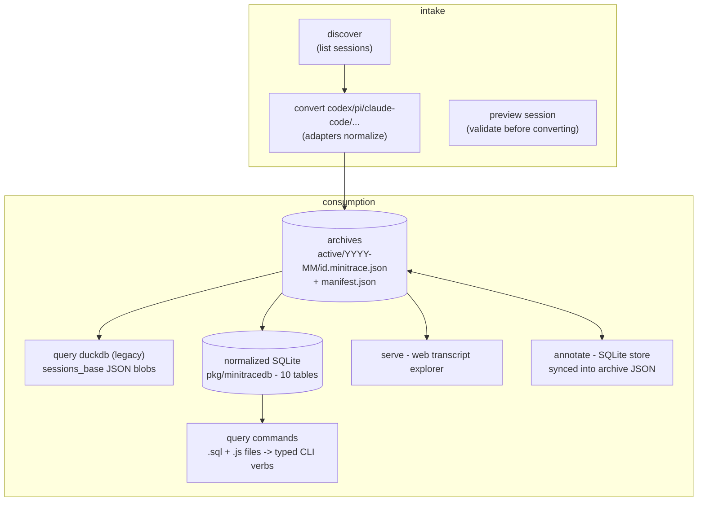

# go-minitrace: analysis, design, and implementation guide

## 1. Executive summary

go-minitrace turns the transcript stores that coding-agent frameworks leave behind (`~/.codex/sessions`, `~/.pi/agent/sessions`, `~/.claude/projects`, plus ChatGPT/claude.ai exports, Copilot, and Geppetto turns.db) into **minitrace archives**: one normalized JSON document per session with a stable schema. On top of the archives it offers batch analytics (SQL and JavaScript **query commands** with typed CLI flags), a web **transcript explorer** (`serve`), an **annotation** workflow, and inspection verbs (`discover`, `preview`, `validate`). It is a Glazed-based Go port of the original minitrace, developed ticket-by-ticket in this very `ttmp/` tree (GMT-001…GMT-008).

This guide is the onboarding document a new contributor should read first. It explains every subsystem with file references and diagrams (sections 3–10), then assesses the architecture (section 11) and lays out a prioritized improvement plan (sections 12–13) — **excluding** the query-engine consolidation, which has its own design doc (`design-doc/02-single-query-engine-…`), because that migration is the largest single change and deserves standalone treatment.

The evidence base is unusually strong for a document like this: in ticket DOCMGR-200 (docmgr repo) we used go-minitrace intensively on a real workload — converting a 240-session sample (98 codex / 88 pi / 54 claude-code) and analyzing 14,166 tool calls exclusively through custom JS query commands — and followed up with file:line source reviews. So claims here come in two flavors, both labeled: *measured* (from the converted sample, e.g. the adapter-fidelity NULL-rate matrix) and *read* (from source, with anchors relative to this repo).

Headline assessment: the schema, the builder-style JS API, and the marker-scanned query commands are the right architecture and pleasant to use in anger. The debt is concentrated in: **adapter fidelity** (pi/claude tool calls have no duration/exit-code because adapters overwrite emit timestamps and drop claude's `toolUseResult`), **the intake path** (no cwd-aware discovery, no per-session conversion for codex/claude), **the dual query engine** (design-doc/02), **manifests** (write-only, last-invocation-wins), and **docs/skills drift** (the ecosystem still teaches the legacy DuckDB API in places).

## 2. How to read this document

- New to the codebase: read 3–10 in order with the repo open; every claim has a `file:line` anchor (paths relative to the go-minitrace repo root, verified against the checkout at `go-minitrace/` in this workspace, commit `7fc9fcf`).
- Deciding what to build: sections 11–13, then design-doc/02 for the engine.
- Reproducing measurements: appendix in section 15; the instruments live in the docmgr repo's DOCMGR-200 ticket (`scripts/query-commands/docmgr/*.js`, `sources/minitrace-*.json`).

## 3. What go-minitrace is — the mental model

Three planes: **intake** (native stores → archives), **storage** (archives + derived caches), **consumption** (CLI queries, JS/SQL commands, web explorer, annotations).



A session's life, end to end:

```
~/.codex/sessions/2026/02/23/rollout-….jsonl        (native, framework-specific)
  └─ convert codex --source-dir ~/.codex             (adapter maps records)
      └─ output/active/2026-02/rollout-….minitrace.json   (normalized archive)
          └─ query commands docmgr usage command-freq
              --archive-glob 'output/active/*/*.minitrace.json'
              (archives → cached SQLite → sandboxed SQL from a JS handler)
```

The repo layout mirrors the planes: `pkg/adapters/*` (intake), `pkg/minitrace` (schema + archive writer), `pkg/minitracedb` (SQLite engine), `pkg/query` (legacy DuckDB engine), `pkg/minitracejs` (JS runtime), `pkg/minitracecmd` (query-command catalog), `pkg/annotate`, `cmd/go-minitrace/cmds/*` (CLI wiring), `web/` (explorer frontend), `proto/`+`gen/` (API types), `pkg/doc` (22 embedded help pages), `ttmp/` (its own docmgr workspace).

## 4. The data model

### 4.1 The archive schema (`pkg/minitrace/schema.go`)

One JSON document per session, schema version `minitrace-v0.2.0` (`pkg/minitrace/util.go:18`). Core objects:

- **Session envelope**: id, title (first human turn, 80-char cap), summary, quality tier (A/B/C heuristic, `pkg/minitrace/metrics.go:193-213`), classification, provenance (source_format/source_path/converted_at/converter_version), flags (`for_research`, `needs_cleaning`, `contains_error`, `contains_pii`), environment (model, framework, version), operational_context (working_directory, git_branch/ref, autonomy_level, sandbox, framework_config), timing.
- **turns[]**: role, content, thinking, per-turn token usage (input/output/cache_read/cache_creation/reasoning), intent markers, framework_metadata, `tool_calls_in_turn`.
- **tool_calls[]**: tool_name, operation_type (READ/MODIFY/CREATE/EXECUTE/DELEGATE/OTHER), input (arguments/command/file_path/justification), output (result/error/exit_code/duration_ms/truncated/full_bytes/full_hash), context (position_in_session, tools_before), spawned_agent linkage.
- **events[]** and **attachments[]**: first-class source lifecycle facts (compaction, model_change, permission_mode_change, subagent_spawn, rate_limits, image_view) and artifact references.
- **annotations[]**: human/automated notes with minitrace/MAST/toolemu taxonomies.
- **metrics**: computed rollups (counts by operation type, token totals, session_cost, subagent counts, response-size stats).

Two facts every query author must know:

1. **Results are truncated at conversion time**: `TruncateLimit = 10240` bytes (`util.go:19`), applied by every adapter; `\n[truncated]` marker appended (`util.go:174-177`). Known bug: the pre-cap at `limit*4` corrupts `full_bytes`/`full_hash` for outputs >40 KiB (`util.go:161-163`).
2. **A third of the schema currently has no writer**: `Outcome` (measured: `outcome_success` 100% NULL across all frameworks), `Condition`, `Coordination.*`, `Handover.*`, `Context.TimeSinceLastUser` (`schema.go:175`, never set), `Metrics.SubagentToolCalls` (hardcoded 0, `metrics.go:106`), `Usage.ToolTokens`, `Environment.Temperature`. Treat these columns as reserved, not as data.

### 4.2 The normalized SQLite projection (`pkg/minitracedb/schema.go`)

Ten tables (`Tables()`, :37-50): `sessions, turns, tool_calls, turn_tool_calls, files, annotations, handovers, metrics, attachments, events`, with 17 indexes (:604-624) and a `raw_json` escape-hatch column on every row. `MaterializeSession` (`materialize.go:33-115`) inserts one session per transaction and **generates synthetic events** per turn and per tool call (severity `error` when `!success`, :219-251) beside explicit source events — the `events` table mixes derived and source rows, distinguished only by `kind`.

Schema identity string `normalized-sqlite-v2` (`schema.go:10`) participates in the cache key; there is **no migration story** because DBs are always rebuilt from archives (in-memory or content-addressed disk cache `~/.cache/go-minitrace/minitracedb/mtdb-<sha>.sqlite`, `db_builder.go:560-676` — currently unbounded, no eviction).

## 5. Converters / adapters

All three primary adapters (`pkg/adapters/{codex,pi,claudecode}/convert.go` — 1288/845/1149 lines) share a skeleton: `BuildSessionSkeleton` + `BuildToolCall` (`pkg/minitrace/builders.go`), `ComputeTiming`/`ComputeMetrics` (`pkg/minitrace/metrics.go`), truncation, and a good "data-quality facts as annotations" pattern (orphaned tool calls, dedup notes).

### 5.1 Measured fidelity matrix (240-session sample; % NULL/empty)

| column (null %) | claude-code | codex | pi |
|---|---|---|---|
| tool_calls.duration_ms | **100** | 16.4 | **100** |
| tool_calls.exit_code | **100** | 4.5 | **100** |
| turns.thinking | **100** | 34.4 | 63.8 |
| sessions.git_branch | 29.6 | **100** | **100** |
| sessions.system_prompt | 100 | 10.2 | 100 |
| sessions.outcome_success | 100 | 100 | 100 |

### 5.2 Root causes (read, anchored)

- **codex is the only adapter with timing/exit codes because Codex embeds them in tool output text** and the adapter scrapes them: `parseFunctionOutput` handles structured `{metadata:{exit_code,duration_seconds}}` and `"Wall time: X"` / `"Process exited with code N"` lines (`codex/convert.go:969-1028`).
- **pi and claude-code could derive durations but destroy the input**: both overwrite the tool-call *emit* timestamp with the *result* timestamp (`pi/convert.go:430`, `claudecode/convert.go:199`), making emit→result deltas irrecoverable. Neither sets `exit_code` ever.
- **claude-code drops the `toolUseResult` record object entirely** (`{stdout, stderr, interrupted, …}` — no reference anywhere in `pkg/adapters`): structured exit semantics, stderr, and interrupt status vanish. It also reads cwd/gitBranch/version **only from `records[0]`** (:82-95), which is frequently a `file-history-snapshot` without them — matching the measured 29.6% NULL git_branch.
- **codex drops `session_meta` fields outside a fixed 7-key set** (:308-317), including `parent_thread_id` — so subagent linkage falls back to scraping UUIDs out of `spawn_agent` output text (:834-840), and `ComputeMetrics(..., 0, …)` hardcodes `subagentCount=0` (:138).
- **success is not cross-framework comparable**: codex `success = exit_code==0` (:725-727); pi/claude `success = !is_error`, and claude's `is_error` includes user interrupts. Any cross-framework failure-rate table needs this caveat.
- **Known correctness bug**: codex *exec-format* tool calls all share one aliased `EmittingTurnIndex` pointer (`&turnIndex` of the loop variable, `codex/convert.go:541`; the session-format path does `turnIndexCopy := turnIndex` correctly at :370-371) — every exec tool call reports the final turn index.
- pi is the only adapter mapping **cost** (`usage.cost.total` → `metrics.session_cost`, `pi/convert.go:397-402`); claude-code is the only one mapping **git branch**; nobody maps codex git info.

### 5.3 Adapter pseudocode (the shape all three follow)

```
convert(sourceFile):
    records = parse JSONL
    session = BuildSessionSkeleton(id, framework, provenance)
    for record in records:
        switch record.type:
            user/assistant  -> turns[] (content, thinking, usage)
            tool_use        -> BuildToolCall(..., success=true)   # optimistic
            tool_result     -> applyToolResult(call): success/result/error
                               # BUG: also overwrites call.Timestamp (pi/claude)
            lifecycle       -> events[] (compaction, model_change, ...)
    mark orphaned tool calls (no result) failed + annotate
    ComputeTiming, ComputeMetrics, AssignQualityTier, DetectPII
    TruncateContent on every result (10 KiB)
    WriteSession -> active/YYYY-MM/<id>.minitrace.json
```

Note `DetectPIIInPaths` (`pkg/minitrace/util.go:231-241`) flags any `/home/` or `/Users/` path — effectively every real session — cascading into `classification=confidential`, `for_research=false`: a constant, not a signal.

## 6. Archive layout and manifests

`WriteSession` (`pkg/minitrace/archive.go:31-90`) → `outputDir/active/<YYYY-MM>/<sanitized-id>.minitrace.json` (timestampless sessions land in `active/unknown/`). `WriteManifests` (:92-251) writes a root `manifest.json` plus per-period manifests — **built exclusively from the current invocation's in-memory index**. Consequences (all verified): converting pi then codex into one output dir leaves a root manifest describing only the codex batch; stale period manifests disagree with the root; and since queries glob session files directly (`pkg/query/engine.go:101-133`), manifests are consumed by nothing — pure liability today. The JS importer adds a third layout: `mt.importer().Save()` writes `rootDir/<id>/session.minitrace.json` + `metadata.json` (`pkg/minitracejs/import_builder.go:397-415`), manifest-free.

## 7. Query surfaces

### 7.1 Legacy DuckDB engine (`pkg/query/engine.go`)

Loads every archive matching `--archive-glob` into one DuckDB table (default `sessions_base`) via `read_json` with an explicit column map (:80-95) — turns/tool_calls remain JSON blobs queried with `->>`/`UNNEST`. No row/cell limits, string-interpolated file lists (:75-98), `panic` on glob errors (:61-67), a laxer validator (allows EXPLAIN/DESCRIBE/SHOW, `pkg/query/validation.go:9-24`). Exposed via `query duckdb` (presets + `--sql-file`), and — critically — **the structured-command runtime preloads it for every command, including JS ones that never touch it** (`pkg/minitracecmd/command_runtime.go:86-99`). Full dependency map and retirement plan: design-doc/02.

### 7.2 Normalized SQLite engine (`pkg/minitracedb`)

The modern path: archives → `MaterializeSession` → in-memory or disk-cached SQLite → sandboxed queries. The sandbox is the best-engineered subsystem in the repo — three independent layers: prefix/single-statement/literal-stripping validation (`query.go:204-348`), `stmt.Readonly()` verification (:364-384), and a SQLite **authorizer** allowing only `SELECT`/functions/reads-of-allowlisted-tables (:409-431; allowlist = exactly the 10 schema tables via `AllowedTableNames()`, `schema.go:52-59` — this is why `sqlite_master` is denied; use `db.schema()`/`db.tables()` instead). Default limits: 4,000 chars/cell, row/column caps, per-query timeout (`query.go:37`, :109-110). Content-addressed caching (`cache.go`): keys fingerprint file sha256 + sizes + schema/converter versions; atomic temp-file install.

### 7.3 Query commands (`pkg/minitracecmd`)

A catalog of commands assembled from (1) the embedded core (`pkg/minitracecmd/core/**`) and (2) external repositories via `--query-repository`, `GO_MINITRACE_QUERY_REPOSITORIES`, or config files. `.sql` files become leaf commands (running against DuckDB `sessions_base`); `.js` files are scanned for `__section__`/`__verb__` markers (scanner lives in go-go-goja `pkg/jsverbs`; parse at `parse_javascript.go:18-25`) and each verb becomes a subcommand with **typed flags generated from the section fields**. Path rule: a JS file adds a group level from its stem, collapsed only when the file defines exactly one verb named like the stem (`jsCommandPath`, :88-101) — the source of the confusing `Too many arguments` when you type the uncollapsed path.

### 7.4 The JS runtime API (`pkg/minitracejs`)

`require("minitrace")` exposes builder factories (`module.go:22-71`): `mt.db()`, `mt.sources()`, `mt.cache()`, `mt.limits()`, `mt.importPolicy()`, `mt.query()` (canned recipes), `mt.view()`, `mt.session()`, `mt.importer()`, plus `mt.sql.{string,stringIn,like}` and `mt.runtime`. Canonical handler:

```js
__section__("filters", { fields: {
  framework: { type: "stringList", help: "Filter by framework" },
  limit:     { type: "int", default: 25 },
}});

function myAnalysis(filters) {
  const mt = require("minitrace");
  const db = mt.db().RuntimeArchives().QueryCommandDefaults()
               .MaxRows(500000).MaxCellChars(4000).Build();
  try {
    return db.query(`SELECT ... FROM tool_calls tc JOIN sessions s USING(session_id) ...`);
  } finally { db.close(); }
}

__verb__("myAnalysis", { name: "my-analysis", short: "...",
                         fields: { filters: { bind: "filters" } } });
```

Design strengths: builder error-accumulation surfaced at `Build()`/`Validate()` (`db_builder.go:442-486`); Go-owned handles; `QueryCommandDefaults()` as the one-liner. Known warts: goja exceptions surface as raw stack traces (`cmd/.../query/js_runtime.go:89-93` returns them unwrapped — the SQL side's structured `QueryResult.Error` pattern, `query.go:95-105`, should be adopted); `mt.runtime.dbPath/tableName/persistLoaded` are documented-legacy vestiges; the loader's DuckDB `conn` parameter is explicitly dead (`module.go:23`); the query-repo tree is scanned twice per invocation (catalog build + `js_runtime.go:47`).

## 8. serve and the web transcript explorer

### 8.1 Server (`cmd/go-minitrace/cmds/serve/`)

`go-minitrace serve` is a long-running Glazed bare command (`serve.go:27-88`). Startup (`serve.go:92-167`): open DuckDB → attach `annotations.db` via sqlite_scanner (`serve.go:113-118`) → `read_json` all `--archive-glob` matches into `sessions_base` → build a **session-ID → archive-file index** by reading every archive's `id` (`server.go:257-278`; duplicate IDs are a hard error) → open the SQLite annotation store → resolve query-command roots (embedded catalog fallback) → serve on `:8080` with graceful shutdown. `--dev` disables the embedded SPA (Vite serves the frontend on :5173, proxying `/api`).

Route table (stdlib `http.ServeMux`, Go 1.22 method+pattern syntax, `server.go:88-113`; every `/api/v2/*` response is a **protojson-marshaled protobuf message**):

| Route | Purpose |
|---|---|
| `GET /api/v2/sessions` | session list from DuckDB `sessions_base` (`handlers_sessions.go:174-191`) |
| `GET /api/v2/sessions/{id}` / `…/summary` / `…/blocks` | session detail — reads the archive **file** via the index (`handlers_sessions.go:500-514`), computes blocks/badges on the fly |
| `POST /api/query` | ad-hoc SQL from the web Query Editor (deliberately plain JSON, `server.go:46-49`; read-only-validated `server.go:178`) |
| `GET /api/v2/presets` / `GET|POST|PUT|DELETE /api/v2/queries[...]` | embedded presets (read-only) + user-saved `.sql` CRUD under `--query-dir` (traversal-guarded, `handlers_queries.go:184-235`) |
| `GET|POST /api/v2/query-commands[...]` | structured-command catalog + execute (SQL renders/executes; JS runs the goja runtime; `handlers_query_commands_v2.go`) |
| `GET|POST /api/v2/sessions/{id}/annotations`, `GET|PUT|DELETE /api/v2/annotations[...]`, `POST /api/v2/annotations/sync` | annotation CRUD + sync-to-archive |
| `GET /` | embedded SPA, index.html fallback |

Transcript shaping is server-side, not stored: `buildSessionBlocks` (`blocks.go:23-51`) groups turns into user-anchored blocks with gap-minute computation; `DetectBadges`/`DetectBlockArtifacts` (`badges.go`) tag tool calls (`error`, `commit`, `ticket-create`, `doc-add`, `diary-write`) and extract commit messages/ticket IDs per block via regexes — note the docmgr-aware heuristics: the explorer natively badges docmgr bookkeeping activity.

### 8.2 Protobuf API layer (`proto/`, `gen/`, buf)

Five proto files under `proto/go_go_golems/minitrace/api/v1/` define the **HTTP payload types only** (the archive schema stays plain JSON): common (ApiMeta, timing/metrics/env, `ToolCallBadge`, `StringList` for unset-vs-empty patch semantics), sessions, annotations, queries, query_commands (with `google.protobuf.Struct` for free-form rows). `buf.gen.yaml` generates **both** Go (`gen/proto/...pb.go`, consumed with `protojson` — camelCase JSON) and TypeScript (`web/src/gen/`, consumed with `fromJson(<Schema>,…)`). Codegen is manual `buf generate` — no Makefile target or go:generate directive; generated files are checked in. Int-width clamps between Go `int` and proto types live in `proto_numbers.go:5-31`.

### 8.3 Web frontend (`web/`)

React 19 + TS + Vite 8 + MUI 7 + RTK Query + CodeMirror 6; pnpm 10.15.0; Storybook 10 with vitest browser-mode story tests; opt-in MSW mocks (`VITE_USE_MSW`). Three routes (`App.tsx:9-18`): `/sessions` (browser), `/sessions/:id` (transcript viewer), `/query` (SQL/command editor). One RTK Query slice (`web/src/api/minitrace.ts:49-176`) decodes protojson through the buf-generated schemas and adapts to UI types. The transcript viewer is the flagship: virtualized block list, collapsible thinking/system-prompt folds, per-turn token chips, tool-call rows with success/error icons and a naive line-diff for edits, a SourceFactsPanel for events/attachments, and deep-linkable annotation targets (`?focusType/focusId` + `data-tool-call-id` scroll-and-highlight). The query editor unifies presets / saved queries / structured commands, polls the filesystem-backed lists every 3 s while active, and renders typed forms for command parameters.

## 9. Annotations

One subsystem, three storage locations, explicit sync:

```
CLI (annotate add/list/edit/delete/import)  ┐
web UI (v2 annotation routes)               ├──> annotations.db (SQLite, WAL; outputDir)
                                            │        │  change_count marks dirty sessions
                                            │        ▼
                                            │    annotate sync / POST /api/v2/annotations/sync
                                            │        │  atomic rewrite of the archive's annotations[]
                                            │        ▼
                                            └──  .minitrace.json archives (canonical interchange)
serve SQL surface <── sqlite_scanner attach ──── annotations.db (live reads)
```

Store schema (`pkg/annotate/store.go:61-90`): one `annotations` table (scope session/turn/tool_call, category from a fixed 8-value enum, tags, three parallel taxonomies — minitrace codes like `F-AUT`, plus MAST and toolemu — as JSON columns) + `sync_state`. `SyncSession` (`sync.go:40-105`) replaces only the `annotations` key in the archive JSON, atomic temp-file+rename. The CLI verbs are plain Cobra pending Glazed migration (`root.go:3` file-ignore pragma). The taxonomy triple is carried end-to-end: schema → SQLite → proto → CLI flags → web UI.

## 10. Supporting subsystems

- **`discover` / `preview` / `validate`**: name-only discovery (`SessionLocator` = id/format_hint/source_path — the cwd gap in §11); `preview session` renders per-session role/tool/event breakdowns with privacy tiers (`structural|snippets|full`) — the right pre-conversion validation tool; `validate` sanity-checks JSON targets.
- **`queries/` (repo root)**: a documentation-grade library of plain DuckDB SQL, *also* serve's default `--query-dir` — running serve from the repo root exposes the whole tree as editable saved queries (and the web UI writes new files into `queries/my-queries/`, one of which is accidentally tracked despite the README's gitignore claim). Duplicates 9 of the embedded presets by hand.
- **`testdata/query-repositories/`**: `js-showcase` (multi-verb JS files, helper modules, async verbs, aliases-over-JS) and `mixed-sql-js-showcase` (SQL front-matter + JS side by side) — the best learning material for command authors, and genuinely tested: serve's tests execute them end-to-end through the HTTP API (`server_test.go:1183-1263`), and CI runs `go test ./...`.
- **Build/release/CI**: frontend built by a Dagger pipeline (`cmd/build-web`, node:22 + pinned pnpm, exported into `cmd/go-minitrace/cmds/serve/frontend/`, `//go:embed all:frontend`); Makefile has lint (golangci + pinned glazed-lint), logcopter generate/check, svu tagging, and a tmux dev environment; release is GoReleaser Pro split builds (CGO for DuckDB/SQLite forces per-OS builders + aarch64 cross-compilers) merged, signed, published to GitHub + Homebrew, plus a docs export to the go-go-golems registry. CI: push tests (with real Dagger frontend build), lint, CodeQL, dependency/secret scanning.
- **README/AGENT.md drift** (fix list): README says "six presets" (there are 9), omits Copilot support and the transcript-viewer/annotation UI; the Makefile dev-help pane curls legacy v1 routes that now 404 (`Makefile:139-140` vs `server_test.go:203,731`); `queries/README.md`'s gitignore claim is contradicted by a tracked file; AGENT.md is generic boilerplate prescribing bun/templ/bootstrap for a pnpm/Vite/MUI app and an `internal/` layout the repo doesn't use; `web/index.html` still ships `<title>web</title>`.

## 11. Architecture assessment

**Strong** (keep and build on): the normalized schema and its documentation; the three-layer SQLite sandbox; content-addressed DB caching; the builder JS API; marker-scanned query commands; adapter data-quality annotations; the 22-page embedded help corpus; repo hygiene (zero TODOs, logcopter/lint discipline).

**Misshapen** (ranked):

1. **Dual query engines, with the legacy half load-bearing** — full treatment and migration plan in design-doc/02.
2. **Three archive layouts, zero reconcilers** (§6): dated dirs + write-only manifests; importer per-session dirs; annotation SQLite synced back into JSON by a manual verb. Nothing ever rescans a directory to reconcile.
3. **Aspirational schema surface** (§4.1): permanently-NULL columns mislead query authors; either write them (`Outcome` first), drop them, or document per-adapter support.
4. **Adapter fidelity silently varies by framework** (§5): the fix list is small and mostly mechanical (P0 below), but until then every cross-framework analysis is subtly wrong.
5. **Intake ergonomics**: discovery exposes only `id, format_hint, source_path` (`pkg/adapters/types.go`; `discover/codex.go:77-86`), forcing users to grep raw stores; codex/claude-code lack `--source-session`; `--source-dir` means four different things across converters; convert aborts a whole batch on the first bad session (`convert/codex.go:82-85`).

## 12. Improvement backlog (excluding the engine migration — see design-doc/02)

**P0 — adapter correctness (small diffs, immediate analytical payoff):**

| # | change | anchor |
|---|---|---|
| 1 | Preserve emit timestamps; derive `duration_ms = result_ts − emit_ts` for pi/claude | `pi/convert.go:430`, `claudecode/convert.go:199` |
| 2 | Map claude-code `toolUseResult` (stdout/stderr/interrupted → error/exit semantics) | `claudecode/convert.go:183-198` area |
| 3 | Fix codex exec `EmittingTurnIndex` aliasing | `codex/convert.go:541` |
| 4 | Hash/size full content before capping in `TruncateContent` | `pkg/minitrace/util.go:161-163` |
| 5 | Scan all records for claude cwd/gitBranch; keep codex `parent_thread_id`; real codex subagentCount | `claudecode/convert.go:82-95`, `codex/convert.go:308-317,138` |
| 6 | Convert: skip-and-report per-session failures instead of aborting the batch | `cmd/.../convert/codex.go:82-85` |

**P1 — intake path:** `--source-session` (repeatable) + `--source-list` on all converters; `discover --with-cwd/--cwd-contains/--since` (read the cheap header line; extend `SessionLocator`); unify `--source-dir` semantics; manifests read-merge-write or a `manifest rebuild` verb (or delete manifests).

**P2 — analyst experience:** structured JS error envelopes (+ `{"error":…}` on failed `--output json`); wrong-path errors that print the resolved path and candidates; `sqlite_master` denial pointing at `db.schema()`; a **fidelity-matrix help page** (adapter × column: mapped/scraped/derived/never) kept honest by a CI test recomputing NULL rates over testdata; disk-cache eviction; rethink `DetectPIIInPaths`.

**P3 — docs and skills refresh** (the "related docs and skills" scope of this ticket):

1. `pkg/doc/query.md`: delete the claim that events/attachments are DuckDB-queryable (they are SQLite-only; the DuckDB column map at `pkg/query/engine.go:80-95` excludes them).
2. `pkg/doc/adapter-reference.md`: correct the pi MCP-classification claim (no such logic — `pi/convert.go:489-512`), refresh the claude-code operation table, and **document the never-populated columns per adapter** (duration/exit_code/toolUseResult drop) — this is the single highest-value doc fix.
3. Add a manifest-semantics page (or remove manifests and document that).
4. New help page: "choosing between query duckdb and query commands" that says plainly the DuckDB path is legacy (until design-doc/02 removes it).
5. **The `go-minitrace-transcript-analysis` skill** (`~/.claude/skills/go-minitrace-transcript-analysis`): still teaches `mt.query()`/`mt.queryOne()`/`mt.tableName` and `sessions_base`-era DuckDB flows as the primary JS API; the current runtime is builder-based (`mt.db()…`). Update the skill's JS example to the builder pattern, add the collapse-rule warning for self-named single-verb files, the `db.schema()` tip, and the staging recipe for codex/claude subset conversion (until P1 lands).
6. README: add the query-commands and JS-runtime surfaces (it undersells the current tool), link the fidelity matrix.

## 13. Implementation plan (file-level, non-engine items)

- **Phase A (P0 adapters)**: touch only `pkg/adapters/*` + `pkg/minitrace/util.go`; regenerate testdata goldens; add a fidelity CI test (convert `testdata/`, assert NULL-rate ceilings per column per adapter).
- **Phase B (P1 intake)**: extend `adapters.SessionLocator` with `cwd`/`started_at` (each discover impl reads its store's header record); add `--source-session/--source-list` to `cmd/.../convert/{codex,claude_code}.go` mirroring `pi.go:55,74-85`; convert loops collect per-session errors into the existing diagnostics rows.
- **Phase C (P2 UX)**: wrap goja invocation errors in `cmd/.../query/js_runtime.go:89-93` with a structured envelope + candidate-path suggestions from the catalog; authorizer denial message in `pkg/minitracedb/query.go:399-407`; cache eviction in `db_builder.go:667-676` (LRU by atime, size cap from config).
- **Phase D (P3 docs/skills)**: the six items above; each is an independent, reviewable diff.

## 14. Testing strategy

1. **Adapter goldens**: `testdata/` sessions per framework, converted in CI, compared field-by-field — extended with the new duration/exit_code/toolUseResult expectations.
2. **Fidelity gate**: recompute the §5.1 matrix over testdata in CI; fail if a mapped column regresses to NULL.
3. **Query-command contract tests**: run the js-showcase and mixed-sql-js-showcase repositories against a fixture archive; assert row shapes and that error cases produce structured envelopes.
4. **Manifest property test** (if manifests are kept): convert framework A then B into one dir; assert the root manifest lists both.
5. Real-world smoke: the DOCMGR-200 instruments (`fidelity`, `command-freq`, `retry-chains`) run unchanged against a locally converted sample — they double as integration tests for the JS surface.

## 15. References and reproduction

- **Prior evidence**: docmgr repo, ticket DOCMGR-200 — `analysis/01-go-minitrace-field-report-…md` (friction log F1–F9, fidelity matrix, prioritized backlog), `scripts/query-commands/docmgr/{probe,usage,paths,volume,fidelity}.js`, `sources/minitrace-*.json`, `scripts/03-stage-and-convert.sh` (the staging workaround this backlog eliminates).
- **Key files**: adapters `pkg/adapters/{codex,pi,claudecode}/convert.go`; schema `pkg/minitrace/schema.go`, `pkg/minitracedb/schema.go`; engines `pkg/query/engine.go` (legacy), `pkg/minitracedb/{materialize,query,cache,db_builder}.go`; JS `pkg/minitracejs/{module,db_builder,query_view_session,import_builder}.go`; catalog `pkg/minitracecmd/{command_runtime,parse_javascript}.go`; archive `pkg/minitrace/archive.go`; CLI `cmd/go-minitrace/cmds/*`; docs `pkg/doc/*.md`.
- Reproduce the fidelity matrix: `go-minitrace query commands docmgr fidelity --query-repository <docmgr-ticket>/scripts/query-commands --archive-glob '<work>/archive/*/active/*/*.minitrace.json' --output json`.
