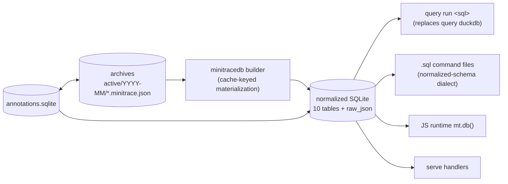

# Single query engine: migrating go-minitrace off the dual DuckDB/SQLite stack

## 1. Context and problem statement

go-minitrace currently ships **two complete query stacks** over the same archives:

- **Legacy DuckDB** (`pkg/query`): loads every archive matching a glob into one `sessions_base` table via `read_json`; turns/tool_calls stay JSON blobs queried with `->>`/`UNNEST`. Consumed by `query duckdb`, the embedded/user **`.sql` query commands**, and — load-bearing — the **`serve` web explorer** and the annotation attach path.
- **Normalized SQLite** (`pkg/minitracedb`): materializes archives into 10 relational tables behind a three-layer read-only sandbox with limits and content-addressed caching. Consumed by the **JS query commands** (`mt.db()` builders) and the canned recipes/views.

The duplication is not free: two validators with different rules, two value normalizers, two truncation regimes, two SQL dialects taught in the docs, and — worst — the structured-command runtime **preloads DuckDB for every command invocation even when the command is JS and never touches it** (`pkg/minitracecmd/command_runtime.go:86-99`), so the modern path pays the legacy path's full archive-load cost on every run. Users must learn which engine their query targets (`sessions_base` blob SQL vs normalized tables), and the help corpus teaches both.

**Decision (made by the maintainer, this ticket):** consolidate on a single engine. This document designs that migration. Direction: **normalized SQLite wins**; DuckDB is retired from the runtime path.

## 2. Goals and non-goals

**Goals**

1. One engine, one dialect, one validator/limits/truncation regime for every consumer: `query` CLI, `.sql` command files, JS runtime, `serve`, annotations.
2. No archive-format change; archives remain the source of truth.
3. `.sql` query-command files keep working as a concept (files → typed CLI verbs) after a mechanical rewrite to the normalized schema.
4. Kill the unconditional preload; JS/SQL commands only build the DB they actually use.
5. Docs/skills teach exactly one query surface when this lands.

**Non-goals**

- Analytical parity for exotic DuckDB features (list comprehensions, `read_json` ad-hockery) — out of scope; the normalized schema plus `raw_json` columns covers the real use cases.
- Keeping `query duckdb` alive behind a flag (rejected below — see DR-2).
- Changing the archive layout/manifests (tracked in design-doc/01 §12).

## 3. Why SQLite (decision record DR-1)

- **Context**: one engine must serve batch analytics (CLI/JS), the web explorer, and annotations, on end-user machines, embedded in a single Go binary.
- **Options**: (a) SQLite normalized schema; (b) DuckDB everywhere (normalize into DuckDB tables); (c) both behind an interface.
- **Decision**: **(a) SQLite.**
- **Rationale**: the SQLite side already has the hard parts built and battle-tested — the three-layer sandbox (validator + `stmt.Readonly()` + authorizer, `pkg/minitracedb/query.go:204-431`), limits, structured errors, and content-addressed caching (`cache.go`, `db_builder.go:513-676`) — none of which exists on the DuckDB side (no limits, string-interpolated file lists, `panic` on glob errors, laxer validation allowing EXPLAIN/DESCRIBE/SHOW). The normalized relational shape is what real analyses use (all six DOCMGR-200 analysis verbs ran on it; zero needed `sessions_base`). SQLite (mattn/go-sqlite3) is one cgo dependency the project needs anyway for annotations; dropping go-duckdb removes a second heavyweight cgo dependency and its binary-size cost. DuckDB's genuine advantages (columnar scans over huge JSON, richer SQL) don't bind at minitrace scale — hundreds-to-thousands of sessions, already cached as SQLite.
- **Consequences**: DuckDB-specific SQL in embedded presets, user `.sql` files, and two help pages must be rewritten; `serve` must be ported; window/aggregate feature gaps (if any surface) must be solved in SQLite's dialect or in Go post-processing.
- **Status**: proposed (direction pre-approved by maintainer; details in review).

## 4. Complete DuckDB dependency map

All anchors relative to the go-minitrace repo (checkout `7fc9fcf`).

### 4.1 The dependency itself

- `go.mod:9` `duckdb-go/v2 v2.10502.0`, plus indirect `duckdb-go-bindings` **prebuilt static libraries for five platforms** (go.mod:60-65) and `apache/arrow-go/v18` (:33). The DuckDB static lib dominates the binary — on the order of **~50 MB on linux-amd64**; removing it is a multi-tens-of-MB binary-size win. SQLite (mattn/go-sqlite3, go.mod:16) is already a direct dependency for annotations and minitracedb.
- Driver usage is remarkably contained: exactly **three** non-test files import it — `pkg/query/engine.go:14,28` (driver + `duckdb.Decimal` in `NormalizeValue` :227-228), and `pkg/annotate/duckdb.go:20-53` (`INSTALL/LOAD sqlite_scanner`, `CALL sqlite_attach` for annotations.db).

### 4.2 What `sessions_base` actually is

`buildLoadSQLFromFiles` (`pkg/query/engine.go:69-99`): `CREATE OR REPLACE TEMP TABLE sessions_base AS SELECT * FROM read_json(<files>, columns={...}, ignore_errors=true)` with **exactly 14 columns** — 5 VARCHAR (`id,title,summary,classification,profile`), 6 JSON blobs (`provenance,flags,environment,operational_context,timing,metrics`), 3 JSON arrays (`turns,tool_calls,annotations`). **No** `events`, `attachments`, `quality`, `outcome`, `coordination`, `handover` — the normalized SQLite schema is a strict superset (10 tables incl. events/attachments/handovers/metrics, 57-column `sessions`, and complete `raw_json` copies on every row: `materialize.go:117-320`). Nothing queryable in `sessions_base` is unreachable from the normalized DB (long tail via `json_extract(raw_json, …)`).

### 4.3 Consumers

| Consumer | Coupling (anchor) | Notes |
|---|---|---|
| `query duckdb` CLI | whole command (`cmd/.../query/duckdb.go:63-144`) | presets, `--sql/--sql-file`, `--load-only` emits `backend:"duckdb"` |
| **Command-runtime preload** | `command_runtime.go:86-99` loads archives into DuckDB **before** the runtime switch — including for JS commands whose loader discards the conn (`minitracejs/module.go:23`) | re-parses every archive per invocation; no cache |
| SQL command files | embedded core catalog: **12 commands + 1 alias**, all `{{TABLE_NAME}}`→`sessions_base` (`pkg/minitracecmd/core/**.sql`); legacy presets ×9 (`pkg/query/presets/`, duplicated by the catalog) | dialect: `UNNEST(...) AS t(x)`, `->>` on JSON columns, `LEFT()`, `CAST(x AS DATE)` |
| `serve` | one process-lifetime conn (`serve/serve.go:104-125`), **shared `*sql.Conn` serializing all HTTP queries** (`server.go:24-36`); handlers: `POST /api/query` (web Query Editor SQL, `server.go:152-255`), `GET /api/v2/sessions` (`handlers_sessions_v2.go:13-25`), `GET /api/v2/presets` (ships rendered DuckDB SQL to the frontend), `POST /api/v2/query-commands/*/execute` SQL branch | session **detail** views read `.minitrace.json` from disk directly (`handlers_sessions.go:500-514`) — not DuckDB |
| Annotations attach | `pkg/annotate/duckdb.go:20-53` sqlite_scanner bridge (live reads of annotations.db) | annotation CRUD itself is plain SQLite |
| Web frontend | default/sample SQL uses `sessions_base`/`UNNEST … WITH ORDINALITY` (`web/src/store/uiSlice.ts:16,37`, `web/src/mocks/data.ts:493-604`) | |
| Tests | `pkg/query/*_test.go`, `commands_test.go:91`, `command_runtime{,_js}_test.go`, `serve/server_test.go` | |
| Docs/skill | ~15 help pages incl. `query-duckdb.md`, `writing-duckdb-queries.md`, `duckdb-query-recipes.md` (already stale — references a `quality` column `sessions_base` doesn't define), `annotation-playbook.md`; `README.md:120-160`; the `go-minitrace-transcript-analysis` user skill | |
| Repo `queries/` dir | saved queries for serve (`--query-dir`, default `./queries`): `load.sql` (raw `read_json` bootstrap — delete), framework-metadata UNNEST queries (data available via `*_json` columns), etc. | |

**Not** coupled: `convert`, `discover`, `preview`, `validate`, `annotate` CLI, annotation CRUD, saved-query CRUD, session-detail rendering.

### 4.4 Embedded SQL classification (the migration workload)

**0 of the 12 embedded SQL commands run on normalized SQLite as-is; all 12 are mechanical rewrites; every one gets simpler.** Examples: `overview/session-list.sql`'s `environment->>'agent_framework'` becomes the `sessions.agent_framework` column; `tools/tool-failures.sql`'s `UNNEST(tool_calls)`+`json_extract`+quote-stripping hack becomes a plain SELECT on the `tool_calls` table; `nightly/workspace-summary.sql`'s three-way COALESCE over blobs collapses to `working_directory`. Dialect fix list: `UNNEST → child tables`, `LEFT → substr`, `CAST(x AS DATE) → date(x)`, `->>` on blob columns → real columns (or `->>` on `raw_json`, supported by SQLite ≥3.38). The only truly unportable constructs live in docs/scripts: `DESCRIBE`/`SHOW` (allowed by the DuckDB validator, `pkg/query/validation.go:9-24`) and `read_json`/`sqlite_attach`.

### 4.5 Performance and concurrency comparison

| | DuckDB path | SQLite path |
|---|---|---|
| Load | re-parses **all** archives per CLI invocation / per serve boot; no cache | content-addressed cache (sha256 + schema/converter versions); memory + disk tiers |
| Concurrency | `SetMaxOpenConns(1)`; serve serializes every query on one conn | per-handle `*sql.DB`; read-only disk DBs open concurrently; per-query timeout |
| Limits | none (unbounded result sets) | 1,000 rows / 128 cols / 4,000 chars / 5 s defaults — serve must raise these |
| Binary | ~50 MB static libs ×5 platforms + arrow-go | ~2–3 MB |

## 5. Target architecture

Key moves:

1. **One `QueryTarget` seam.** Extract the handle produced by `pkg/minitracedb.DBBuilder.Build()` (query/queryOne/queryResult/schema/limits/close) as the single Go interface every consumer takes. The JS runtime already consumes exactly this; `serve` and the SQL-command executor are ported onto it.
2. **`.sql` command files target the normalized schema.** A command file's SQL runs through the same sandbox as JS-issued SQL — same validator, same limits, same error envelope. `--table-name`/`sessions_base` disappear from their contract.
3. **The command runtime builds lazily.** `pkg/minitracecmd/command_runtime.go` stops preloading anything; SQL commands ask for a DB handle scoped to `--archive-glob`, JS commands build their own (as today). One shared cache means the second command in a session is warm either way.
4. **`serve` reads the same cache.** The explorer's session-list/detail queries become normalized-SQLite queries (they are simple projections; the transcript detail view mostly reads single sessions — `mt.session()`'s recipes already produce these rows). Annotations attach as today's SQLite store, now a plain same-engine ATTACH (or a second connection) instead of DuckDB's `sqlite_scanner` bridge.
5. **`query duckdb` → `query run` (new)**: ad-hoc SQL + `--sql-file` + presets, against the normalized DB. Presets are rewritten (see §6). The `duckdb` verb is removed, not aliased (DR-2 below).

**DR-2 — no compatibility shim for `query duckdb`.**
Context: existing muscle memory/scripts/help teach `query duckdb --preset …`. Options: (a) keep `query duckdb` as an alias executing rewritten presets on SQLite; (b) hard-remove with a clear error naming `query run`; (c) keep real DuckDB behind a build tag. Decision: **(b)**. Rationale: an alias that runs a *different dialect* against a *different schema* silently breaks every saved user SQL anyway — pretending otherwise converts loud breakage into quiet wrong results; a build tag keeps the double maintenance this design exists to end. The removal error message should name the replacement and the migration help page. Status: proposed.

**DR-3 — expose JSON blobs for long-tail queries.**
Context: `sessions_base` let users poke at raw JSON with `->>`; the normalized schema pre-flattens the common fields, and every table keeps `raw_json`. Options: (a) rely on `raw_json` + SQLite's `json_extract`/`->>` (SQLite ≥3.38 supports the arrow operators); (b) add generated columns on demand; (c) nothing. Decision: **(a)**, documented with recipes; (b) case-by-case when a raw field graduates to a real column (that's the existing `framework_metadata` promotion policy). Status: proposed.

## 6. Migration mechanics (phased, each phase shippable)

### Phase 0 — Kill the vestigial JS preload (S, pure win)

`command_runtime.go:86-99`: move `OpenConnection`+`LoadArchive` inside the `CommandRuntimeSQL` branch only. JS commands stop paying the DuckDB load they discard (`minitracejs/module.go:23`). No user-visible SQL change; measurable cold-start improvement on every JS verb. Keep `mt.runtime.tableName/dbPath/persistLoaded` values intact (the js-showcase `runtime-playground.js:28,32` reads them).

### Phase 1 — A `QueryTarget` seam + `query run` (M)

- Extract the minitracedb handle behind a small Go interface (`Query/QueryOne/QueryResult/Schema/Close`) in `pkg/minitracedb`; the JS `DBHandle` already implements it.
- New `query run` command: `--archive-glob`, `--sql/--sql-file/--preset`, built on the builder + sandbox with **configurable limits** (`--max-rows`, `--timeout`); `query duckdb` untouched in this phase.
- Port the 9 legacy presets (`pkg/query/presets/`) to the normalized schema as `query run --preset` targets. Parity harness: run old (DuckDB) and new (SQLite) preset side by side over `testdata/` fixtures, diff rows.

### Phase 2 — SQL command files to the normalized schema (M)

- Rewrite the 12 embedded core `.sql` commands (mechanical, per §4.4) and drop `{{TABLE_NAME}}` (or re-point it at `sessions` for template compatibility).
- The SQL branch of `command_runtime.go:102-113` executes via the `QueryTarget` (same sandbox as JS); the DuckDB validator (`pkg/query/validation.go`) is no longer used by this path.
- `--table-name`/`--db-path`/`--persist-loaded` on the runtime section become accepted-but-deprecated (warn once), removed one release later.
- **Optional compat view** (recommended): `CREATE VIEW sessions_base AS SELECT id, title, …, raw_json AS session_json FROM sessions` reconstructing the six blob columns via `json_extract(raw_json, '$.environment')` etc. This lets *session-level* saved SQL using `->>` run unmodified on SQLite ≥3.38. `UNNEST`/`DESCRIBE`/`read_json` remain unportable — the migration help page documents the rewrite patterns.

### Phase 3 — Port `serve` (M, the load-bearing consumer)

Per the serve review, only four handler groups touch DuckDB; session detail/summary/blocks already read archive JSON directly:

1. `GET /api/v2/sessions` — `buildSessionListSQL` (`handlers_sessions.go:174-191`) becomes a plain `sessions` SELECT (columns already flattened). **S**.
2. `POST /api/query` (web Query Editor) — execute on the `QueryTarget` with lifted limits; structured error envelope replaces the current normalize path. The frontend's default/sample SQL (`web/src/store/uiSlice.ts:16,37`, incl. `openQueryForSession`'s generated UNNEST query) is rewritten to normalized-schema equivalents. **M**.
3. `GET /api/v2/presets` — serves the rewritten presets; no handler change beyond the source. **S**.
4. `POST /api/v2/query-commands/*/execute` SQL branch — same `QueryTarget` as the CLI (falls out of Phase 2). **S**.

Annotations: replace the sqlite_scanner bridge (`pkg/annotate/duckdb.go`) with a **same-engine ATTACH** of `annotations.db` on the serve connection (Go-side `ATTACH DATABASE ? AS anno` before the authorizer is installed, with `anno.annotations` added to the read allowlist) — preserving today's *live* annotation reads, which a materialized snapshot would lose. Concurrency improves for free: per-handle `*sql.DB` on a read-only cached file replaces the single serialized `*sql.Conn`.

Startup changes: serve builds (or reuses from cache) the normalized DB once; the session-ID→file index stays as-is for detail views.

### Phase 4 — Remove (L, mostly deletion)

- Delete `query duckdb` (replacement error names `query run` + the migration help page), `pkg/query/{engine,validation,assets}.go` + presets dir (keep `NormalizeValue` minus `duckdb.Decimal` if serve still needs it, else delete), `pkg/annotate/duckdb.go`, the runtime section's DuckDB flags, `queries/load.sql`.
- `go.mod`: drop duckdb-go, duckdb-go-bindings (×5 platform libs), arrow-go. Record the binary-size delta (expect tens of MB); release job simplifies (aarch64 cross-compile stays for sqlite3 cgo).
- Rewrite the `queries/` tree to the normalized dialect (it doubles as serve's default `--query-dir`, so stale files would surface as broken saved queries in the UI).
- Docs sweep (~15 pages): `query-duckdb.md` + `writing-duckdb-queries.md` + `duckdb-query-recipes.md` collapse into `writing-queries.md` + `query-recipes.md` (normalized schema); `annotation-playbook.md` drops sqlite_scanner recipes; `query.md`, `getting-started.md`, `analysis-guide.md`, `end-to-end-analysis.md`, README updated; **new page: `migrating-from-duckdb.md`** with the rewrite table from §4.4.
- Update the `go-minitrace-transcript-analysis` skill (teaches "run DuckDB queries" as the primary workflow).
- Tests: retarget the 5 DuckDB-coupled test files; keep the parity harness's golden rows as the new preset tests.

### Effort summary

| Phase | Scope | Effort | Ships alone? |
|---|---|---|---|
| 0 | drop JS preload | S | yes — immediate perf win |
| 1 | QueryTarget + `query run` + preset ports | M | yes — additive |
| 2 | SQL command files + compat view | M | yes |
| 3 | serve port + annotation ATTACH | M | yes |
| 4 | delete DuckDB + docs/skill sweep | L (deletion-heavy) | yes — after 3 soaks a release |

## 7. Testing and rollout

1. **Preset parity tests**: for each rewritten preset/embedded SQL command, a fixture archive and golden rows; before deletion, run old-vs-new side by side in a one-off test binary to diff results.
2. **serve smoke**: the existing web e2e (or a minimal playwright pass) against a fixture archive: session list, transcript detail, annotation round-trip.
3. **Perf gate**: command cold-start time on a 240-session archive must not regress vs the SQLite-only path today (it will improve — the DuckDB preload disappears); record before/after in the ticket.
4. **Binary size**: record the delta from dropping go-duckdb (expected multi-MB win).
5. **Rollout order**: land the lazy-runtime change first (pure win, no user-visible SQL change), then SQL-file/preset rewrites, then serve port, then dependency removal last — each phase leaves the tree shippable.
6. **Rollback**: phases are independent commits; the only hard-to-revert step is the final dependency removal, gated on a full release cycle of the ported serve.

## 8. Risks and open questions

- **Dialect gaps**: DuckDB SQL in user repositories (outside this repo) will break; mitigations are the migration help page + the structured error naming it. Open question: scan `queries/` and known query repositories for constructs SQLite lacks (full list in §4's classification).
- **serve feature parity**: any explorer feature secretly relying on DuckDB-only SQL must be found by the smoke tests before the port lands (§4 inventories the handlers).
- **Annotation attach**: same-engine ATTACH must respect the sandbox (the authorizer currently allowlists only the 10 schema tables — the annotation tables need adding to the allowlist for read paths).
- **Cache size**: consolidating everyone onto the disk cache increases its importance; the unbounded-cache fix (design-doc/01 §12 P2) should land with or before this.
- Open question: should `mt.runtime.tableName/dbPath/persistLoaded` be removed in the same release (JS API break) or deprecated one release later?

## 9. Appendix — consumer → effort table (from the dependency map)

| Consumer | DuckDB coupling | SQLite equivalent exists? | Effort |
|---|---|---|---|
| `pkg/query` engine + presets | driver, `read_json`, Decimal (`engine.go:14,28,75-98,227`) | yes — minitracedb | L (delete/replace) |
| `query duckdb` CLI | whole command | partial — needs `query run` | M |
| SQL command runtime | preload + exec (`command_runtime.go:86-113`) | yes — QueryRunner + 12 rewrites | M |
| JS command runtime | vestigial preload only | **already SQLite** | S |
| `serve` boot + `/api/query` | resident serialized conn, user SQL | yes — QueryTarget + lifted limits | M |
| `serve` sessions list / presets / query-commands | 3 handler groups | yes | S each |
| Annotations attach | sqlite_scanner (`pkg/annotate/duckdb.go`) | native ATTACH | S/M (liveness) |
| `queries/` + web default SQL | dialect | yes via rewrite (+ compat view) | M |
| Docs (~15 pages) + README + skill | teach DuckDB | rewrite | M |
| Tests (5 files) | duckdb types/commands | yes | S |
| go.mod / binary / release | duckdb-go + 5 platform static libs + arrow-go | sqlite3 already present | S (large size win) |

## 10. References

- Architecture context: `design-doc/01-go-minitrace-analysis-design-and-implementation-guide.md` (this ticket), especially §7 (query surfaces) and §8-10 (serve/web/annotations).
- Field evidence: docmgr repo ticket DOCMGR-200, `analysis/01-go-minitrace-field-report-…md` (the DuckDB toll measured on a 1.1 GB / 240-session archive set; friction log).
- Key files: `pkg/query/engine.go`, `pkg/minitracedb/{schema,query,db_builder,cache,materialize}.go`, `pkg/minitracecmd/command_runtime.go` (in `cmd/go-minitrace/cmds/query/`), `cmd/go-minitrace/cmds/serve/{serve,server,handlers_*}.go`, `pkg/annotate/{store,sync,duckdb}.go`, `pkg/minitracecmd/core/**.sql`, `queries/`, `pkg/doc/*.md`.
