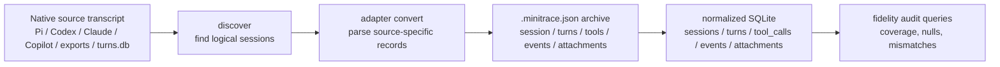

# Adapter fidelity intern implementation guide

## 1. Executive summary

This guide explains how to audit and improve the quality of go-minitrace transcript conversions. A conversion adapter is the code that takes a native agent transcript store — Pi JSONL, Claude Code JSONL, Codex JSONL, Copilot state, ChatGPT exports, claude.ai exports, or turns.db — and turns it into a `.minitrace.json` archive.

The adapter layer is the trust boundary for the whole system. Once facts are dropped or misrepresented during conversion, every downstream feature inherits the mistake: SQL queries, the web transcript viewer, annotations, metrics, skills, and reports. The goal of GMT-012 is therefore not just “make tests green”; it is to prove, with real transcript evidence, what each adapter preserves, what it derives, and what it still loses.

The workflow is:

1. **Inventory real source shapes** without committing raw private transcripts.
2. **Convert representative samples** into a ticket-local output directory.
3. **Query converted archives** with the normalized SQLite engine.
4. **Compare source facts to archive facts** adapter by adapter.
5. **Use agentsview as a reference** for known parser edge cases and provider architecture.
6. **Implement only evidence-backed fixes** with minimized fixtures and regression tests.
7. **Update `pkg/doc/adapter-reference.md`** so its fidelity matrix reflects measured behavior.

Initial sampling in this ticket found local material for every supported family:

| Source family | Discovered locally | Sampled by inventory script | Converted in first JSONL pass |
|---|---:|---:|---:|
| Pi | 1,226 JSONL files | 12 | 12 converted |
| Codex | 1,208 JSONL files | 12 | 8 converted, 4 old `unknown-jsonl` failed |
| Claude Code | 173 JSONL files | 12 | 12 converted |
| Copilot | 1 JSONL candidate | 1 | not converted by the first JSONL script |
| ChatGPT exports | 9 candidate files | 9 | not converted by the first JSONL script |
| claude.ai exports | 3 candidate files | 3 | not converted by the first JSONL script |
| turns.db | 44 DB candidates | 12 | not converted by the first JSONL script |

The first converted sample already produced useful measured signals:

| Framework | Sessions | Tool calls | Turns | Missing tool duration | Missing exit code | Turns with thinking | Turns with usage |
|---|---:|---:|---:|---:|---:|---:|---:|
| claude-code | 12 | 1,661 | 3,375 | 0 | 1,616 | 0 | 3,164 |
| codex | 8 | 2,416 | 649 | 334 | 180 | 198 | 557 |
| pi | 12 | 4,179 | 3,854 | 7 | 4,179 | 1,523 | 3,613 |

These numbers are not final product claims. They are the first pass that shows the audit pipeline works and highlights where to dig next: old Codex formats, exit-code semantics, source thinking fields, attachment classification, and source-specific lifecycle preservation.

## 2. Mental model: what conversion is supposed to preserve

Think of a native transcript as a noisy source event stream. A minitrace archive is a stable, queryable projection of that stream.



Each adapter has two responsibilities:

1. **Normalize common concepts** into first-class schema fields.
   - Example: a shell command becomes `tool_calls.input.command`.
   - Example: a user message becomes a `turns[]` row with `role = user`.
   - Example: token usage becomes per-turn usage fields and metrics.

2. **Preserve source-specific facts** that do not fit common fields.
   - Use `events[]` for lifecycle/timeline facts from the source.
   - Use `attachments[]` for images/files/artifact references.
   - Use `framework_metadata` for adapter-specific payload fragments.
   - Use annotations only for derived/human review notes, not native source events.

A good adapter should be honest. It is acceptable for a source not to have an exit code. It is not acceptable to silently drop an exit code or synthesize a misleading one.

## 3. Where the important code lives

### 3.1 Target schema

Start with the archive schema:

- `pkg/minitrace/schema.go`
  - `Session`
  - `Turn`
  - `ToolCall`
  - `Event`
  - `Attachment`
  - `Annotation`
  - `Metrics`

Then read the normalized SQLite projection:

- `pkg/minitracedb/schema.go`
  - `sessions`
  - `turns`
  - `tool_calls`
  - `turn_tool_calls`
  - `files`
  - `annotations`
  - `handovers`
  - `metrics`
  - `attachments`
  - `events`

The audit uses SQLite because it can answer fidelity questions across many converted archives quickly:

```sql
SELECT agent_framework,
       COUNT(*) AS tool_calls,
       SUM(duration_ms IS NULL) AS missing_duration,
       SUM(exit_code IS NULL) AS missing_exit_code
FROM tool_calls
GROUP BY agent_framework;
```

### 3.2 Adapter code

Primary adapter files:

| Adapter | Code to read first | Notes |
|---|---|---|
| Pi | `pkg/adapters/pi/convert.go` | JSONL v3, thinking, usage/cost, tool results, lifecycle records |
| Claude Code | `pkg/adapters/claudecode/convert.go` | JSONL v2, `toolUseResult`, subagents, permissions/mode/title, attachments |
| Codex | `pkg/adapters/codex/convert.go` | session and exec JSONL, token events, spawn/wait agents, rate limits |
| Copilot | `pkg/adapters/copilot/discover.go`, `pkg/adapters/copilot/convert.go` | discovery and event ordering, permission/deferred events |
| ChatGPT | `pkg/adapters/chatgpt` | exports, search/tool payloads, conversation mapping |
| claude.ai | `pkg/adapters/claudeai` | exported chats, reasoning/search/attachment facts |
| turnsdb | `pkg/adapters/turnsdb` | database rows, Geppetto/Pinocchio turns and deltas |

Common helper areas:

- `pkg/minitrace/builders.go` — helper constructors for sessions, turns, tool calls.
- `pkg/minitrace/metrics.go` — timing and aggregate metric computation.
- `pkg/minitrace/util.go` — truncation, hashing, timestamp normalization.
- `pkg/minitrace/archive.go` — archive writing and manifests.

### 3.3 User-facing docs to update

The final claims live in:

- `pkg/doc/adapter-reference.md`

That page currently contains a useful matrix with terms like `native`, `derived`, `scraped`, and `–`. GMT-012 should turn that into a measured matrix:

- how many real sessions were sampled;
- which source fields were observed;
- which output fields were populated;
- what is intentionally absent;
- what remains a known limitation.

## 4. Agentsview as a reference, not a replacement

The user asked us to inspect `~/code/others/agentsview` for inspiration. This is valuable because agentsview has a broad parser/provider layer with many edge cases already encoded.

### 4.1 Provider architecture

`/home/manuel/code/others/agentsview/internal/parser/provider.go` defines a provider interface:

```go
type Provider interface {
    Discover(context.Context) ([]SourceRef, error)
    WatchPlan(context.Context) (WatchPlan, error)
    SourcesForChangedPath(context.Context, ChangedPathRequest) ([]SourceRef, error)
    FindSource(context.Context, FindSourceRequest) (SourceRef, bool, error)
    Fingerprint(context.Context, SourceRef) (SourceFingerprint, error)
    Parse(context.Context, ParseRequest) (ParseOutcome, error)
    ParseIncremental(context.Context, IncrementalRequest) (IncrementalOutcome, IncrementalStatus, error)
}
```

The big idea is that providers own source identity and source freshness. The engine does not need to know whether the backing data is a file, DB row, sidecar set, or virtual source.

For go-minitrace, this suggests future improvements:

- make `discover` and `convert --source-session` share more source identity logic;
- record stable fingerprints for conversion inputs;
- represent partial batch success explicitly, not only as CLI rows;
- add per-adapter source-resolution tests.

Do not copy this architecture wholesale in GMT-012. Use it to ask better questions.

### 4.2 Codex reference: fork/replay handling

Agentsview's `internal/parser/codex.go` has a `codexForkGate` that suppresses replayed parent history in forked Codex sessions. That is a critical edge case: if go-minitrace does not detect replayed history, metrics can double-count parent turns, tools, and token usage.

Audit questions for go-minitrace Codex:

- Do real sampled Codex files contain `forked_from_id`?
- Are `turn_id` values UUIDv7 and timestamp-anchored?
- Does go-minitrace suppress replayed parent turns or currently count them?
- If unsupported, should replayed history become an event/provenance note rather than ordinary turns?

### 4.3 Pi reference: title slots, lineage, visible ancestors

Agentsview's `internal/parser/pi.go` handles:

- title-slot lines before the session header;
- v1 sessions without explicit IDs;
- `branchedFrom` and OMP `parentSession` lineage;
- metadata rows that need visible-ancestor remapping.

Audit questions for go-minitrace Pi:

- Does the adapter skip title-slot lines before reading the session header?
- Does it handle older sessions without explicit IDs?
- Does it preserve parent/branch lineage when present?
- Do metadata-only rows affect parent-child relationships for turns/tools?

### 4.4 Claude reference: provider surfaces and incremental parsing

Agentsview's `internal/parser/claude_provider.go` supports discovered transcript parsing, uploaded transcript parsing, and incremental parse surfaces. go-minitrace may not need incremental parsing immediately, but the source-shape handling should be compared.

Audit questions for go-minitrace Claude Code:

- Are subagent sessions linked to parent tool calls and parent session metadata?
- Are `permission-mode`, `mode`, `title`, and attachment events represented as events/attachments?
- Are all observed `toolUseResult` forms mapped or preserved?
- Are cwd/git branch/version fields collected even if not on the first record?

### 4.5 Copilot reference: source layouts

Agentsview's Copilot provider discovers both bare and directory session-state layouts and deduplicates when both exist. Compare this with go-minitrace's Copilot support.

Audit questions:

- Does go-minitrace discover both `<uuid>.jsonl` and `<uuid>/events.jsonl` layouts?
- If both exist, does it avoid duplicate sessions?
- Are permission and deferred tool events attached to the correct turn/tool call?

## 5. Ticket scripts created for this audit

The scripts live in:

```text
ttmp/2026/07/06/GMT-012-adapter-fidelity-real-transcript-audit--audit-and-improve-adapter-fidelity-using-real-transcripts/scripts/
```

### 5.1 `01-inventory-source-shapes.py`

Purpose: produce redaction-safe summaries of local transcript stores.

What it discovers:

- Pi JSONL under `~/.pi/agent/sessions`
- Codex JSONL under `~/.codex/sessions`
- Claude Code JSONL under `~/.claude/projects`
- Copilot JSONL candidates under `~/.copilot` and `~/.config/github-copilot`
- ChatGPT/claude.ai export candidates under `~/Downloads`
- `turns.db` files under common local roots

What it writes:

```text
sources/source-shape-inventory/inventory-summary.json
sources/source-shape-inventory/<adapter>-source-shapes.json
sources/source-shape-inventory/<adapter>-sample-list.txt
```

Redaction policy:

- JSON summaries use path hashes, not raw paths.
- Raw content is not copied.
- Sample-list files contain local paths for scripts; review before committing or sharing.

Pseudocode:

```python
for adapter in adapters:
    paths = discover(adapter.roots)
    samples = choose_old_new_random_mix(paths)
    for path in samples:
        summary = {
            path_hash,
            file_hash_prefix,
            event_type_counts,
            top_keys,
            tool_names,
            timestamp_keys,
            signals: has_errors/has_subagents/has_attachments/has_usage,
        }
    write_json(summary)
    write_sample_list(paths)
```

### 5.2 `02-convert-sampled-jsonl.sh`

Purpose: convert sampled JSONL adapters into ticket-local archives.

It currently covers:

- Pi
- Codex
- Claude Code

It intentionally does not yet convert ChatGPT/claude.ai zip exports, turns.db, or Copilot candidates because those adapters have different CLI shapes and should be audited separately.

Output:

```text
sources/converted-corpus/pi/...
sources/converted-corpus/codex/...
sources/converted-corpus/claude-code/...
scripts/logs/02-convert-*.log
```

### 5.3 `03-query-converted-fidelity.sh`

Purpose: query converted archives with normalized SQLite and write JSON evidence.

Queries include:

- sessions by framework;
- tool fidelity coverage;
- turn thinking/usage coverage;
- event kind counts;
- attachment kind counts.

Output:

```text
scripts/logs/03-sessions_by_framework.json
scripts/logs/03-tool_fidelity.json
scripts/logs/03-turn_fidelity.json
scripts/logs/03-event_kinds.json
scripts/logs/03-attachments.json
```

## 6. Initial measured findings from local transcript samples

These findings are from the first pass only. They prove the audit pipeline works and identify where to focus next.

### 6.1 Inventory results

`01-inventory-source-shapes.py --max-per-adapter 12 --max-lines 1500` found:

| Adapter | Discovered | Sampled | Notes |
|---|---:|---:|---|
| Pi | 1,226 | 12 | Many long, tool-heavy sessions available |
| Codex | 1,208 | 12 | Some older files identified as unsupported `unknown-jsonl` |
| Claude Code | 173 | 12 | Includes primary and subagent files |
| Copilot | 1 | 1 | Needs separate conversion/discovery inspection |
| ChatGPT | 9 | 9 | Export candidates only, not converted yet |
| claude.ai | 3 | 3 | Export candidates only, not converted yet |
| turnsdb | 44 | 12 | DB candidates only, not converted yet |

### 6.2 Conversion results

`02-convert-sampled-jsonl.sh` converted:

| Adapter | Sampled | Converted | Failed | Important observation |
|---|---:|---:|---:|---|
| Pi | 12 | 12 | 0 | Large sessions converted, including one with 2,039 tools and 2,112 turns |
| Codex | 12 | 8 | 4 | Four older 2025 files failed as `unsupported Codex format hint: unknown-jsonl` |
| Claude Code | 12 | 12 | 0 | Includes subagent-like files and very large sessions |

The Codex failure is a real audit finding: either those old files are truly unsupported and should be documented, or format detection needs a legacy path.

### 6.3 Fidelity query results

`03-query-converted-fidelity.sh` reported:

| Framework | Sessions | Tool calls | Turns |
|---|---:|---:|---:|
| claude-code | 12 | 1,661 | 3,375 |
| codex | 8 | 2,416 | 649 |
| pi | 12 | 4,179 | 3,854 |

Tool coverage:

| Framework | Tool calls | Missing duration | Missing exit code | Error outputs | Truncated outputs |
|---|---:|---:|---:|---:|---:|
| claude-code | 1,661 | 0 | 1,616 | 80 | 30 |
| codex | 2,416 | 334 | 180 | 133 | 136 |
| pi | 4,179 | 7 | 4,179 | 211 | 245 |

Turn coverage:

| Framework | Turns | Turns with thinking | Turns with usage |
|---|---:|---:|---:|
| claude-code | 3,375 | 0 | 3,164 |
| codex | 649 | 198 | 557 |
| pi | 3,854 | 1,523 | 3,613 |

Event and attachment highlights:

- Claude Code emitted many lifecycle-ish attachment records: `total_tokens_reminder`, `task_reminder`, `queued_command`, `diagnostics`, `edited_text_file`, `deferred_tools_delta`, `command_permissions`, etc.
- Claude Code emitted `mode_change`, `permission_mode_change`, and `title_change` events.
- Codex emitted `rate_limits`, `subagent_spawn`, `subagent_wait`, and `image_view` events.
- Pi emitted `thinking_level_change`, `model_change`, `custom.pinned-skills-state`, `compaction`, `session_info`, and `annotation` events.

## 7. How to interpret fidelity metrics

Do not treat every null as a bug. The key question is whether the source had the fact.

### Example: exit codes

Pi shows `missing_exit_code = 4179 / 4179`. This is probably acceptable if Pi source tool results do not encode shell exit codes. The adapter should not invent them.

Claude Code shows `missing_exit_code = 1616 / 1661`. This needs source inspection:

- if only failing Bash results encode `Error: Exit code N`, high missing rate is normal;
- if successful Bash results include structured exit codes in `toolUseResult`, the adapter may still be missing them.

Codex shows `missing_exit_code = 180 / 2416`, which is comparatively good and matches current expectations that Codex has native or scraped exec metadata.

### Example: thinking

Claude Code shows zero turns with thinking in this sample. That could mean:

- sampled Claude sessions did not contain thinking blocks;
- the adapter misses a source shape;
- thinking is stored in a different field from the one expected.

The next step is to query source-shape summaries for keys containing `thinking` or inspect redacted key lists, not to change code immediately.

### Example: old Codex format

Four sampled Codex files failed with `unknown-jsonl`. This is an actionable investigation target because the files are real and local. The next step is to use the source-shape summaries to compare their top-level event types against supported Codex detection.

## 8. Adapter-by-adapter audit checklist

### 8.1 Pi

Read:

- `pkg/adapters/pi/convert.go`
- agentsview `internal/parser/pi.go`

Questions:

- Does go-minitrace handle title-slot header lines like agentsview?
- Does it support old v1 sessions without explicit IDs?
- Does it preserve branch lineage (`branchedFrom`, `parentSession`) if present?
- Are thinking-level/model-change/compaction events mapped as source events?
- Are edit diffs and first changed line preserved in tool metadata?
- Are the seven missing durations orphaned tools, malformed source records, or bugs?

Suggested query:

```sql
SELECT session_id, tool_name, success, result IS NOT NULL AS has_result,
       duration_ms, timestamp
FROM tool_calls
WHERE agent_framework = 'pi' AND duration_ms IS NULL
LIMIT 50;
```

### 8.2 Claude Code

Read:

- `pkg/adapters/claudecode/convert.go`
- agentsview `internal/parser/claude_provider.go`

Questions:

- Are all `toolUseResult` variants represented in real samples?
- Are success and failure exit codes both handled when present?
- Do attachment-like source records belong in `attachments[]`, `events[]`, or framework metadata?
- Are subagent sessions marked as subagents and linked to parent sessions/tool calls?
- Are cwd/gitBranch/version collected across all records, not just the first?
- Why do sampled sessions have zero thinking turns?

Suggested source-shape follow-up:

```bash
jq '.[].interesting_keys[]' sources/source-shape-inventory/claude-code-source-shapes.json \
  | rg -i 'thinking|toolUseResult|gitBranch|permission|attachment' | sort -u
```

### 8.3 Codex

Read:

- `pkg/adapters/codex/convert.go`
- agentsview `internal/parser/codex.go`

Questions:

- What event types exist in the four `unknown-jsonl` files?
- Does go-minitrace need a legacy Codex parser path?
- Are forked sessions with replayed parent history double-counted?
- Are `spawn_agent` and `wait_agent` linked and counted correctly?
- Are rate limits, image views, and originator/personality metadata preserved?
- Are the 334 missing durations non-exec tools or missed metadata?

Suggested source-shape follow-up:

```bash
jq '.[] | select(.first_type == "<missing>" or (.event_types | has("session_meta") | not)) | {event_types, interesting_keys}' \
  sources/source-shape-inventory/codex-source-shapes.json
```

### 8.4 Copilot

Read:

- `pkg/adapters/copilot/discover.go`
- `pkg/adapters/copilot/convert.go`
- agentsview `internal/parser/copilot_provider.go`

Questions:

- Does go-minitrace discover both bare and directory `session-state` layouts?
- If both exist, does it dedupe?
- Are permission/deferred tool events attached to the correct turn/tool?
- Does the one local sample match the converter's expected source layout?

### 8.5 ChatGPT and claude.ai exports

Read:

- `pkg/adapters/chatgpt`
- `pkg/adapters/claudeai`

Questions:

- Are export zip/json candidates detected correctly?
- Are search/tool payloads preserved as tool calls, events, or framework metadata?
- Are attachments represented as references rather than dropped?
- Are conversation summaries/titles/timestamps mapped consistently?

### 8.6 turnsdb

Read:

- `pkg/adapters/turnsdb`

Questions:

- Which table layouts exist across the 44 discovered DB candidates?
- Are deltas and tool-call payloads preserved under framework metadata?
- Are session/conversation IDs stable and deduped?

## 9. Implementation patterns for safe fixes

### 9.1 Convert one observed source shape into one regression fixture

When a real transcript reveals a bug, do not commit the raw transcript. Create a minimized fixture that preserves the structural shape only.

```text
pkg/adapters/codex/testdata/legacy-unknown-jsonl-minimal.jsonl
```

The fixture should keep:

- top-level event type fields;
- relevant metadata keys;
- representative timestamps;
- one or two messages/tool events;
- no private content.

### 9.2 Write the test before or with the fix

Example skeleton:

```go
func TestCodexLegacyUnknownJSONLShapeConverts(t *testing.T) {
    session, err := codex.ConvertFile("testdata/legacy-unknown-jsonl-minimal.jsonl")
    require.NoError(t, err)
    require.Equal(t, "codex", *session.Environment.AgentFramework)
    require.Len(t, session.Turns, 2)
    require.Len(t, session.ToolCalls, 1)
    require.Equal(t, "rate_limits", session.Events[0].Kind)
}
```

### 9.3 Preserve unknown facts in framework metadata first

If a source field is real but not yet promoted to schema, preserve it under `framework_metadata`. Promote it later if repeated queries need it.

```go
metadata := map[string]any{}
metadata["source_payload"] = boundedPayload(raw)
metadata["observed_new_field"] = raw.NewField
turn.FrameworkMetadata = metadata
```

### 9.4 Use events and attachments deliberately

Use `events[]` for source-observed lifecycle facts:

```go
session.Events = append(session.Events, minitrace.Event{
    Kind: "permission_mode_change",
    Timestamp: ts,
    Summary: "Permission mode changed to plan",
    Raw: boundedRaw,
})
```

Use `attachments[]` for source-observed artifact references:

```go
session.Attachments = append(session.Attachments, minitrace.Attachment{
    Kind: "image",
    Path: imagePath,
    MediaType: "image/png",
    Source: "codex.view_image",
})
```

## 10. Suggested next implementation order

1. **Codex old-format triage**
   - Four real sampled Codex files failed conversion.
   - Determine if unsupported by design or easy legacy parser gap.
   - Highest value because failures mean whole sessions are absent.

2. **Claude Code thinking/toolUseResult source-shape check**
   - Sample shows zero thinking turns and many missing exit codes.
   - Inspect source-shape summaries before changing code.

3. **Pi missing-duration triage**
   - Only seven missing durations out of 4,179 tools.
   - Likely orphaned tools, but verify.

4. **Copilot single-sample conversion path**
   - Inventory found one candidate; verify converter recognizes it.

5. **Export adapters**
   - ChatGPT and claude.ai need separate zip/json conversion scripts.

6. **turnsdb table-shape audit**
   - Inventory found 44 candidates; first inspect table layouts.

## 11. Validation and documentation requirements

Every code fix should update at least one of:

- adapter unit tests;
- minimized testdata fixture;
- `pkg/doc/adapter-reference.md`;
- ticket source-shape/fidelity report.

Run:

```bash
GOWORK=off go test ./pkg/adapters/... ./cmd/go-minitrace/cmds/convert ./cmd/go-minitrace/cmds/discover
GOWORK=off go test ./...
make glazed-lint
docmgr --root ./ttmp doctor --ticket GMT-012-adapter-fidelity-real-transcript-audit --stale-after 30
```

If you changed docs with SQL snippets, run representative `query run` commands against the converted ticket corpus.

## 12. What not to do

- Do not commit raw private transcript files.
- Do not copy agentsview architecture wholesale into go-minitrace without a separate design ticket.
- Do not mark every null as a bug.
- Do not hide unsupported source formats behind silent success.
- Do not update `adapter-reference.md` with aspirational claims; label observed/derived/scraped/absent accurately.

## 13. Appendix: two go-minitrace checkouts in this workspace

There are two local directories because they serve different purposes during this PR series:

- `go-minitrace` is the older worktree that was added to the workspace first. Its `.git` file points to an external gitdir/worktree setup, and earlier sessions found it awkward for committing. It currently shows the large GMT-009/GMT-010/GMT-011 changes as local working-tree changes against an older base.
- `go-minitrace-pr` is the clean full clone/check-out used for PR #22 work. Its `.git` directory is local and writable. GMT-009, GMT-010, and GMT-011 commits were made and pushed from this directory.

For new implementation work, use `go-minitrace-pr`. Treat `go-minitrace` as a synced scratch mirror unless you intentionally need to inspect the older worktree state.
