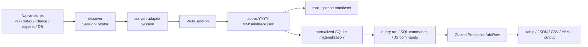

# Agent-safe transcript analysis architecture and implementation guide

## 1. Executive summary

go-minitrace already has the main components required for rigorous transcript analysis: native-source discovery, adapter-based conversion, a normalized archive schema, a sandboxed SQLite query engine, structured CLI output, embedded help, and a transcript-analysis skill. Two isolated external-agent evaluations showed that this stack can recover the correct historical implementation session and verify its claims against a Git repository. The first evaluation correctly attributed a RAG implementation; the second correctly attributed the implementation and review-hardening work for go-go-goja PR #95. The second run passed all 27 acceptance checks and received a 42/45 qualitative evaluation.

The evaluations also exposed failures that are unsafe in unattended or evidence-producing workflows:

1. Codex subagent files can contain more than one `session_meta` record. The adapter currently replaces `metadata.SessionID` for every such record. A child file can therefore finish conversion with its parent's ID, and `WriteSession` silently overwrites any existing archive with that ID.
2. Archive manifests merge by session ID and explicitly make the current invocation win. That is useful for intentional reconversion but cannot distinguish reconversion from identity corruption.
3. Report-bearing inline SQL is easy to run without saving. The resulting report cannot prove exactly which query was executed.
4. The normalized query result contains columns, rows, count, truncation, and error state, but the Glazed row processor receives only rows. Zero rows therefore produce no call to `AddRow`; the streaming JSON formatter emits an empty byte stream instead of `[]`.
5. Conversion and helper scripts can appear successful after partial work or when pipeline truncation hides an upstream failure. Shell pipelines remain a caller responsibility, but the CLI can provide direct file output, durable run receipts, explicit partial-success policy, and reliable non-zero exits.
6. The help corpus and the transcript-analysis skill duplicate workflows and query guidance. Adding a separate page for every new behavior would make this worse.

This design addresses those failures as one provenance and execution-contract problem. The recommended order is:

- **P0 correctness:** preserve native child identity, fail safely on conflicting archive IDs, and add archive-level validation.
- **P0 output contract:** make every structured invocation produce valid structured data, including zero-row and error cases, with documented exit semantics.
- **P1 reproducibility:** add conversion and query run receipts, deterministic input inventories, and an opt-in strict agent profile.
- **P1 discovery:** expose source identity, parent identity, repository cwd, source role, and fingerprints so callers do not need format-specific grep scripts.
- **P1 documentation:** consolidate guidance into existing pages; do not create an “agent mode,” “provenance,” or “session attribution” help page.
- **P2 schema semantics:** replace the binary tool success field with an evidence-bearing status model while preserving a derived compatibility projection.

The proposal intentionally keeps SQL and archive JSON as the evidence interchange formats. It does not introduce a workflow database, orchestration daemon, or a second query engine.

## 2. Scope and non-goals

### 2.1 In scope

- Codex native, parent, and archive identity semantics.
- Collision detection before archive replacement.
- Atomic batch conversion and explicit partial-success behavior.
- Conversion receipts and query run receipts.
- Archive/manifests verification through the existing `validate` command.
- Valid JSON for empty and failed query runs.
- Process exit status and truncation semantics.
- Repository-backed attribution workflow support.
- Consolidation of embedded help and skill documentation.
- Tests and fixtures for all new contracts.

### 2.2 Non-goals

- Replacing the normalized SQLite engine.
- Storing raw native transcripts in Git.
- Making cwd or prompt text sufficient proof of implementation authorship.
- Automatically declaring one historical session “the implementer” without repository verification.
- Hiding errors to preserve old scripts. Behavior changes should be documented and tested instead of adding silent compatibility shims.
- Creating a new help page for each feature in this design.
- Solving arbitrary shell-pipeline semantics inside go-minitrace. The CLI can avoid requiring pipelines; callers must still use `set -o pipefail` when they create one.

## 3. Evidence from the isolated evaluations

### 3.1 Evaluation outcomes

Two fresh Pi workers, both using `umans-glm-5.2`, were given bounded native-source snapshots and the transcript-analysis skill. Expected answers were not included in their prompts.

| Evaluation | Result | Quantitative acceptance | Qualitative score |
|---|---|---:|---:|
| RAG implementation attribution | Correctly identified Codex session `019f4805-c991-70b3-ae0d-855c389d79d7` | 17/17 fixture checks after preservation | 39/45 |
| go-go-goja PR #95 holdout | Correctly identified Pi session `019ee82a-7169-74f2-adc7-df7e7e07200f` and verified commits `9923094…` and `2fce13f…` | 27/27 | 42/45 |

The result is important because the workers did not merely search for repository names. They converted bounded sources, queried normalized archives, classified candidate roles, and checked claims against Git hashes, paths, timestamps, and tests. This is the workflow go-minitrace should make easy and enforceable.

### 3.2 Observed failures

The runs produced concrete failure evidence:

- Six report-bearing SQL queries in the holdout were executed ad hoc and never saved.
- `audit_manifests.sh` was invoked at a single archive root although it expects a parent directory containing one child directory per framework.
- A truncated pipeline hid these upstream errors:

  ```text
  find: ‘analysis/pi/active/active’: No such file or directory
  find: ‘analysis/codex/active/active’: No such file or directory
  ```

- A zero-row JSON query produced no bytes, and a downstream Python decoder failed:

  ```text
  json.decoder.JSONDecodeError: Expecting value: line 1 column 1 (char 0)
  ```

- An early source-audit helper assumed `.payload.source` was always an object and failed on Codex records where it was a string:

  ```text
  jq: error (at <stdin>:1): Cannot index string with string "subagent"
  ```

The first two errors are workflow design defects. The third is partly shell behavior, but the CLI can remove the need for fragile pipelines. The fourth is a CLI output-contract defect. The fifth demonstrates why source-shape rules belong in adapter code and tests rather than downstream shell scripts.

### 3.3 Corrected Codex identity diagnosis

The original evaluation report initially described child files as sharing a native ID. Direct inspection corrected that claim. The child files have distinct first `session_meta.payload.id` values and share a parent thread ID. A representative file begins with child ID `019f622f-fc14-7f83-bb1e-119052c9219b` and parent ID `019f4805-c991-70b3-ae0d-855c389d79d7`, but later contains a second parent `session_meta` record.

Current adapter behavior explains the collision:

1. `ConvertRecords` accepts a locator/session ID (`pkg/adapters/codex/convert.go:66`).
2. `parseSessionJSONL` assigns `metadata.SessionID` for every `session_meta` record (`convert.go:322`). The assignment uses the newly observed ID first, so later records replace earlier ones.
3. `ConvertRecords` replaces its input `sessionID` with the final metadata ID (`convert.go:92-94`).
4. `WriteSession` names the file `<SanitizeID(session.ID)>.minitrace.json` (`pkg/minitrace/archive.go:49-50`) and uses `os.WriteFile` without a collision check (`archive.go:56`).
5. `WriteManifests` merges by `entry.ID`, with the current invocation winning (`archive.go:97-111`).

The resulting archive recorded the parent as both `id` and `provenance.original_session_id`, while `operational_context.framework_config.parent_thread_id` also held the parent ID. Three distinct child inputs therefore normalized to the same archive identity.

This is not a filename-only issue. The identity is already wrong before the archive writer runs.

## 4. Current architecture

### 4.1 Intake, storage, and query flow



The boundaries are well separated, but important state is lost at each boundary:

- `SessionLocator` carries only ID, source path, and format hint. Discovery cannot express parent identity, cwd evidence, or source fingerprint.
- Adapters return `*Session, error`, which cannot express warnings, input identity evidence, or a partial parse outcome.
- `WriteSession` has no information about whether an existing path is the same source, a safe reconversion, or a collision.
- `WriteManifests` is a derived index but currently participates in no verification contract.
- `QueryResult` carries execution metadata, but `RunQueryTargetIntoProcessor` emits only row maps.
- Output formatting is controlled below the query command, so the query command cannot currently guarantee a result envelope.

### 4.2 Existing strengths to preserve

- `query run` already enforces exactly one of `--preset`, `--sql`, or `--sql-file` (`cmd/go-minitrace/cmds/query/run.go:94-112`).
- The normalized query runner already returns `Columns`, `Rows`, `Count`, `Truncated`, and `Error` (`pkg/minitracedb/query.go:22-28`).
- SQLite execution is sandboxed, row-limited, cell-limited, and time-limited.
- `collectSourceSessions` already supports explicit `--source-session` values plus line-oriented `--source-list` files, ignoring blank and comment lines.
- The archive writer already rescans existing archives before regenerating manifests, so manifest reconciliation has a foundation.
- `provenance.original_session_id` and `coordination.predecessor_session` already exist in the archive schema (`pkg/minitrace/schema.go:29-35`, `82-87`). The immediate identity fix does not require inventing a new lineage model.
- JavaScript command failures are already compacted by `wrapJSCommandError`; the remaining requirement is to unify failure envelopes and process behavior across SQL and JS.

### 4.3 Current validation gap

`validate --path` walks JSON files and checks JSON syntax plus selected annotations, events, and attachments. A map that is not a session, including a manifest, is treated as valid without archive-layout checks. It does not prove:

- every manifest entry has a file;
- every archive file appears in the proper period manifest;
- root and period counts agree;
- filename, session ID, period, and `started_at` agree;
- session IDs are unique across files;
- source paths or source fingerprints conflict;
- a conversion batch was complete.

The external `audit_manifests.sh` helper partly fills this gap but encodes a directory-shape assumption that caused one of the holdout failures. The capability belongs in `validate`, which already owns archive correctness.

## 5. Required behavioral contracts

### 5.1 Identity contract

For every converted source, preserve these meanings:

| Concept | Meaning | Initial storage |
|---|---|---|
| source session ID | The native logical session identified by the source header/discovery parser | `provenance.original_session_id` |
| archive session ID | The unique ID used as `Session.ID`, database primary key, and archive filename | `Session.ID` |
| parent session ID | The native predecessor/parent thread; never an alias for the child | `coordination.predecessor_session` and adapter framework metadata |
| source path | Normalized path of the exact converted input | `provenance.source_path` |
| source fingerprint | SHA-256 of the exact native bytes used for conversion | new `provenance.source_fingerprint` |
| identity basis | How the adapter selected the native ID | new `provenance.identity_basis`, for example `first-session-meta` |

For Codex session JSONL, the first valid top-level `session_meta` establishes source identity. Later `session_meta` records are replay/history records unless the format provides explicit evidence otherwise. They may update non-identity metadata under documented precedence rules, but they must not replace the established child ID.

The immediate rule is deliberately narrow and testable. A generalized replay/fork gate can follow after representative fixtures prove the necessary boundaries.

### 5.2 Collision contract

Archive writes must never silently replace different content under the same session ID.

Default policy:

- destination absent: write;
- destination present and recorded source fingerprint equals the new fingerprint: idempotent reconversion is allowed;
- destination present and fingerprints differ: return a collision error before changing the archive or manifests;
- legacy destination without a fingerprint: compare canonical session payloads or require explicit `--collision replace`; do not guess silently.

Supported explicit policy:

```text
--collision error       # default; permit only fingerprint-identical reconversion
--collision replace     # explicit destructive replacement, recorded in receipt
```

Do not implement `keep-both` in the first phase. The normalized `sessions.session_id` is a primary key, and suffixing filenames alone would create duplicate logical IDs that cannot coexist in one query database. If a future use case requires competing variants, add a first-class `archive_id`/variant model across schema, manifests, materialization, and lineage rather than a filename hack.

### 5.3 Batch contract

A conversion invocation produces a batch outcome, not merely a stream of successful rows.

- Inputs are resolved, normalized, deduplicated, sorted, and fingerprinted before conversion.
- Conversion writes into a staging directory.
- In strict mode, any failed input or collision prevents publication of all staged files.
- In partial mode, successful files may be published, but the process exits non-zero unless `--allow-partial` was explicitly supplied.
- A conversion receipt records every requested source and its state: converted, unchanged, skipped, collided, or failed.
- Manifests are rebuilt only after publication.

This removes the current “fail after some files were already written” ambiguity.

### 5.4 Query contract

- A valid query returning zero rows is a successful execution.
- JSON array output for zero rows is exactly `[]\n`.
- NDJSON output for zero rows is an empty stream by definition and must be requested explicitly; it must not be confused with JSON array output.
- Query validation, archive loading, SQL execution, timeout, or output errors produce non-zero exit status.
- `Truncated=true` is not silently treated as a complete report. In strict mode it is a non-zero “incomplete result” unless `--allow-truncated` is supplied.
- Report-bearing runs should use `--sql-file` or a named preset. Strict agent mode rejects inline `--sql` unless a run receipt is requested that captures the exact SQL text and hash.
- Results should be written directly with Glazed's output-file support; examples must not rely on `| head` or similar truncating pipelines.

### 5.5 Attribution contract

go-minitrace ranks evidence; it does not declare authorship from weak signals.

A defensible implementation-session attribution requires:

1. candidate discovery bounded by source store, time range, and repository cwd;
2. conversion with preserved native and parent identities;
3. role classification: implementer, reviewer, investigator, or reference-only;
4. transcript claims extracted by saved SQL;
5. repository verification of commit hashes, changed paths, timestamps, tests, and working-tree state;
6. a report that distinguishes transcript evidence from repository facts and unresolved inference.

Repository cwd and prompt mentions are shortlist signals only. A session that discusses a commit after it exists is not necessarily the implementation session.

## 6. Proposed architecture

### 6.1 Source descriptors and adapter results

Extend the adapter boundary without forcing every adapter to parse all metadata during the first phase.

```go
// pkg/adapters/types.go
type SourceIdentity struct {
    NativeSessionID string
    ParentSessionID *string
    SourcePath      string
    SourceFormat    string
    WorkingDir      *string
    Role            string // parent, subagent, fork, unknown
    IdentityBasis   string // header, filename, database-key, derived
    SHA256          string
    SizeBytes       int64
}

type ConversionWarning struct {
    Code    string
    Message string
    Record  *int
}

type ConvertResult struct {
    Session  *minitrace.Session
    Source   SourceIdentity
    Warnings []ConversionWarning
}
```

`SessionLocator` may retain its current fields for compatibility inside the codebase while gaining an optional `Identity *SourceIdentity`. Discover commands should emit the descriptor fields as columns. Convert commands should call the same descriptor parser rather than rediscovering identity independently.

Adapter application pseudocode:

```text
resolve_source(path):
    bytes = read(path)
    identity = adapter.inspect_header(bytes)
    identity.sha256 = sha256(bytes)
    identity.size = len(bytes)
    return identity, bytes

convert(identity, bytes):
    records = parse(bytes)
    session, warnings = adapter.map_records(records, identity)
    session.id = identity.native_session_id
    provenance.original_session_id = identity.native_session_id
    provenance.source_fingerprint = identity.sha256
    provenance.identity_basis = identity.identity_basis
    coordination.predecessor_session = identity.parent_session_id
    return ConvertResult(session, identity, warnings)
```

### 6.2 Codex identity state machine

The Codex parser needs explicit metadata precedence instead of repeated `firstNonEmpty(new, old)` assignments.

```text
state:
    identity_locked = false
    source_session_id = locator.id
    parent_session_id = null

for record_index, record in records:
    if record.type != session_meta:
        parse normally
        continue

    id = record.payload.id
    parent = direct parent_thread_id
             or source.subagent.thread_spawn.parent_thread_id

    if not identity_locked and id is valid:
        source_session_id = id
        identity_basis = "first-session-meta"
        identity_locked = true
        parent_session_id = parent
        merge stable header metadata
        continue

    if id == source_session_id:
        merge permitted updates
        continue

    record warning "codex-replayed-session-meta"
    preserve record as replay/lineage metadata or event
    do not replace source_session_id
```

Tests must include the exact shape observed in the July 14 subagent file: child header, parent ID, then later parent `session_meta`. A minimized fixture is sufficient; do not commit private transcript text.

### 6.3 Collision-aware archive publisher

Move publication decisions out of adapter commands into `pkg/minitrace`.

```go
type CollisionPolicy string
const (
    CollisionError   CollisionPolicy = "error"
    CollisionReplace CollisionPolicy = "replace"
)

type PublishOptions struct {
    CollisionPolicy CollisionPolicy
    AtomicBatch     bool
}

type PublishStatus string
const (
    PublishCreated   PublishStatus = "created"
    PublishUnchanged PublishStatus = "unchanged"
    PublishReplaced  PublishStatus = "replaced"
)

type PublishResult struct {
    Entry          *SessionIndexEntry
    Status         PublishStatus
    PreviousSHA256 string
}
```

`WriteSession` should be split into serialization and publication:

```text
serialize(session) -> canonical bytes
inspect destination if present
compare source fingerprint and archive identity
stage bytes with fsync
rename staged file into destination
return publication status
```

For an atomic batch, stage all archives and a rebuilt manifest tree under `<output>/.staging/<run-id>`. Check every collision before the first final rename. Publication should use same-filesystem renames. If replacing several existing files cannot be committed atomically as a directory swap without disturbing unrelated periods, create a rollback journal in the staging directory and test interruption recovery. Phase 1 may implement all-or-nothing validation plus per-file atomic rename if the receipt clearly states the remaining crash window.

### 6.4 Conversion receipt

Write one JSON receipt per invocation when `--run-record PATH` is supplied; strict agent mode requires it.

```json
{
  "schema": "go-minitrace-conversion-run-v1",
  "run_id": "uuid",
  "tool_version": "...",
  "adapter": "codex",
  "started_at": "...",
  "finished_at": "...",
  "output_root": "/abs/path",
  "collision_policy": "error",
  "allow_partial": false,
  "inputs": [
    {
      "source_path": "/abs/path/rollout.jsonl",
      "source_sha256": "...",
      "native_session_id": "...",
      "parent_session_id": "...",
      "identity_basis": "first-session-meta",
      "status": "created",
      "archive_path": "/abs/path/active/2026-07/id.minitrace.json",
      "archive_sha256": "...",
      "warnings": []
    }
  ],
  "summary": {"requested": 1, "created": 1, "unchanged": 0, "failed": 0},
  "complete": true
}
```

The receipt is evidence, not the canonical archive index. Manifests remain derived from archives and can be rebuilt.

### 6.5 Archive validation through the existing command

Extend `validate`; do not add an `archive verify` command or help page.

Proposed flags:

```text
go-minitrace validate \
  --path ./analysis/codex \
  --recursive \
  --checks syntax,schema,archive \
  --output json \
  --output-file ./validation.json
```

Archive checks:

- parse every archive and manifest;
- ensure archive filenames match sanitized session IDs;
- ensure directory periods match `timing.started_at` or `unknown`;
- detect duplicate session IDs across paths;
- detect conflicting native source IDs/fingerprints;
- compare root manifest periods/counts with period manifests;
- compare period entries with files and selected archive fields;
- report orphan files and orphan manifest entries;
- optionally verify conversion receipt inputs and outputs;
- return non-zero when any error-severity finding exists.

A single root and a parent containing multiple framework roots should both work. The command should identify an archive root by the presence of `manifest.json` and `active/`, eliminating the helper's “wrong directory level” failure.

### 6.6 Query execution record

Add `--run-record PATH` to `query run` and structured SQL/JS command runtime settings.

```json
{
  "schema": "go-minitrace-query-run-v1",
  "run_id": "uuid",
  "tool_version": "...",
  "engine": "normalized-sqlite-v2",
  "query": {
    "kind": "sql-file",
    "path": "/abs/path/commit-verification.sql",
    "sha256": "..."
  },
  "archives": {
    "globs": ["..."],
    "resolved_count": 19,
    "inventory_sha256": "...",
    "files": [
      {"path": "/abs/path/x.minitrace.json", "sha256": "...", "session_id": "..."}
    ]
  },
  "limits": {"max_rows": 1000, "max_cell_chars": 4000, "timeout_ms": 5000},
  "result": {"columns": ["session_id"], "row_count": 0, "truncated": false},
  "started_at": "...",
  "finished_at": "...",
  "status": "success"
}
```

The archive inventory must be sorted before hashing. For very large runs, allow `--run-record-detail summary|files`; summary still includes the inventory hash and count.

The record is written only after output processing succeeds. On failure, write a failure receipt atomically with a stable error code and non-zero process exit. This makes a receipt useful even when stdout/stderr were not preserved.

### 6.7 Result emission and zero-row JSON

The root cause is below SQL execution. `QueryResult` initializes `Rows` as an empty non-nil slice, but `RunQueryTargetIntoProcessor` calls `AddRow` only inside the row loop (`cmd/go-minitrace/cmds/query/command_runtime.go:138-157`). Glazed's streaming JSON formatter writes `[` on its first `OutputRow`; its `Close` writes `]` only when streaming began. No row means no JSON bytes.

Preferred implementation:

1. Add an empty-stream finalization test and fix to Glazed's JSON formatter so array mode writes `[]\n` when `Close` occurs before the first row.
2. Pin/upgrade Glazed in go-minitrace.
3. Add go-minitrace integration tests for SQL, JS, discover, and validate zero-row output so the contract does not depend solely on an upstream unit test.
4. Keep JSON error envelopes separate from successful row arrays. On failure, stdout should contain one documented error object only when machine-readable error output is requested; stderr receives a concise diagnostic and process status is non-zero.

Do not emit a fake row or sentinel into the data stream. It corrupts SQL result semantics and makes CSV/table behavior inconsistent.

### 6.8 Strict agent profile

Add one opt-in profile rather than many unrelated flags:

```text
--execution-profile interactive|agent-strict
```

`agent-strict` expands to:

- deterministic sorted source and archive inventories;
- collision policy `error`;
- no partial success unless explicitly overridden;
- run receipt required;
- inline SQL rejected unless captured in the receipt;
- truncated query result treated as incomplete/non-zero;
- machine-readable errors available;
- no prompts or TTY-dependent behavior.

The expanded settings must be recorded in the receipt. Individual flags remain available for explicit scripting. The profile should be implemented in a shared command settings section so convert, query, discover, and validate do not define divergent meanings.

### 6.9 Discovery for repository attribution

Extend existing discover commands, not the help tree, with common filters and fields:

```text
go-minitrace discover codex \
  --cwd /home/manuel/code/example/repo \
  --since 2026-07-01T00:00:00Z \
  --until 2026-07-15T23:59:59Z \
  --include-subagents \
  --output json \
  --output-file sources.json
```

Common result columns:

- `native_session_id`;
- `parent_session_id`;
- `source_role` (`parent`, `subagent`, `fork`, `unknown`);
- `source_path`;
- `source_format`;
- `working_directory`;
- `started_at`;
- `source_sha256` when `--fingerprint` is supplied;
- parse warnings.

Cwd filtering should compare normalized absolute paths and support `exact|descendant` matching. It remains a discovery filter, not proof of authorship.

## 7. Tool and process outcome semantics

Three outcome layers must remain separate:

| Layer | Question | Current representation | Required change |
|---|---|---|---|
| transcript tool call | Did a historical tool operation succeed? | non-null `output.success` bool | add evidence-bearing status; keep derived bool temporarily |
| go-minitrace invocation | Did this command fully execute? | returned Go error / exit code | document stable exit behavior and partial/truncated policy |
| shell pipeline | Did every process in the caller's pipeline succeed? | shell-dependent | documentation requires `pipefail` or direct output files |

### 7.1 Proposed tool-call status model

The current bool forces unknown, interrupted, missing-result, and inferred outcomes into success or failure. Add:

```go
type ToolCallOutput struct {
    Status         string   `json:"status"` // succeeded, failed, cancelled, unknown
    StatusEvidence []string `json:"status_evidence,omitempty"`
    Success        *bool    `json:"success"` // derived compatibility field
    // existing result/error/exit code/duration fields
}
```

Examples of evidence values: `native-is-error`, `exit-code`, `structured-result`, `adapter-scrape`, `missing-result`, `user-interrupt`.

This is P2 because it changes archive and SQLite schemas, presets, and web/API assumptions. It must not block the P0 identity and output fixes. Until then, documentation and `tool-failures` must state framework-specific success inference.

## 8. Documentation information architecture

### 8.1 Principle

Do not add help pages named “agent-safe workflow,” “provenance,” “run receipts,” “session identity,” or “attribution.” These are cross-cutting sections of existing user journeys and command contracts.

`pkg/doc/doc.go` embeds every `pkg/doc/*.md` file and registers all of them. New files automatically enlarge the help catalog. The correct response is to assign each fact one canonical owner, merge overlapping pages, and use short links elsewhere.

### 8.2 Target help tree

Use the existing pages as follows:

| Existing page | Canonical responsibility after refactor | Changes |
|---|---|---|
| `getting-started.md` | shortest successful discover → convert → validate → query journey | keep basic; link to rigorous workflow instead of duplicating it |
| `analysis-guide.md` | canonical rigorous workflow, including bounded sources, attribution, saved evidence, Git verification, and receipts | merge the useful journey material from `end-to-end-analysis.md`; add agent-safe sections here |
| `discover.md` | discover command contract and common identity/cwd fields | add filters, role and identity meanings |
| `convert.md` | source-list, identity, collision, batch, receipt, and archive layout contract | add strict examples and failure behavior |
| `query.md` | query modes, limits, receipts, truncation, and process semantics | add direct-file and strict examples |
| `output-formats.md` | JSON array vs NDJSON, zero-row output, errors, direct files, and shell safety | make this the only canonical output contract |
| `validate.md` | syntax, schema, archive, manifest, and receipt checks | extend existing page; no archive-verification page |
| `adapter-reference.md` | adapter capabilities, identity extraction, lineage, and outcome evidence | merge `framework-metadata-mappings.md` into an appendix |
| `writing-queries.md` | authoring saved SQL against normalized schema | remove repeated command workflow |
| `query-recipes.md` | copyable canonical SQL recipes | keep recipes only; link to analysis guide for methodology |
| `troubleshooting.md` | symptom → cause → corrective command | add collisions, empty old JSON behavior, partial conversion, and stale manifests |

### 8.3 Pages to merge or retire

1. Merge `end-to-end-analysis.md` into `analysis-guide.md`, then remove it from the embedded catalog. Its broad workflow overlaps both `getting-started` and `analysis-guide`.
2. Merge `framework-metadata-mappings.md` into `adapter-reference.md` as a source-specific metadata appendix, then remove it.
3. Keep `query-duckdb.md` as the sole hidden migration reference while DuckDB migration remains relevant. Remove the two redundant hidden stubs `writing-duckdb-queries.md` and `duckdb-query-recipes.md` after checking external links. Their destinations are already named in `query-duckdb.md`.
4. Refactor the transcript-analysis skill into a short operational checklist that links to canonical embedded help and retains only skill-specific automation/scripts. Move no generic SQL tutorial into the skill.
5. Keep `README.md` as product orientation and installation, not a second analysis manual.

This reduces the help corpus by four pages while adding the required behavior documentation.

### 8.4 Documentation ownership matrix

- identity and lineage definitions: `adapter-reference`;
- CLI collision behavior: `convert-commands`;
- analysis methodology and attribution: `analysis-guide`;
- SQL syntax/schema use: `writing-queries`;
- output bytes and exit behavior: `output-formats-and-pipelines`;
- symptoms and recovery: `troubleshooting`.

Other pages should link to the canonical section rather than copying tables or command blocks.

### 8.5 Documentation tests

Add tests that:

- load every embedded section and reject duplicate slugs;
- verify all `go-minitrace help <slug>` cross-references resolve;
- verify command names in `Commands:` frontmatter exist;
- run selected fenced command examples against fixtures;
- fail when retired slugs remain referenced inside the repository;
- compare documented defaults for max rows, max cell chars, and timeout with Go constants, preferably by generating those snippets from command definitions.

## 9. Decision records

### DR-1: The first native Codex session header owns child identity

- **Status:** proposed
- **Context:** Subagent files can include a child `session_meta` followed by replayed parent metadata. Last-record-wins converts distinct children to the parent ID.
- **Options:** last ID wins; locator ID always wins; first valid header wins with mismatch warnings.
- **Decision:** first valid native header wins, cross-checked against locator ID; later mismatches become warnings/replay evidence.
- **Rationale:** it matches observed native file identity and preserves parent lineage separately.
- **Consequences:** minimized replay fixtures and explicit metadata precedence are required.

### DR-2: Conflicting archive IDs fail by default

- **Status:** proposed
- **Context:** `os.WriteFile` and manifest merge currently make collisions destructive and silent.
- **Options:** always overwrite; suffix filenames; fail unless identical or explicitly replaced.
- **Decision:** allow fingerprint-identical reconversion, otherwise fail unless `--collision replace` is explicit.
- **Rationale:** it preserves deterministic IDs without introducing unqueryable duplicate logical sessions.
- **Consequences:** some existing scripts will begin failing on conflicts; this is intended and must be documented.

### DR-3: Run receipts are sidecars, not a new database

- **Status:** proposed
- **Context:** report-bearing queries and conversions need durable provenance.
- **Options:** prose-only logs; a workflow SQLite database; JSON sidecars.
- **Decision:** versioned atomic JSON run receipts.
- **Rationale:** sidecars are portable, diffable, archivable, and do not add service state.
- **Consequences:** schemas need compatibility tests and redaction guidance for paths/SQL.

### DR-4: Extend `validate`; do not add an archive command family

- **Status:** proposed
- **Context:** Archive audits currently rely on shape-sensitive external scripts.
- **Options:** new `archive verify`; new `manifest audit`; extend `validate`.
- **Decision:** add syntax/schema/archive checks to `validate`.
- **Rationale:** users already look to validation for correctness, and this avoids command/help proliferation.
- **Consequences:** `validate` results need stable finding codes and severity.

### DR-5: Fix empty JSON at the formatter boundary

- **Status:** proposed
- **Context:** all row-producing commands can emit no rows; SQL is only the observed trigger.
- **Options:** emit fake rows; wrap only SQL output; fix Glazed streaming JSON finalization and integration-test go-minitrace.
- **Decision:** fix the formatter and add downstream tests.
- **Rationale:** an empty collection is an output-format concern and must work uniformly.
- **Consequences:** requires an upstream Glazed patch/version update or a temporary local formatter integration change.

### DR-6: Consolidate existing documentation

- **Status:** accepted for this design
- **Context:** The help tree already has overlapping journeys and references.
- **Options:** add feature pages; leave docs fragmented; merge into canonical owners.
- **Decision:** no new feature help pages; merge four overlapping/legacy pages out of the catalog.
- **Rationale:** a stable, smaller information architecture is easier for humans and agents to navigate.
- **Consequences:** check links before deleting slugs and mention removals in release notes.

## 10. Phased implementation plan

### Phase 0: Regression fixtures and contracts

Files:

- `pkg/adapters/codex/testdata/`
- `pkg/adapters/codex/convert_test.go`
- `pkg/minitrace/archive_test.go`
- `cmd/go-minitrace/cmds/query/run_test.go`
- CLI integration test package

Work:

1. Create a redacted Codex child→parent replay fixture.
2. Add a failing test that currently produces the parent ID.
3. Add a collision test proving two different fingerprints cannot overwrite one path.
4. Add empty JSON and invalid-query machine-output tests.
5. Capture current intended process exit behavior in tests before changing it.

Exit criterion: every observed failure has a deterministic failing regression test.

### Phase 1: Identity and collision safety

Files:

- `pkg/adapters/types.go`
- `pkg/adapters/codex/discover.go`
- `pkg/adapters/codex/convert.go`
- `pkg/minitrace/schema.go`
- `pkg/minitrace/archive.go`
- `cmd/go-minitrace/cmds/convert/{codex,pi,claude_code,sources}.go`

Work:

1. Add source identity inspection and fingerprinting.
2. Lock Codex identity to the first header.
3. Populate original ID, parent ID, fingerprint, and identity basis.
4. Introduce collision-aware publication.
5. Add `--collision` and conversion receipt.
6. Refactor adapter commands to use one batch runner.

Exit criterion: distinct child sources produce distinct archives; conflicting IDs fail before changing output; identical reconversion is idempotent.

### Phase 2: Validation and manifests

Files:

- `pkg/validate/`
- `cmd/go-minitrace/cmds/validate/validate.go`
- `pkg/minitrace/archive.go`
- `pkg/minitrace/archive_test.go`

Work:

1. Add finding codes, severity, and check selection.
2. Implement archive-root detection and layout verification.
3. Verify root/period manifests against archive files.
4. Verify optional conversion receipts.
5. Make manifest writes atomic.

Exit criterion: the native validation command replaces `audit_manifests.sh` for single and multi-root layouts.

### Phase 3: Query receipts and structured output

Files:

- `cmd/go-minitrace/cmds/query/run.go`
- `cmd/go-minitrace/cmds/query/command_runtime.go`
- `cmd/go-minitrace/cmds/query/js_runtime.go`
- `pkg/minitracedb/query.go`
- Glazed JSON formatter dependency

Work:

1. Fix zero-row JSON array output upstream and pin the fix.
2. Add run-record settings and archive inventory hashing.
3. Record query path/text hash, limits, row count, columns, and truncation.
4. Unify SQL/JS machine-readable error envelopes and exit codes.
5. Add `--allow-truncated`.

Exit criterion: a successful zero-row SQL run creates `[]\n`, a success receipt, and exit 0; every execution error creates a failure receipt and non-zero exit.

### Phase 4: Discovery and strict profile

Files:

- `cmd/go-minitrace/cmds/discover/*.go`
- adapter discover implementations
- shared command settings package

Work:

1. Add common cwd/time/role filters.
2. Emit source identity fields consistently.
3. Add `interactive|agent-strict` shared profile.
4. Add a machine-readable capability/version object if agents still require flag probing after profile implementation.

Exit criterion: a bounded repository candidate list can be produced without format-specific shell parsing.

### Phase 5: Documentation consolidation

Files:

- existing pages listed in section 8;
- `skills/go-minitrace-transcript-analysis/`;
- help registry tests.

Work:

1. Merge and delete overlapping pages in one commit so links never point to half-migrated content.
2. Update command help to link to canonical page sections.
3. Add the strict, direct-file attribution example to `analysis-guide`.
4. Thin the skill to operational automation and canonical links.
5. Add help-link and executable-example tests.

Exit criterion: no new help page exists for this ticket; four obsolete pages are gone; all internal links and tested examples pass.

### Phase 6: Tool outcome semantics

Files:

- archive schema and builders;
- every adapter;
- normalized SQLite schema/materialization;
- presets, web API, and documentation.

Work:

1. Add status/evidence fields and a migration plan.
2. Populate evidence per adapter.
3. Port failure presets and UI.
4. Measure before/after fidelity on real redacted samples.

Exit criterion: unknown, cancelled, and failed historical tool calls are distinguishable without adapter-specific SQL.

## 11. Test matrix

| Area | Test | Expected result |
|---|---|---|
| Codex identity | child header followed by parent replay metadata | archive ID remains child; predecessor is parent |
| Codex identity | locator/header mismatch | stable warning or hard error according to documented rule |
| collision | same ID, same source fingerprint | unchanged/idempotent result |
| collision | same ID, different source fingerprint | no file change; collision error; non-zero exit |
| replace | explicit replacement | file replaced; old/new hashes recorded |
| batch | second of three inputs fails in strict mode | no staged archive published |
| batch | partial mode without allow-partial | successes published, receipt incomplete, non-zero exit |
| manifests | root count differs from files | `validate` finding with stable code |
| manifests | period file missing | error finding and non-zero exit |
| archive | filename ID differs from payload ID | error finding |
| query | SQL returns zero rows with JSON array output | exact bytes `[]\n`, exit 0 |
| query | SQL returns zero rows with NDJSON | zero bytes, exit 0, receipt row_count 0 |
| query | invalid SQL | parseable error envelope when requested, failure receipt, non-zero exit |
| query | max rows reached | truncated receipt; non-zero in strict mode unless allowed |
| receipt | archives presented in different glob order | same sorted inventory hash |
| receipt | SQL file changes | query hash changes |
| discovery | cwd exact vs descendant | deterministic bounded source set |
| help | every internal slug link | resolves through embedded help store |
| docs | retired slugs | no in-repository references |

Also run:

```bash
gofmt -w <changed-go-files>
go test ./... -count=1
go test -race ./... -count=1
golangci-lint run
make glazed-lint
go-minitrace help analysis-guide
go-minitrace help output-formats-and-pipelines
```

Use minimized synthetic fixtures in Git. Run an opt-in local test against real Codex/Pi stores to detect source-shape drift, but never commit raw private transcripts.

## 12. Recommended strict workflow after implementation

```bash
set -euo pipefail

ROOT="$PWD/analysis"
mkdir -p "$ROOT/queries" "$ROOT/results" "$ROOT/runs"

# 1. Discover bounded candidates directly to a file.
go-minitrace discover codex \
  --cwd "$REPO" \
  --since "$SINCE" \
  --until "$UNTIL" \
  --include-subagents \
  --execution-profile agent-strict \
  --output json \
  --output-file "$ROOT/codex-sources.json"

# 2. Convert an explicit source list with a durable receipt.
go-minitrace convert codex \
  --source-list "$ROOT/codex-source-list.txt" \
  --output-dir "$ROOT/codex" \
  --execution-profile agent-strict \
  --run-record "$ROOT/runs/codex-convert.json" \
  --output json \
  --output-file "$ROOT/results/codex-convert.json"

# 3. Verify archive, manifests, and receipt.
go-minitrace validate \
  --path "$ROOT/codex" \
  --recursive \
  --checks syntax,schema,archive \
  --execution-profile agent-strict \
  --run-record "$ROOT/runs/codex-validate.json" \
  --output json \
  --output-file "$ROOT/results/codex-validate.json"

# 4. Save SQL before running it.
cat > "$ROOT/queries/session-profile.sql" <<'SQL'
SELECT session_id, started_at, working_directory, turn_count, tool_call_count
FROM sessions
ORDER BY started_at, session_id;
SQL

go-minitrace query run \
  --archive-glob "$ROOT/codex/active/*/*.minitrace.json" \
  --sql-file "$ROOT/queries/session-profile.sql" \
  --execution-profile agent-strict \
  --run-record "$ROOT/runs/session-profile.json" \
  --output json \
  --output-file "$ROOT/results/session-profile.json"

# 5. Inspect result files after commands finish; no truncating producer pipeline.
jq 'length' "$ROOT/results/session-profile.json"
```

Git verification remains a separate, explicit phase. Record exact commands and outputs used to prove hashes and paths.

## 13. Risks and mitigations

### 13.1 Native format ambiguity

Codex may emit legitimate multi-header shapes beyond the observed subagent replay. Mitigation: preserve warnings and record indices, minimize several real shapes, and make identity precedence adapter-versioned.

### 13.2 Performance cost of hashing

Hashing every native source and archive adds I/O. Mitigation: strict workflows prioritize evidence; interactive mode may fingerprint only selected sources. Query database caching already computes content evidence and can share an inventory component.

### 13.3 Privacy in receipts

Absolute paths and SQL can contain sensitive information. Mitigation: receipts inherit archive classification, support path redaction/base substitution, and document that receipts are evidence artifacts requiring the same handling as reports.

### 13.4 Atomic multi-file publication

Per-file rename does not make a multi-period batch globally atomic. Mitigation: perform all validation before publication, write a rollback journal, keep manifests last, and test process interruption. Do not claim all-or-nothing until crash recovery is proven.

### 13.5 Glazed upstream dependency

The empty JSON fix belongs in Glazed but release timing may delay go-minitrace. Mitigation: submit the upstream regression test and patch first; if necessary, pin a commit or use a narrowly scoped local output middleware. Do not add a fake result row.

### 13.6 Behavior changes break permissive scripts

Collision failures, truncation failures in strict mode, and non-zero partial results will expose previously hidden problems. Mitigation: keep interactive defaults where safe, provide explicit overrides, publish receipt examples, and avoid silent fallback.

### 13.7 Documentation deletion breaks old links

Removing slugs can break bookmarks. Mitigation: search repository and published docs, mention removed slugs in release notes, and keep only one hidden migration page where historical discoverability is genuinely needed. Do not retain several permanent redirect stubs.

## 14. Open questions

1. Should `provenance.source_fingerprint` hash raw bytes or an adapter-normalized record stream? Recommendation: raw bytes for evidence; add a separate semantic fingerprint only if needed later.
2. Should failure receipts include exact SQL text or only path and hash? Recommendation: include text for inline SQL, path+hash for files, with an optional redaction mode.
3. Can the archive tree be atomically swapped without disturbing unrelated prior sessions? Prototype before claiming batch atomicity.
4. Should locator/header ID mismatch be an error in strict mode and a warning interactively? Recommendation: yes.
5. Should `--execution-profile` live in Glazed shared settings or a go-minitrace settings section? Choose the implementation that guarantees one expansion across commands.
6. Does the Glazed JSON formatter fix affect non-streaming table output or `--output jsonl` behavior? Add upstream tests before patching.
7. How long should DuckDB migration help remain? Remove it after one documented release window with no in-repository legacy references.

## 15. File-level review guide

Start review in this order:

1. `pkg/adapters/codex/convert.go`: trace `ConvertRecords`, `parseSessionJSONL`, and each `metadata.SessionID` assignment.
2. `pkg/minitrace/archive.go`: inspect filename derivation, overwrite behavior, manifest merge, and invalid-file skipping.
3. `pkg/minitrace/schema.go`: confirm which proposed provenance and status fields already exist.
4. `cmd/go-minitrace/cmds/convert/sources.go` and converter commands: trace source-list resolution and partial publication.
5. `pkg/minitracedb/query.go`: inspect the existing result envelope.
6. `cmd/go-minitrace/cmds/query/command_runtime.go`: identify where the result envelope becomes only rows.
7. Glazed `pkg/formatters/json/json.go`: inspect streaming first-row and close behavior.
8. `pkg/validate/json.go`: inspect syntax/partial-semantic validation and manifest bypass.
9. `pkg/doc/doc.go` and `pkg/doc/*.md`: confirm that every Markdown file becomes an embedded help section and apply the consolidation map.

Review critical points:

- no parent ID can replace a child archive ID;
- no conflicting destination changes before the collision decision;
- receipts are written atomically and accurately report incomplete runs;
- empty JSON output is valid without fake data;
- strict mode cannot report success on truncation or partial conversion;
- docs have one canonical owner for each contract.

## 16. References

### Repository files

- `pkg/adapters/codex/convert.go`
- `pkg/adapters/codex/discover.go`
- `pkg/minitrace/schema.go`
- `pkg/minitrace/archive.go`
- `pkg/minitrace/archive_test.go`
- `cmd/go-minitrace/cmds/convert/sources.go`
- `cmd/go-minitrace/cmds/convert/codex.go`
- `cmd/go-minitrace/cmds/query/run.go`
- `cmd/go-minitrace/cmds/query/command_runtime.go`
- `cmd/go-minitrace/cmds/query/js_runtime.go`
- `pkg/minitracedb/query.go`
- `pkg/validate/json.go`
- `pkg/doc/doc.go`
- `pkg/doc/analysis-guide.md`
- `pkg/doc/output-formats.md`
- `pkg/doc/adapter-reference.md`
- `skills/go-minitrace-transcript-analysis/SKILL.md`

### Evaluation evidence

- `RESEARCHCTL-012/experiments/01-goja-pr95-review-hardening-skill-holdout/01-experiment-overview.md`
- `RESEARCHCTL-012/experiments/01-goja-pr95-review-hardening-skill-holdout/03-worker-report.md`
- `RESEARCHCTL-012/experiments/01-goja-pr95-review-hardening-skill-holdout/04-evaluation.md`
- Obsidian report: `PROJECT REPORT - External Agent Validation Loop - Isolated Skill Experiments and Transcript Evaluation.md`

All line anchors in this guide were checked against go-minitrace commit `33858e053022` on 2026-07-15.
